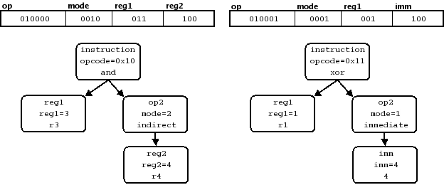
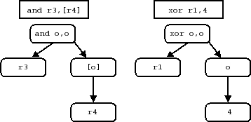
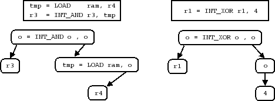

::: {.navheader}
7. Constructors
:::

[Prev](sleigh_tokens.html) 

 

 [Next](sleigh_context.html)

------------------------------------------------------------------------

::: {.sect1}
::: {.titlepage}
<div>

<div>

[]{#sleigh_constructors}7. Constructors {#constructors .title style="clear: both"}
---------------------------------------

</div>

</div>
:::

Fields are the basic building block for family symbols. The mechanisms
for building up from fields to the root [*instruction*]{.emphasis}
symbol are the [*constructor*]{.emphasis} and [*table*]{.emphasis}.

A [*constructor*]{.emphasis} is the unit of syntax for building new
symbols. In essence a constructor describes how to build a new family
symbol, by describing, in turn, how to build a new display meaning, how
to build a new semantic meaning, and how encodings map to these new
meanings. A [*table*]{.emphasis} is a set of one or more constructors
and is the final step in creating a new family symbol identifier
associated with the pieces defined by constructors. The name of the
table is this new identifier, and it is this identifier which can be
used in the syntax for subsequent constructors.

The difference between a constructor and table is slightly confusing at
first. In short, the syntactical elements described in this chapter, for
combining existing symbols into new symbols, are all used to describe a
single constructor. Specifications for multiple constructors are
combined to describe a single table. Since many tables are built with
only one constructor, it is natural and correct to think of a
constructor as a kind of table in and of itself. But it is only the
table that has an actual family symbol identifier associated with it.
Most of this chapter is devoted to describing how to define a single
constructor. The issues involved in combining multiple constructors into
a single table are addressed in [Section 7.8,
"Tables"](sleigh_constructors.html#sleigh_tables "7.8. Tables"){.xref}.

::: {.sect2}
::: {.titlepage}
<div>

<div>

### []{#sleigh_sections_constructor}7.1. The Five Sections of a Constructor {#the-five-sections-of-a-constructor .title}

</div>

</div>
:::

A single complex statement in the specification file describes a
constructor. This statement is always made up of five distinct sections
that are listed below in the order in which the must occur.

::: {.informalexample}
::: {.orderedlist}
1.  Table Header
2.  Display Section
3.  Bit Pattern Sections
4.  Disassembly Actions Section
5.  Semantics Actions Section
:::
:::

The full set of rules for correctly writing each section is long and
involved, but for any given constructor in a real specification file,
the syntax typically fits on a single line. We describe each section in
turn.
:::

::: {.sect2}
::: {.titlepage}
<div>

<div>

### []{#sleigh_table_header}7.2. The Table Header {#the-table-header .title}

</div>

</div>
:::

Every constructor must be part of a table, which is the element with an
actual family symbol identifier associated with it. So each constructor
starts with the identifier of the table it belongs to followed by a
colon ':'.

::: {.informalexample}
```
mode1:           ...
```
:::

The above line starts the definition of a constructor that is part of
the table identified as [*mode1*]{.emphasis}. If the identifier has not
appeared before, a new table is created. If other constructors have used
the identifier, the new constructor becomes an additional part of that
same table. A constructor in the root [*instruction*]{.emphasis} table
is defined by omitting the identifier.

::: {.informalexample}
```
:                ...
```
:::

The identifier [*instruction*]{.emphasis} is actually reserved for the
root table, but should not be used in the table header as the SLEIGH
parser uses the blank identifier to help distinguish assembly mnemonics
from operands (see [Section 7.3.1,
"Mnemonic"](sleigh_constructors.html#sleigh_mnemonic "7.3.1. Mnemonic"){.xref}).
:::

::: {.sect2}
::: {.titlepage}
<div>

<div>

### []{#sleigh_display_section}7.3. The Display Section {#the-display-section .title}

</div>

</div>
:::

The [*display section*]{.emphasis} consists of all characters after the
table header ':' up to the SLEIGH keyword [**is**]{.bold}. The section's
primary purpose is to assign disassembly display meaning to the
constructor. The section's secondary purpose is to define local
identifiers for the pieces out of which the constructor is being built.
Characters in the display section are treated as literals with the
following exceptions.

::: {.informalexample}
::: {.itemizedlist}
-   Legal identifiers are not treated literally unless
    ::: {.orderedlist}
    a.  The identifier is surrounded by double quotes.
    b.  The identifier is considered a mnemonic (see below).
    :::
-   The character '\^' has special meaning.
-   White space is trimmed from the beginning and end of the section.
-   Other sequences of white space characters are condensed into a
    single space.
:::
:::

In particular, all punctuation except '\^' loses its special meaning.
Those identifiers that are not treated as literals are considered to be
new, initially undefined, family symbols. We refer to these new symbols
as the [*operands*]{.emphasis} of the constructor. And for root
constructors, these operands frequently correspond to the natural
assembly operands. Thinking of it as a family symbol, the constructor's
display meaning becomes the string of literals itself, with each
identifier replaced with the display meaning of the symbol corresponding
to that identifier.

::: {.informalexample}
```
mode1: ( op1 ),op2 is          ...
```
:::

In the above example, a constructor for table [*mode1*]{.emphasis} is
being built out of two pieces, symbol [*op1*]{.emphasis} and symbol
[*op2*]{.emphasis}. The characters '(', ')', and ',' become literal
parts of the disassembly display for symbol mode1. After the display
strings for [*op1*]{.emphasis} and [*op2*]{.emphasis} are found, they
are inserted into the string of literals, forming the constructor's
display string. The white space characters surrounding the
[*op1*]{.emphasis} identifier are preserved as part of this string.

The identifiers [*op1*]{.emphasis} and [*op2*]{.emphasis} are local to
the constructor and can mask global symbols with the same names. The
symbols will (must) be defined in the following sections, but only their
identifiers are established in the display section.

::: {.sect3}
::: {.titlepage}
<div>

<div>

#### []{#sleigh_mnemonic}7.3.1. Mnemonic {#mnemonic .title}

</div>

</div>
:::

If the constructor is part of the root instruction table, the first
string of characters in the display section that does not contain white
space is treated as the [*literal mnemonic*]{.emphasis} of the
instruction and is not considered a local symbol identifier even if it
is legal.

::: {.informalexample}
```
:and (var1) is                 ...
```
:::

In the above example, the string "var1" is treated as a symbol
identifier, but the string "and" is considered to be the mnemonic of the
instruction.

There is nothing that special about the mnemonic. As far as the display
meaning of the constructor is concerned, it is just a sequence of
literal characters. Although the current parser does not concern itself
with this, the mnemonic of any assembly language instruction in general
is used to guarantee the uniqueness of the assembly representation. It
is conceivable that a forward engineering engine built on SLEIGH would
place additional requirements on the mnemonic to assure uniqueness, but
for reverse engineering applications there is no such requirement.
:::

::: {.sect3}
::: {.titlepage}
<div>

<div>

#### []{#sleigh_caret}7.3.2. The \'\^\' character {#the-character .title}

</div>

</div>
:::

The '\^' character in the display section is used to separate
identifiers from other characters where there shouldn't be white space
in the disassembly display. This can be used in any manner but is
usually used to attach display characters from a local symbol to the
literal characters of the mnemonic.

::: {.informalexample}
```
:bra^cc op1,op2 is             ...
```
:::

In the above example, "bra" is treated as literal characters in the
resulting display string followed immediately, with no intervening
spaces, by the display string of the local symbol [*cc*]{.emphasis}.
Thus the whole constructor actually has three operands, denoted by the
three identifiers [*cc*]{.emphasis}, [*op1*]{.emphasis}, and
[*op2*]{.emphasis}.

If the '\^' is used as the first (non-whitespace) character in the
display section of a base constructor, this inhibits the first
identifier in the display from being considered the mnemonic, as
described in [Section 7.3.1,
"Mnemonic"](sleigh_constructors.html#sleigh_mnemonic "7.3.1. Mnemonic"){.xref}.
This allows specification of less common situations, where the first
part of the mnemonic, rather than perhaps a later part, needs to be
considered as an operand. An initial '\^' character can also facilitate
certain recursive constructions.
:::
:::

::: {.sect2}
::: {.titlepage}
<div>

<div>

### []{#sleigh_bit_pattern}7.4. The Bit Pattern Section {#the-bit-pattern-section .title}

</div>

</div>
:::

Syntactically, this section comes between the keyword [**is**]{.bold}
and the delimiter for the following section, either an '{' or an '\['.
The [*bit pattern section*]{.emphasis} describes a constructor's
[*pattern*]{.emphasis}, the subset of possible instruction encodings
that the designer wants to [*match*]{.emphasis} the constructor being
defined.

::: {.sect3}
::: {.titlepage}
<div>

<div>

#### []{#sleigh_constraints}7.4.1. Constraints {#constraints .title}

</div>

</div>
:::

The patterns required for processor specifications can almost always be
described as a mask and value pair. Given a specific instruction
encoding, we can decide if the encoding matches our pattern by looking
at just the bits specified by the [*mask*]{.emphasis} and seeing if they
match a specific [*value*]{.emphasis}. The fields, as defined in
[Section 6.1, "Defining Tokens and
Fields"](sleigh_tokens.html#sleigh_defining_tokens "6.1. Defining Tokens and Fields"){.xref},
typically give us our masks. So to construct a pattern, we can simply
require that the field take on a specific value, as in the example
below.

::: {.informalexample}
```
:halt is opcode=0x15 {         ...
```
:::

Assuming the symbol [*opcode*]{.emphasis} was defined as a field, this
says that a root constructor with mnemonic "halt" matches any
instruction where the bits defining this field have the value 0x15. The
equation "opcode=0x15" is called a [*constraint*]{.emphasis}.

The standard bit encoding of the integer is used when restricting the
value of a field. This encoding is used even if an [**attach**]{.bold}
statement has assigned a different meaning to the field. The alternate
meaning does not apply within the pattern. This can be slightly
confusing, particularly in the case of an [**attach values**]{.bold}
statement, which provides an alternate integer interpretation of the
field.
:::

::: {.sect3}
::: {.titlepage}
<div>

<div>

#### []{#sleigh_ampandor}7.4.2. The \'&\' and \'\|\' Operators {#the-and-operators .title}

</div>

</div>
:::

More complicated patterns are built out of logical operators. The
meaning of these are fairly straightforward. We can force two or more
constraints to be true at the same time, a [*logical and*]{.emphasis}
'&', or we can require that either one constraint or another must be
true, a [*logical or*]{.emphasis} '\|'. By using these with constraints
and parentheses for grouping, arbitrarily complicated patterns can be
constructed.

::: {.informalexample}
```
:nop is (opcode=0 & mode=0) | (opcode=15) { ...
```
:::

Of the two operators, the [*logical and*]{.emphasis} is much more
common. The SLEIGH compiler typically can group together several
constraints that are combined with this operator into a single efficient
mask/value check, so this operator is to be preferred if at all
possible. The [*logical or*]{.emphasis} operator usually requires two or
more mask/value style checks to correctly implement.
:::

::: {.sect3}
::: {.titlepage}
<div>

<div>

#### []{#sleigh_defining_operands}7.4.3. Defining Operands and Invoking Subtables {#defining-operands-and-invoking-subtables .title}

</div>

</div>
:::

The principle way of defining a constructor operand, left undefined from
the display section, is done in the bit pattern section. If an operand's
identifier is used by itself, not as part of a constraint, then the
operand takes on both the display and semantic definition of the global
symbol with the same identifier. The syntax is slightly confusing at
first. The identifier must appear in the pattern as if it were a term in
a sequence of constraints but without the operator and right-hand side
of the constraint.

::: {.informalexample}
```
define token instr(32)
    opcode = (0,5)
    r1 = (6,10)
    r2 = (11,15);
attach variables [ r1 r2 ] [ reg0 reg1 reg2 reg3 ];

:add r1,r2 is opcode=7 & r1 & r2 { ...
```
:::

This is a typical example. The [*add*]{.emphasis} instruction must have
the bits in the [*opcode*]{.emphasis} field set specifically. But it
also uses two fields in the instruction which specify registers. The
[*r1*]{.emphasis} and [*r2*]{.emphasis} identifiers are defined to be
local because they appear in the display section, but their use in the
pattern section of the definition links the local symbols with the
global register symbols defined as fields with attached registers. The
constructor is essentially saying that it is building the full
[*add*]{.emphasis} instruction encoding out of the register fields
[*r1*]{.emphasis} and [*r2*]{.emphasis} but is not specifying their
value.

The syntax makes a little more sense keeping in mind this principle:

::: {.informalexample}
::: {.itemizedlist}
-   The pattern must somehow specify all the bits and symbols being used
    by the constructor, even if the bits are not restricted to specific
    values.
:::
:::

The linkage from local symbol to global symbol will happen for any
global identifier which represents a family symbol, including table
symbols. This is in fact the principle mechanism for recursively
building new symbols from old symbols. For those familiar with grammar
parsers, a SLEIGH specification is in part a grammar specification. The
terminal symbols, or tokens, are the bits of an instruction, and the
constructors and tables are the non-terminating symbols. These all build
up to the root instruction table, the grammar's start symbol. So this
link from local to global is simply a statement of the grouping of old
symbols into the new constructor.
:::

::: {.sect3}
::: {.titlepage}
<div>

<div>

#### []{#sleigh_variable_length}7.4.4. Variable Length Instructions {#variable-length-instructions .title}

</div>

</div>
:::

There are some additional complexities to designing a specification for
a processor with variable length instructions. Some initial portion of
an instruction must always be parsed. But depending on the fields in
this first portion, additional portions of varying lengths may need to
be read. The key to incorporating this behavior into a SLEIGH
specification is the token. Recall that all fields are built on top of a
token which is defined to be a specific number of bytes. If a processor
has fixed length instructions, the specification needs to define only a
single token representing the entire instruction, and all fields are
built on top of this one token. For processors with variable length
instructions however, more than one token needs to be defined. Each
token has different fields defined upon it, and the SLEIGH compiler can
distinguish which tokens are involved in a particular constructor by
examining the fields it uses. The tokens that are actually used by any
matching constructors determine the final length of the instruction.
SLEIGH has two operators that are specific to variable length
instruction sets and that give the designer control over how tokens fit
together.

::: {.sect4}
::: {.titlepage}
<div>

<div>

##### []{#sleigh_semicolon}7.4.4.1. The \';\' Operator {#the-operator .title}

</div>

</div>
:::

The most important operator for patterns defining variable length
instructions is the concatenation operator ';'. When building a
constructor with fields from two or more tokens, the pattern must
explicitly define the order of the tokens. In terms of the logic of the
pattern expressions themselves, the ';' operator has the same meaning as
the '&' operator. The combined expression matches only if both
subexpressions are true. However, it also requires that the
subexpressions involve multiple tokens and explicitly indicates an order
for them.

::: {.informalexample}
```
define token base(8)
    op=(0,3)
    mode=(4,4)
    reg=(5,7);
define token immtoken(16)
    imm16 = (0,15);

:inc reg       is op=2 & reg        { ...
:add reg,imm16 is op=3 & reg; imm16 { ...
```
:::

In the above example, we see the definitions of two different tokens,
[*base*]{.emphasis} and [*immtoken*]{.emphasis}. For the first
instruction, [*inc*]{.emphasis}, the constructor uses fields
[*op*]{.emphasis} and [*reg*]{.emphasis}, both defined on
[*base*]{.emphasis}. Thus, the pattern applies constraints to just a
single byte, the size of base, in the corresponding encoding. The second
instruction, [*add*]{.emphasis}, uses fields [*op*]{.emphasis} and
[*reg*]{.emphasis}, but it also uses field [*imm16*]{.emphasis}
contained in [*immtoken*]{.emphasis}. The ';' operator indicates that
token [*base*]{.emphasis} (via its fields) comes first in the encoding,
followed by [*immtoken*]{.emphasis}. The constraints on
[*base*]{.emphasis} will therefore correspond to constraints on the
first byte of the encoding, and the constraints on
[*immtoken*]{.emphasis} will apply to the second and third bytes. The
length of the final encoding for [*add*]{.emphasis} will be 3 bytes, the
sum of the lengths of the two tokens.

If two pattern expressions are combined with the '&' or '\|' operator,
where the concatenation operator ';' is also being used, the designer
must make sure that the tokens underlying each expression are the same
and come in the same order. In the example [*add*]{.emphasis}
instruction for instance, the '&' operator combines the "op=3" and "reg"
expressions. Both of these expressions involve only the token
[*base*]{.emphasis}, so the matching requirement is satisfied. The '&'
and '\|' operators can combine expressions built out of more than one
token, but the tokens must come in the same order. Also these operators
have higher precedence than the ';' operator, so parentheses may be
necessary to get the intended meaning.
:::

::: {.sect4}
::: {.titlepage}
<div>

<div>

##### []{#sleigh_ellipsis}7.4.4.2. The \'\...\' Operator {#the-...-operator .title}

</div>

</div>
:::

The ellipsis operator '\...' is used to satisfy the token matching
requirements of the '&' and '\|' operators (described in the previous
section), when the operands are of different lengths. The ellipsis is a
unary operator applied to a pattern expression that extends its token
length before it is combined with another expression. Depending on what
side of the expression the ellipsis is applied, the expression\'s tokens
are either right or left justified within the extension.

::: {.informalexample}
```
addrmode: reg is reg & mode=0    {     ...
addrmode: #imm16 is mode=1; imm16    {  ...

:xor “A”,addrmode is op=4 ... & addrmode {  ...
```
:::

Extending the example from the previous section, we add a subtable
[*addrmode*]{.emphasis}, representing an operand that can be encoded
either as a register, if [*mode*]{.emphasis} is set to zero, or as an
immediate value, if the [*mode*]{.emphasis} bit is one. If the immediate
value mode is selected, the operand is built by reading an additional
two bytes directly from the instruction encoding. So the
[*addrmode*]{.emphasis} table can represent a 1 byte or a 3 byte
encoding depending on the mode. In the following [*xor*]{.emphasis}
instruction, [*addrmode*]{.emphasis} is used as an operand. The
particular instruction is selected by encoding a 4 in the
[*op*]{.emphasis} field, so it requires a constraint on that field in
the pattern expression. Since the instruction uses the
[*addrmode*]{.emphasis} operand, it must combine the constraint on
[*op*]{.emphasis} with the pattern for [*addrmode*]{.emphasis}. But
[*op*]{.emphasis} involves only the token [*base*]{.emphasis}, while
[*addrmode*]{.emphasis} may also involve [*immtoken*]{.emphasis}. The
ellipsis operator resolves the conflict by extending the
[*op*]{.emphasis} constraint to be whatever the length of
[*addrmode*]{.emphasis} turns out to be.

Since the [*op*]{.emphasis} constraint occurs to the left of the
ellipsis, it is considered left justified, and the matching requirement
for '&' will insist that [*base*]{.emphasis} is the first token in all
forms of [*addrmode*]{.emphasis}. This allows the [*xor*]{.emphasis}
instruction\'s constraint on [*op*]{.emphasis} and the
[*addrmode*]{.emphasis} constraint on [*mode*]{.emphasis} to be combined
into constraints on a single byte in the final encoding.
:::
:::

::: {.sect3}
::: {.titlepage}
<div>

<div>

#### []{#sleigh_invisible_operands}7.4.5. Invisible Operands {#invisible-operands .title}

</div>

</div>
:::

It is not necessary for a global symbol, which is needed by a
constructor, to appear in the display section of the definition. If the
global identifier is used in the pattern section as it would be for a
normal operand definition but the identifier was not used in the display
section, then the constructor defines an [*invisible
operand*]{.emphasis}. Such an operand behaves and is parsed exactly like
any other operand but there is absolutely no visible indication of the
operand in the final display of the assembly instruction. The one common
type of instruction that uses this is the relative branch (see
[Section 7.5.1, "Relative
Branches"](sleigh_constructors.html#sleigh_relative_branches "7.5.1. Relative Branches"){.xref})
but it is otherwise needed only in more esoteric instructions. It is
useful in situations where you need to break up the parsing of an
instruction along lines that don't quite match the assembly.
:::

::: {.sect3}
::: {.titlepage}
<div>

<div>

#### []{#sleigh_empty_patterns}7.4.6. Empty Patterns {#empty-patterns .title}

</div>

</div>
:::

Occasionally there is a need for an empty pattern when building tables.
An empty pattern matches everything. There is a predefined symbol
[*epsilon*]{.emphasis} which has been traditionally used to indicate an
empty pattern.
:::

::: {.sect3}
::: {.titlepage}
<div>

<div>

#### []{#sleigh_advanced_constraints}7.4.7. Advanced Constraints {#advanced-constraints .title}

</div>

</div>
:::

A constraint does not have to be of the form "field = constant",
although this is almost always what is needed. In certain situations, it
may be more convenient to use a different kind of constraint. Special
care should be taken when designing these constraints because they can
substantially deviate from the mask/value model used to implement most
constraints. These more general constraints are implemented by splitting
it up into smaller states which can be modeled as a mask/value pair.
This is all done automatically, and the designer may inadvertently
create huge numbers of parsing states for a single constraint.

A constraint can actually be built out of arbitrary expressions. These
[*pattern expressions*]{.emphasis} are more commonly used in disassembly
actions and are defined in [Section 7.5.2, "General Actions and Pattern
Expressions"](sleigh_constructors.html#sleigh_general_actions "7.5.2. General Actions and Pattern Expressions"){.xref},
but they can also be used in constraints. So in general, a constraint is
any equation where the left-hand side is a single family symbol, the
right-hand side is an arbitrary pattern expression, and the constraint
operator is one of the following:

::: {.informalexample}
::: {.table}
[]{#constraints.htmltable}

**Table 3. Constraint Operators**

::: {.table-contents}
  -----------------------------------------------------------------------
  [**Operator Name**]{.bold}          [**Syntax**]{.bold}
  ----------------------------------- -----------------------------------
  Integer equality                    =

  Integer inequality                  !=

  Integer less-than                   \<

  Integer greater-than                \>
  -----------------------------------------------------------------------
:::
:::

\
:::

For a particular instruction encoding, each variable evaluates to a
specific integer depending on the encoding. A constraint is
[*satisfied*]{.emphasis} if, when all the variables are evaluated, the
equation is true.

::: {.informalexample}
```
:xor r1,r2 is opcode=0xcd & r1 & r2 { r1 = r1 ^ r2; }
:clr r1    is opcode=0xcd & r1 & r1=r2 { r1 = 0; }
```
:::

The above example illustrates a situation that does come up
occasionally. A processor uses an exclusive-or instruction to clear a
register by setting both operands of the instruction to the same
register. The first line in the example illustrates such an instruction.
However, processor documentation stipulates, and analysts prefer, that,
in this case, the disassembler should print a pseudo-instruction
[*clr*]{.emphasis}. The distinguishing feature of [*clr*]{.emphasis}
from [*xor*]{.emphasis} is that the two fields, specifying the two
register inputs to [*xor*]{.emphasis}, are equal. The easiest way to
specify this special case is with the general constraint,
"[*r1*]{.emphasis} = [*r2*]{.emphasis}", as in the second line of the
example. The SLEIGH compiler will implement this by enumerating all the
cases where [*r1*]{.emphasis} equals [*r2*]{.emphasis}, creating as many
states as there are registers. But the specification itself, at least,
remains compact.
:::
:::

::: {.sect2}
::: {.titlepage}
<div>

<div>

### []{#sleigh_disassembly_actions}7.5. Disassembly Actions Section {#disassembly-actions-section .title}

</div>

</div>
:::

After the bit pattern section, there can optionally be a section for
doing dynamic calculations, which must be between square brackets. For
certain kinds of instructions, there is a need to calculate values that
depend on the specific bits of the instruction, but which cannot be
obtained as an integer interpretation of a field or by building with an
[**attach values**]{.bold} statement. So SLEIGH provides a mechanism to
build values of arbitrary complexity. This section is not intended to
emulate the execution of the processor (this is the job of the semantic
section) but is intended to produce only those values that are needed at
disassembly time, usually for part of the disassembly display.

::: {.sect3}
::: {.titlepage}
<div>

<div>

#### []{#sleigh_relative_branches}7.5.1. Relative Branches {#relative-branches .title}

</div>

</div>
:::

The canonical example of an action at disassembly time is a branch
relocation. A jump instruction encodes the address of where it jumps to
as a relative offset to the instruction's address, for instance. But
when we display the assembly, we want to show the absolute address of
the jump destination. The correct way to specify this is to reserve an
identifier in the display section which represents the absolute address,
but then, instead of defining it in the pattern section, we define it in
the disassembly action section as a function of the current address and
the relative offset.

::: {.informalexample}
```
jmpdest: reloc is simm8 [ reloc=inst_next + simm8*4; ] { ...
```
:::

The identifier [*reloc*]{.emphasis} is reserved in the display section
for this constructor, but the identifier is not defined in the pattern
section. Instead, an invisible operand [*simm8*]{.emphasis} is defined
which is attached to a global field definition. The [*reloc*]{.emphasis}
identifier is defined in the action section as the integer obtained by
adding a multiple of [*simm8*]{.emphasis} to [*inst\_next*]{.emphasis},
a symbol predefined to be equal to the address of the following
instruction (see [Section 5.2, "Predefined
Symbols"](sleigh_symbols.html#sleigh_predefined_symbols "5.2. Predefined Symbols"){.xref}).
Now [*reloc*]{.emphasis} is a specific symbol with both semantic and
display meaning equal to the desired absolute address. This address is
calculated separately, at disassembly time, for every instruction that
this constructor matches.
:::

::: {.sect3}
::: {.titlepage}
<div>

<div>

#### []{#sleigh_general_actions}7.5.2. General Actions and Pattern Expressions {#general-actions-and-pattern-expressions .title}

</div>

</div>
:::

In general, the disassembly actions are encoded as a sequence of
assignments separated by semicolons. The left-hand side of each
statement must be a single operand identifier, and the right-hand side
must be a [*pattern expression*]{.emphasis}. A [*pattern
expression*]{.emphasis} is made up of both integer constants and family
symbols that have retained their semantic meaning as integers, and it is
built up out of the following typical operators:

::: {.informalexample}
::: {.table}
[]{#patexp.htmltable}

**Table 4. Pattern Expression Operators**

::: {.table-contents}
+-----------------------------------+-----------------------------------+
| [**Operator Name**]{.bold}        | [**Syntax**]{.bold}               |
+===================================+===================================+
| Integer addition                  | \+                                |
+-----------------------------------+-----------------------------------+
| Integer subtraction               | \-                                |
+-----------------------------------+-----------------------------------+
| Integer multiplication            | \*                                |
+-----------------------------------+-----------------------------------+
| Integer division                  | /                                 |
+-----------------------------------+-----------------------------------+
| Left-shift                        | \<\<                              |
+-----------------------------------+-----------------------------------+
| Arithmetic right-shift            | \>\>                              |
+-----------------------------------+-----------------------------------+
| Bitwise and                       | ::: {.informaltable}              |
|                                   | []{#bitwiseand.htmltable}         |
|                                   |                                   |
|                                   |   ----------------------------    |
|                                   |   \$and                           |
|                                   |   & (within square brackets)      |
|                                   |   ----------------------------    |
|                                   | :::                               |
+-----------------------------------+-----------------------------------+
| Bitwise or                        | ::: {.informaltable}              |
|                                   | []{#bitwiseor.htmltable}          |
|                                   |                                   |
|                                   |   -----------------------------   |
|                                   |   \$or                            |
|                                   |   \| (within square brackets)     |
|                                   |   -----------------------------   |
|                                   | :::                               |
+-----------------------------------+-----------------------------------+
| Bitwise xor                       | ::: {.informaltable}              |
|                                   | []{#bitwisexor.htmltable}         |
|                                   |                                   |
|                                   |   -------                         |
|                                   |   \$xor                           |
|                                   |   \^                              |
|                                   |   -------                         |
|                                   | :::                               |
+-----------------------------------+-----------------------------------+
| Bitwise negation                  | \~                                |
+-----------------------------------+-----------------------------------+
:::
:::

\
:::

For the sake of these expressions, integers are considered signed values
of arbitrary precision. Expressions can also make use of parentheses. A
family symbol can be used in an expression, only if it can be resolved
to a particular specific symbol. This generally means that a global
family symbol, such as a field, must be attached to a local identifier
before it can be used.

The left-hand side of an assignment statement can be a context variable
(see [Section 6.4, "Context
Variables"](sleigh_tokens.html#sleigh_context_variables "6.4. Context Variables"){.xref}).
An assignment to such a variable changes the context in which the
current instruction is being disassembled and can potentially have a
drastic effect on how the rest of the instruction is disassembled. An
assignment of this form is considered local to the instruction and will
not affect how other instructions are parsed. The context variable is
reset to its original value before parsing other instructions. The
disassembly action may also contain one or more [**globalset**]{.bold}
directives, which cause changes to context variables to become more
permanent. This directive is distinct from the operators in a pattern
expression and must be invoked as a separate statement. See [Section 8,
"Using Context"](sleigh_context.html "8. Using Context"){.xref}, for a
discussion of how to effectively use context variables and [Section 8.3,
"Global Context
Change"](sleigh_context.html#sleigh_global_change "8.3. Global Context Change"){.xref},
for details of the [**globalset**]{.bold} directive.

Note that there are two syntax forms for the logical operators in a
pattern expression. When an expression is used as part of a constraint,
the "\$and" and "\$or" forms of the operators must be used in order to
distinguish the bitwise operators from the special pattern combining
operators, '&' and '\|' (as described in [Section 7.4.2, "The \'&\' and
\'\|\'
Operators"](sleigh_constructors.html#sleigh_ampandor "7.4.2. The '&' and '|' Operators"){.xref}).
However inside the square braces of the disassembly action section, '&'
and '\|' are interpreted as the usual logical operators.
:::
:::

::: {.sect2}
::: {.titlepage}
<div>

<div>

### []{#sleigh_with_block}7.6. The With Block {#the-with-block .title}

</div>

</div>
:::

To avoid tedious repetition and to ease the maintenance of
specifications already having many, many constructors and tables, the
[*with block*]{.emphasis} is provided. It is a syntactic construct that
allows a designer to apply a table header, bit pattern constraints,
and/or disassembly actions to a group of constructors. The block starts
at the [**with**]{.bold} directive and ends with a closing brace. All
constructors within the block are affected:

::: {.informalexample}
```
with op1 : mode=1 [ mode=2; ] {
  :reg   is reg & ind=0 [ mode=1; ] { ... }
  :[reg] is reg & ind=1             { ... }
}
```
:::

In the example, both constructors are added to the table identified by
[*op1*]{.emphasis}. Both require the context field [*mode*]{.emphasis}
to be equal to 1. The listed constraints take the form described in
[Section 7.4, "The Bit Pattern
Section"](sleigh_constructors.html#sleigh_bit_pattern "7.4. The Bit Pattern Section"){.xref},
and they are joined to those given in the constructor statement as if
prepended using '&'. Similarly, the actions take the form described in
[Section 7.5, "Disassembly Actions
Section"](sleigh_constructors.html#sleigh_disassembly_actions "7.5. Disassembly Actions Section"){.xref}
and are prepended to the actions given in the constructor statement.
Prepending the actions allows the statement to override actions in the
with block. Both technically occur, but only the last one has a
noticeable effect. The above example could have been equivalently
specified:

::: {.informalexample}
```
op1:reg   is mode=1 & reg & ind=0 [ mode=2; mode=1; ] { ... }
op1:[ref] is mode=1 & reg & ind=1 [ mode=2; ]         { ... }
```
:::

The three parts (table header, bit pattern section, and disassembly
actions section) of the with block are all optional. Any of them may be
omitted, though omitting all of them is rather pointless. With blocks
may also be nested. The innermost with block having a table header
specifies the default header of the constructors it contains. The
constraints and actions are combined outermost to innermost, left to
right. Note that when a with block has a table header specifying a table
that does not yet exist, the table is created immediately. Inside a with
block that has a table header, a nested with block may specify the
[*instruction*]{.emphasis} table by name, as in \"with instruction :
{[\...]{.weak}}\". Inside such a block, the rule regarding mnemonic
literals is restored (see [Section 7.3.1,
"Mnemonic"](sleigh_constructors.html#sleigh_mnemonic "7.3.1. Mnemonic"){.xref}).
:::

::: {.sect2}
::: {.titlepage}
<div>

<div>

### []{#sleigh_semantic_section}7.7. The Semantic Section {#the-semantic-section .title}

</div>

</div>
:::

The final section of a constructor definition is the [*semantic
section*]{.emphasis}. This is a description of how the processor would
manipulate data if it actually executed an instruction that matched the
constructor. From the perspective of a single constructor, the basic
idea is that all the operands for the constructor have been defined in
the bit pattern or disassembly action sections as either specific or
family symbols. In context, all the family symbols map to specific
symbols, and the semantic section uses these and possibly other global
specific symbols in statements that describe the action of the
constructor. All specific symbols have a varnode associated with them,
so within the semantic section, symbols are manipulated as if they were
varnodes.

The semantic section for one constructor is surrounded by curly braces
'{' and '}' and consists of zero or more statements separated by
semicolons ';'. Most statements are built up out of C-like syntax, where
the variables are the symbols visible to the constructor. There is a
direct correspondence between each type of operator used in the
statements and a p-code operation. The SLEIGH compiler generates p-code
operations and varnodes corresponding to the SLEIGH operators and
symbols by collapsing the syntax trees represented by the statements and
creating temporary storage within the [*unique*]{.emphasis} space when
it needs to.

::: {.informalexample}
```
:add r1,r2 is opcode=0x26 & r1 & r2 { r1 = r1 + r2; }
```
:::

The above example generates exactly one integer addition operation,
[*INT\_ADD*]{.emphasis}, where the input varnodes are [*r1*]{.emphasis}
and [*r2*]{.emphasis} and the output varnode is [*r1*]{.emphasis}.

::: {.sect3}
::: {.titlepage}
<div>

<div>

#### []{#sleigh_expressions}7.7.1. Expressions {#expressions .title}

</div>

</div>
:::

Expressions are built out of symbols and the binary and unary operators
listed in [Table 5, "Semantic Expression Operators and
Syntax"](sleigh_ref.html#syntaxref.htmltable "Table 5. Semantic Expression Operators and Syntax"){.xref}
in the Appendix. All expressions evaluate to an integer, floating point,
or boolean value, depending on the final operation of the expression.
The value is then used depending on the kind of statement. Most of the
operators require that their input and output varnodes all be the same
size (see [Section 7.7.3, "Varnode
Sizes"](sleigh_constructors.html#sleigh_varnode_sizes "7.7.3. Varnode Sizes"){.xref}).
The operators all have a precedence, which is used by the SLEIGH
compiler to determine the ordering of the final p-code operations.
Parentheses can be used within expressions to affect this order.

::: {.sect4}
::: {.titlepage}
<div>

<div>

##### []{#sleigh_arithmetic_logical}7.7.1.1. Arithmetic, Logical and Boolean Operators {#arithmetic-logical-and-boolean-operators .title}

</div>

</div>
:::

For the most part these operators should be familiar to software
developers. The only real differences arise from the fact that varnodes
are typeless. So for instance, there has to be separate operators to
distinguish between dividing unsigned numbers '/', dividing signed
numbers 's/', and dividing floating point numbers 'f/'.

Carry, borrow, and overflow calculations are implemented with separate
operations, rather than having indirect effects with the arithmetic
operations. Thus the [*INT\_CARRY*]{.emphasis},
[*INT\_SCARRY*]{.emphasis}, and [*INT\_SBORROW*]{.emphasis} operations
may be unfamiliar to some people in this form (see the descriptions in
the Appendix).
:::

::: {.sect4}
::: {.titlepage}
<div>

<div>

##### []{#sleigh_star_operator}7.7.1.2. The \'\*\' Operator {#the-operator-1 .title}

</div>

</div>
:::

The dereference operator, which generates [*LOAD*]{.emphasis} operations
(and [*STORE*]{.emphasis} operations), has slightly unfamiliar syntax.
The '\*' operator, as is usual in many programming languages, indicates
that the affected variable is a pointer and that the expression is
[*dereferencing*]{.emphasis} the data being pointed to. Unlike most
languages, in SLEIGH, it is not immediately clear what address space the
variable is pointing into because there may be multiple address spaces
defined. In the absence of any other information, SLEIGH assumes that
the variable points into the [*default*]{.emphasis} space, as labeled in
the definition of one of the address spaces with the
[**default**]{.bold} attribute. If that is not the space desired, the
default can be overridden by putting the identifier for the space in
square brackets immediately after the '\*'.

It is also frequently not clear what the size of the dereferenced data
is because the pointer variable is typeless. The SLEIGH compiler can
frequently deduce what the size must be by looking at the operation in
the context of the entire statement (see [Section 7.7.3, "Varnode
Sizes"](sleigh_constructors.html#sleigh_varnode_sizes "7.7.3. Varnode Sizes"){.xref}).
But in some situations, this may not be possible, so there is a way to
specify the size explicitly. The operator can be followed by a colon ':'
and an integer indicating the number of bytes being dereferenced. This
can be used with or without the address space override. We give an
example of each kind of override in the example below.

::: {.informalexample}
```
:load  r1,[r2] is opcode=0x99 & r1 & r2 { r1 = * r2; }
:load2 r1,[r2] is opcode=0x9a & r1 & r2 { r1 = *[other] r2; }
:load3 r1,[r2] is opcode=0x9b & r1 & r2 { r1 = *:2 r2; }
:load4 r1,[r2] is opcode=0x9c & r1 & r2 { r1 = *[other]:2 r2; }
```
:::

Keep in mind that the address represented by the pointer is not a byte
address if the [**wordsize**]{.bold} attribute is set to something other
than one.
:::

::: {.sect4}
::: {.titlepage}
<div>

<div>

##### []{#sleigh_extension}7.7.1.3. Extension {#extension .title}

</div>

</div>
:::

Most processors have instructions that extend small values into big
values, and many instructions do these minor data manipulations
implicitly. In keeping with the p-code philosophy, these operations must
be specified explicitly with the [*INT\_ZEXT*]{.emphasis} and
[*INT\_SEXT*]{.emphasis} operators in the semantic section. The
[*INT\_ZEXT*]{.emphasis}, does a so-called [*zero
extension*]{.emphasis}. The low-order bits are copied from the input,
and any remaining high-order bits in the result are set to zero. The
[*INT\_SEXT*]{.emphasis}, does a [*signed extension*]{.emphasis}. The
low-order bits are copied from the input, but any remaining high-order
bits in the result are set to the value of the high-order bit of the
input. The [*INT\_ZEXT*]{.emphasis} operation is invoked with the
[**zext**]{.bold} operator, and the [*INT\_SEXT*]{.emphasis} operation
is invoked with the [**sext**]{.bold} operator.
:::

::: {.sect4}
::: {.titlepage}
<div>

<div>

##### []{#sleigh_truncation}7.7.1.4. Truncation {#truncation .title}

</div>

</div>
:::

There are two forms of syntax indicating a truncation of the input
varnode. In one the varnode is followed by a colon ':' and an integer
indicating the number of bytes to copy into the output, starting with
the least significant byte. In the second form, the varnode is followed
by an integer, surrounded by parentheses, indicating the number of least
significant bytes to truncate from the input. This second form doesn't
directly specify the size of the output, which must be inferred from
context.

::: {.informalexample}
```
:split r1,lo,hi is opcode=0x81 & r1 & lo & hi {
    lo = r1:4;
    hi = r1(4);
}
```
:::

This is an example using both forms of truncation to split a large value
[*r1*]{.emphasis} into two smaller pieces, [*lo*]{.emphasis} and
[*hi*]{.emphasis}. Assuming [*r1*]{.emphasis} is an 8 byte value,
[*lo*]{.emphasis} receives the least significant half and
[*hi*]{.emphasis} receives the most significant half.
:::

::: {.sect4}
::: {.titlepage}
<div>

<div>

##### []{#sleigh_bitrange_operator}7.7.1.5. Bit Range Operator {#bit-range-operator .title}

</div>

</div>
:::

A specific subrange of bits within a varnode can be explicitly
referenced. Depending on the range, this may amount to just a variation
on the truncation syntax described earlier. But for this operator, the
size and boundaries of the range do not have to be restricted to byte
alignment.

::: {.informalexample}
```
:bit3 r1,r2 is op=0x7e & r1 & r2 { r1 = zext(r2[3,1]); }
```
:::

A varnode, [*r2*]{.emphasis} in this example, is immediately followed by
square brackets '\[' and '\]' indicating a bit range, and within the
brackets, there are two parameters separated by a comma. The first
parameter is an integer indicating the least significant bit of the
resulting bit range. The bits of the varnode are labeled in order of
significance, with the least significant bit of the varnode being 0. The
second parameter is an integer indicating the number of bits in the
range. In the example, a single bit is extracted from [*r2*]{.emphasis},
and its value is extended to fill [*r1*]{.emphasis}. Thus
[*r1*]{.emphasis} takes either the value 0 or 1, depending on bit 3 of
[*r2*]{.emphasis}.

There are some caveats associated with using this operator. Bit range
extraction is really a pseudo operator, as real p-code can only work
with memory down to byte resolution. The bit range operator will
generate some combination of [*INT\_RIGHT*]{.emphasis},
[*INT\_AND*]{.emphasis}, and [*SUBPIECE*]{.emphasis} to simulate the
extraction of smaller or unaligned pieces. The "r2\[3,1\]" from the
example generates the following p-code, for instance.

::: {.informalexample}
```
u1 = INT_RIGHT r2,#3
u2 = SUBPIECE u1,0
u3 = INT_AND u2,#0x1
```
:::

The result of any bit range operator still has a size in bytes. This
size is always the minimum number of bytes needed to contain the
resulting bit range, and if there are any extra bits in the result these
are automatically set to zero.

This operator can also be used on the left-hand side of assignments with
similar behavior and caveats (see [Section 7.7.2.8, "Bit Range
Assignments"](sleigh_constructors.html#sleigh_bitrange_assign "7.7.2.8. Bit Range Assignments"){.xref}).
:::

::: {.sect4}
::: {.titlepage}
<div>

<div>

##### []{#sleigh_addressof}7.7.1.6. Address-of Operator {#address-of-operator .title}

</div>

</div>
:::

There is an [*address-of*]{.emphasis} operator for generating the
address offset of a selected varnode as an integer value for use in
expressions. Use of this operator is a little subtle because it does
[*not*]{.emphasis} generate a p-code operation that calculates the
desired value. The address is only calculated at disassembly time and
not during execution. The operator can only be used if the symbol
referenced has a static address.

::: {.warning style="margin-left: 0.5in; margin-right: 0.5in;"}
### Warning {#warning .title}

The current SLEIGH compiler cannot distinguish when the symbol has an
address that can always be resolved during disassembly. So improper use
may not be flagged as an error, and the specification may produce
unexpected results.
:::

There '&' operator in front of a symbol invokes this function. The
ampersand can also be followed by a colon ':' and an integer explicitly
indicating the size of the resulting constant as a varnode.

::: {.informalexample}
```
:copyr r1 is op=0x3b & r1 { tmp:4 = &r1 + 4; r1 = *[register]tmp;}
```
:::

The above is a contrived example of using the address-of operator to
copy from a register that is not explicitly indicated by the
instruction. This example constructs the address of the register
following [*r1*]{.emphasis} within the [*register*]{.emphasis} space,
and then loads [*r1*]{.emphasis} with data from that address. The net
effect of all this is that the register following [*r1*]{.emphasis} is
copied into [*r1*]{.emphasis}, even though it is not mentioned directly
in the instruction. Notice that the address-of operator only produces
the offset portion of the address, and to copy the desired value, the
'\*' operator must have a [*register*]{.emphasis} space override.
:::

::: {.sect4}
::: {.titlepage}
<div>

<div>

##### []{#sleigh_managed_code}7.7.1.7. Managed Code Operations {#managed-code-operations .title}

</div>

</div>
:::

SLEIGH provides basic support for instructions where encoding and
context don\'t provide a complete description of the semantics. This is
the case typically for [*managed code*]{.emphasis} instruction sets
where generation of the semantic details of an instruction may be
deferred until run-time. Support for these operators is architecture
dependent, otherwise they just act as black-box functions.

The constant pool operator, [**cpool**]{.bold}, returns sizes, offsets,
addresses, and other structural constants. It behaves like a
[*query*]{.emphasis} to the architecture about these constants. The
first parameter is generally an [*object reference*]{.emphasis}, and
additional parameters are constants describing the particular query. The
operator returns the requested value. In the following example, an
object reference [*regParamC*]{.emphasis} and the encoded constant
[*METHOD\_INDEX*]{.emphasis} are sent as part of a query to obtain the
final destination address of an object method.

::: {.informalexample}
```
:invoke_direct METHOD_INDEX,regParamC
               is inst0=0x70 ; N_PARAMS=1 & METHOD_INDEX & regParamC
{
    iv0 = regParamC;
    destination:4 = cpool( regParamC, METHOD_INDEX, $(CPOOL_METHOD));
    call [ destination ];
}
```
:::

If object memory allocation is an atomic feature of the instruction set,
the specification designer can use the [**newobject**]{.bold} functional
operator to implement it in SLEIGH. It takes one or two parameters. The
first parameter is a [*class reference*]{.emphasis} or other value
describing the object to be allocated, and the second parameter is an
optional count of the number of objects to allocate. It returns a
pointer to the allocated object.
:::

::: {.sect4}
::: {.titlepage}
<div>

<div>

##### []{#sleigh_userdef_op}7.7.1.8. User-Defined Operations {#user-defined-operations .title}

</div>

</div>
:::

Any identifier that has been defined as a new p-code operation, using
the [**define pcodeop**]{.bold} statement, can be invoked as an operator
using functional syntax. The SLEIGH compiler assumes that the operator
can take an arbitrary number of inputs, and if used in an expression,
the compiler assumes the operation returns an output. Using this syntax
of course generates the particular p-code operation reserved for the
identifier.

::: {.informalexample}
```
define pcodeop arctan;
  ...
:atan r1,r2 is opcode=0xa3 & r1 & r2 { r1 = arctan(r2); }
```
:::
:::
:::

::: {.sect3}
::: {.titlepage}
<div>

<div>

#### []{#sleigh_statements}7.7.2. Statements {#statements .title}

</div>

</div>
:::

We describe the types of semantic statements that are allowed in SLEIGH.

::: {.sect4}
::: {.titlepage}
<div>

<div>

##### []{#sleigh_assign_statements}7.7.2.1. Assignment Statements and Temporary Variables {#assignment-statements-and-temporary-variables .title}

</div>

</div>
:::

Of course SLEIGH allows assignment statements with the '=' operator,
where the right-hand side is an arbitrary expression and the left-hand
side is the varnode being assigned. The assigned varnode can be any
specific symbol in the scope of the constructor, either a global symbol
or a local operand.

In SLEIGH, the keyword [**local**]{.bold} is used to allocate temporary
variables. If an assignment statement is prepended with
[**local**]{.bold}, and the identifier on the left-hand side of an
assignment does not match any symbol in the scope of the constructor, a
named temporary varnode is created in the [*unique*]{.emphasis} address
space to hold the result of the expression. The new symbol becomes part
of the local scope of the constructor, and can be referred to in the
following semantic statements. The size of the new varnode is calculated
by examining the statement in context (see [Section 7.7.3, "Varnode
Sizes"](sleigh_constructors.html#sleigh_varnode_sizes "7.7.3. Varnode Sizes"){.xref}).
It is also possible to explicitly indicate the size by using the colon
':' operator followed by an integer size in bytes. The following
examples demonstrate the temporary variable [*tmp*]{.emphasis} being
defined using both forms.

::: {.informalexample}
```
:swap r1,r2 is opcode=0x41 & r1 & r2 {
    local tmp = r1;
    r1 = r2;
    r2 = tmp;
}
:store r1,imm is opcode=0x42 & r1 & imm {
    local tmp:4 = imm+0x20;
    *r1 = tmp;
}
```
:::

The [**local**]{.bold} keyword can also be used to declare a named
temporary varnode, without an assignment statement. This is useful for
temporaries that are immediately passed into a macro.

::: {.informalexample}
```
:pushflags r1 is opcode=0x43 & r1 {
    local tmp:4;
    packflags(tmp);
    * r1 = tmp;
    r1 = r1 - 4;
}
```
:::

::: {.warning style="margin-left: 0.5in; margin-right: 0.5in;"}
### Warning {#warning-1 .title}

Currently, the SLEIGH compiler does not need the [**local**]{.bold}
keyword to create a temporary variable. For any assignment statement, if
the left-hand side has a new identifier, a new temporary symbol will be
created using this identifier. Unfortunately, this can cause SLEIGH to
blindly accept assignment statements where the left-hand side identifier
is a misspelling of an existing symbol. Use of the [**local**]{.bold}
keyword is preferred and may be enforced in future compiler versions.
:::
:::

::: {.sect4}
::: {.titlepage}
<div>

<div>

##### []{#sleigh_storage_statements}7.7.2.2. Storage Statements {#storage-statements .title}

</div>

</div>
:::

SLEIGH supports fairly standard [*storage statement*]{.emphasis} syntax
to complement the load operator. The left-hand side of an assignment
statement uses the '\*' operator to indicate a dynamic storage location,
followed by an arbitrary expression to calculate the location. This
syntax of course generates the p-code [*STORE*]{.emphasis} operator as
the final step of the statement.

::: {.informalexample}
```
:sta [r1],r2 is opcode=0x20 & r1 & r2 { *r1 = r2; }
:stx [r1],r2 is opcode=0x21 & r1 & r2 { *[other] r1 = r2; }
:sti [r1],imm is opcode=0x22 & r1 & imm { *:4 r1 = imm; }
```
:::

The same size and address space considerations that apply to the '\*'
operator when it is used as a load operator also apply when it is used
as a store operator, see [Section 7.7.1.2, "The \'\*\'
Operator"](sleigh_constructors.html#sleigh_star_operator "7.7.1.2. The '*' Operator"){.xref}.
Unless explicit modifiers are given, the default address space is
assumed as the storage destination, and the size of the data being
stored is calculated from context. Keep in mind that the address
represented by the pointer is not a byte address if the
[**wordsize**]{.bold} attribute is set to something other than one.
:::

::: {.sect4}
::: {.titlepage}
<div>

<div>

##### []{#sleigh_exports}7.7.2.3. Exports {#exports .title}

</div>

</div>
:::

The semantic section doesn't just specify how to generate p-code for a
constructor. Except for those constructors in the root table, this
section also associates a semantic meaning to the table symbol the
constructor is part of, allowing the table to be used as an operand in
other tables. The mechanism for making this association is the
[*export*]{.emphasis} statement. This must be the last statement in the
section and consists of the [**export**]{.bold} keyword followed by the
specific symbol to be associated with the constructor. In general, the
constructor will have a sequence of assignment statements building a
final value, and then the varnode containing the value will be exported.
However, anything can be exported.

::: {.informalexample}
```
mode: reg++ is addrmode=0x2 & reg { tmp=reg; reg=reg+1; export tmp; }
```
:::

This is an example of a post-increment addressing mode that would be
used to build more complicated instructions. The constructor increments
a register [*reg*]{.emphasis} but stores a copy of its original value in
[*tmp*]{.emphasis}. The varnode [*tmp*]{.emphasis} is then exported,
associating it with the table symbol [*mode*]{.emphasis}. When this
constructor is matched, as part of a more complicated instruction, the
symbol [*mode*]{.emphasis} will represent the original semantic value of
[*reg*]{.emphasis} but with the standard post-increment side-effect.

The table symbol associated with the constructor becomes a
[*reference*]{.emphasis} to the varnode being exported, not a copy of
the value. If the table symbol is written to, as the left-hand side of
an assignment statement, in some other constructor, the exported varnode
is affected. A constant can be exported if its size as a varnode is
given explicitly with the ':' operator.

It is not legal to put a full expression in an [**export**]{.bold}
statement, any expression must appear in an earlier statement. However,
a single '&' operator is allowed as part of the statement and it behaves
as it would in a normal expression (see [Section 7.7.1.6, "Address-of
Operator"](sleigh_constructors.html#sleigh_addressof "7.7.1.6. Address-of Operator"){.xref}).
It causes the address of the varnode being modified to be exported as an
integer constant.
:::

::: {.sect4}
::: {.titlepage}
<div>

<div>

##### []{#sleigh_dynamic_references}7.7.2.4. Dynamic References {#dynamic-references .title}

</div>

</div>
:::

The only other operator allowed as part of an [**export**]{.bold}
statement, is the '\*' operator. The semantic meaning of this operator
is the same as if it were used in an expression (see [Section 7.7.1.2,
"The \'\*\'
Operator"](sleigh_constructors.html#sleigh_star_operator "7.7.1.2. The '*' Operator"){.xref}),
but it is worth examining the effects of this form of export in detail.
Bearing in mind that an [**export**]{.bold} statement exports a
[*reference*]{.emphasis}, using the '\*' operator in the statement
exports a [*dynamic reference*]{.emphasis}. The varnode being modified
by the '\*' is interpreted as a pointer to another varnode. It is this
varnode being pointed to which is exported, even though the address may
be dynamic and cannot be determined at disassembly time. This is not the
same as dereferencing the pointer into a temporary variable that is then
exported. The dynamic reference can be both read and
[*written*]{.emphasis}. Internally, the SLEIGH compiler keeps track of
the pointer and inserts a [*LOAD*]{.emphasis} or [*STORE*]{.emphasis}
operation when the symbol associated with the dynamic reference is
referred to in other constructors.

::: {.informalexample}
```
mode: reg[off] is addr=1 & reg & off {
    ea = reg + off;
    export *:4 ea;
}
dest: reloc    is abs [ reloc = abs * 4; ] {
    export *[ram]:4 reloc;
}
```
:::

In the first example, the effective address of an operand is calculated
from a register [*reg*]{.emphasis} and a field of the instruction
[*off*]{.emphasis}. The constructor does not export the resulting
pointer [*ea*]{.emphasis}, it exports the location being pointed to by
[*ea*]{.emphasis}. Notice the size of this location (4) is given
explicitly with the ':' modifier. The '\*' operator can also be used on
constant pointers. In the second example, the constant operand
[*reloc*]{.emphasis} is used as the offset portion of an address into
the [*ram*]{.emphasis} address space. The constant [*reloc*]{.emphasis}
is calculated at disassembly time from the instruction field
[*abs*]{.emphasis}. This is a very common construction for jump
destinations (see [Section 7.5.1, "Relative
Branches"](sleigh_constructors.html#sleigh_relative_branches "7.5.1. Relative Branches"){.xref})
but can be used in general. This particular combination of a disassembly
time action and a dynamic export is a very general way to construct a
family of varnodes.

Dynamic references are a key construction for effectively separating
addressing mode implementations from instruction semantics at higher
levels.
:::

::: {.sect4}
::: {.titlepage}
<div>

<div>

##### []{#sleigh_branching_statements}7.7.2.5. Branching Statements {#branching-statements .title}

</div>

</div>
:::

This section discusses statements that generate p-code branching
operations. These are listed in [Table 7, "Branching
Statements"](sleigh_ref.html#branchref.htmltable "Table 7. Branching Statements"){.xref},
in the Appendix.

There are six forms covering the gamut of typical assembly language
branches, but in terms of actual semantics there are really only three.
With p-code,

::: {.informalexample}
::: {.itemizedlist}
-   [*CALL*]{.emphasis} is semantically equivalent to
    [*BRANCH*]{.emphasis},
-   [*CALLIND*]{.emphasis} is semantically equivalent to
    [*BRANCHIND*]{.emphasis}, and
-   [*RETURN*]{.emphasis} is semantically equivalent to
    [*BRANCHIND*]{.emphasis}.
:::
:::

The reason for this is that calls and returns imply the presence of some
sort of a stack. Typically an assembly language call instruction does
several separate actions, manipulating a stack pointer, storing a return
value, and so on. When translating the call instruction into p-code,
these actions must be implemented with explicit operations. The final
step of the instruction, the actual jump to the destination of the call
is now just a branch, stripped of its implied meaning. The
[*CALL*]{.emphasis}, [*CALLIND*]{.emphasis}, and [*RETURN*]{.emphasis}
operations, are kept as distinct from their [*BRANCH*]{.emphasis}
counterparts in order to provide analysis software a hint as to the
higher level meaning of the branch.

There are actually two fundamentally different ways of indicating a
destination for these branch operations. By far the most common way to
specify a destination is to give the [*address*]{.emphasis} of a machine
instruction. It bears repeating here that there is typically more than
one p-code operation per machine instruction. So specifying a
[*destination address*]{.emphasis} really means that the destination is
the first p-code operation for the (translated) machine instruction at
that address. For most cases, this is the only kind of branching needed.
The rarer case of [*p-code relative*]{.emphasis} branching is discussed
in the following section ([Section 7.7.2.6, "P-code Relative
Branching"](sleigh_constructors.html#sleigh_pcode_relative "7.7.2.6. P-code Relative Branching"){.xref}),
but for the remainder of this section, we assume the destination is
ultimately given as an address.

There are two ways to specify a branching operation's destination
address; directly and indirectly. Where a direct address is needed, as
for the [*BRANCH*]{.emphasis}, [*CBRANCH*]{.emphasis}, and
[*CALL*]{.emphasis} instructions, The specification can give the integer
offset of the jump destination within the address space of the current
instruction. Optionally, the offset can be followed by the name of
another address space in square brackets, if the destination is in
another address space.

::: {.informalexample}
```
:reset is opcode=0x0 { goto 0x1000; }
:modeshift is opcode=0x1 { goto 0x0[codespace]; }
```
:::

Of course, most branching instructions encode the destination of the
jump within the instruction somehow. So the jump destination is almost
always represented by an operand symbol and its associated varnode. For
a direct branch, the destination is given by the address space and the
offset defining the varnode. In this case, the varnode itself is really
just an annotation of the jump destination and not used as a variable.
The best way to define varnodes which annotate jump destinations in this
way is with a dynamic export.

::: {.informalexample}
```
dest: rel is simm8 [ rel = inst_next + simm8*4; ] {
    export *[ram]:4 rel;
}
```
:::

In this example, the operand [*rel*]{.emphasis} is defined with a
disassembly action in terms of the address of the following instruction,
[*inst\_next*]{.emphasis}, and a field specifying a relative relocation,
[*simm8*]{.emphasis}. The resulting exported varnode has
[*rel*]{.emphasis} as its offset and [*ram*]{.emphasis} as its address
space, by virtue of the dynamic form of the export. The symbol
associated with this varnode, [*dest*]{.emphasis}, can now be used in
branch operations.

::: {.informalexample}
```
:jmp dest is opcode=3 & dest {
    goto dest;
}
:call dest is opcode=4 & dest {
    *:4 sp = inst_next;
    sp=sp-4;
    call dest;
}
```
:::

The above examples illustrate the direct forms of the [**goto**]{.bold}
and [**call**]{.bold} operators, which generate the p- code
[*BRANCH*]{.emphasis} and [*CALL*]{.emphasis} operations respectively.
Both these operations take a single annotation varnode as input,
indicating the destination address of the jump. Notice the explicit
manipulation of a stack pointer [*sp*]{.emphasis}, for the call
instruction. The [*CBRANCH*]{.emphasis} operation takes two inputs, a
boolean value indicating whether or not the branch should be taken, and
a destination annotation.

::: {.informalexample}
```
:bcc dest is opcode=5 & dest { if (carryflag==0) goto dest; }
```
:::

As in the above example, the [*CBRANCH*]{.emphasis} operation takes two
inputs, a boolean value indicating whether or operation is invoked with
the [**if goto**]{.bold} operation takes two inputs, a boolean value
indicating whether or syntax. The condition of the [**if**]{.bold}
operation takes two inputs, a boolean value indicating whether or can be
any semantic expression that results in a boolean value. The destination
must be an annotation varnode.

The operators [*BRANCHIND*]{.emphasis}, [*CALLIND*]{.emphasis}, and
[*RETURN*]{.emphasis} all have the same semantic meaning and all use the
same syntax to specify an indirect address.

::: {.informalexample}
```
:b [reg] is opcode=6 & reg {
    goto [reg];
}
:call (reg) is opcode=7 & reg {
    *:4 sp = inst_next;
    sp=sp-4;
    call [reg];
}
:ret is opcode=8 {
    sp=sp+4;
    tmp:4 = * sp;
    return [tmp];
}
```
:::

Square brackets surround the varnode containing the address. Currently,
any indirect address must be in the address space containing the branch
instruction. The offset of the destination address is taken dynamically
from the varnode. The size of the varnode must match the size of the
destination space.
:::

::: {.sect4}
::: {.titlepage}
<div>

<div>

##### []{#sleigh_pcode_relative}7.7.2.6. P-code Relative Branching {#p-code-relative-branching .title}

</div>

</div>
:::

In some cases, the semantics of an instruction may require branching
[*within*]{.emphasis} the semantics of a single instruction, so
specifying a destination address is too coarse. In this case, SLEIGH is
capable of [*p-code relative*]{.emphasis} branching. Individual p-code
operations can be identified by a [*label*]{.emphasis}, and this label
can be used as the destination specifier, after the [**goto**]{.bold}
keyword. A [*label*]{.emphasis}, within the semantic section, is any
identifier surrounded by the '\<' and '\>' characters. If this
construction occurs at the beginning of a statement, we say the label is
[*defined*]{.emphasis}, and that identifier is now associated with the
first p-code operation corresponding to the following statement. Any
label must be defined exactly once in this way. When the construction is
used as a destination, immediately after a [**goto**]{.bold} or
[**call**]{.bold}, this is referred to as a label reference. Of course
the p-code destination meant by a label reference is the operation at
the point where the label was defined. Multiple references to the same
label are allowed.

::: {.informalexample}
```
:sum r1,r2,r3 is opcode=7 & r1 & r2 & r3 {
     tmp:4 = 0;
     r1 = 0;
   <loopstart>
     r1 = r1 + *r2;
     r2 = r2 + 4;
     tmp = tmp + 1;
     if (tmp < r3) goto <loopstart>;
}
```
:::

In the example above, the string "loopstart" is the label identifier
which appears twice; once at the point where the label is defined at the
top of the loop, after the initialization, and once as a reference where
the conditional branch is made for the loop.

References to labels can refer to p-code that occurs either before or
after the branching statement. But label references can only be used in
a branching statement, they cannot be used as a varnode in other
expressions. The label identifiers are local symbols and can only be
referred to within the semantic section of the constructor that defines
them. Branching into the middle of some completely different instruction
is not possible.

Internally, branches to labels are encoded as a relative index. Each
p-code operation is assigned an index corresponding to the operation's
position within the entire translation of the instruction. Then the
branch can be expressed as a relative offset between the branch
operation's index and the destination operation's index. The SLEIGH
compiler encodes this offset as a constant varnode that is used as input
to the [*BRANCH*]{.emphasis}, [*CBRANCH*]{.emphasis}, or
[*CALL*]{.emphasis} operation.
:::

::: {.sect4}
::: {.titlepage}
<div>

<div>

##### []{#sleigh_skip_instruction_branching}7.7.2.7. Skip Instruction Branching {#skip-instruction-branching .title}

</div>

</div>
:::

Many processors have a conditional-skip-instruction which must branch
over the next instruction based upon some condition. The
[*inst\_next2*]{.emphasis} symbol has been provided for this purpose.

::: {.informalexample}
```
:skip.eq is opcode=10 {
    if (zeroflag!=0) goto inst_next2;
}
```
:::

In the example above, the branch address will be determined by adding
the parsed-length of the next instruction to the value of
[*inst\_next*]{.emphasis} causing a branch over the next instruction
when the condition is satisfied.
:::

::: {.sect4}
::: {.titlepage}
<div>

<div>

##### []{#sleigh_bitrange_assign}7.7.2.8. Bit Range Assignments {#bit-range-assignments .title}

</div>

</div>
:::

The bit range operator can appear on the left-hand side of an
assignment. But as with the '\*' operator, its meaning is slightly
different when used on this side. The bit range is specified in square
brackets, as before, by giving the integer specifying the least
significant bit of the range, followed by the number of bits in the
range. In contrast with its use on the right however (see
[Section 7.7.1.5, "Bit Range
Operator"](sleigh_constructors.html#sleigh_bitrange_operator "7.7.1.5. Bit Range Operator"){.xref}),
the indicated bit range is filled rather than extracted. Bits obtained
from evaluating the expression on the right are extracted and spliced
into the result at the indicated bit offset.

::: {.informalexample}
```
:bitset3 r1 is op=0x7d & r1 { r1[3,1] = 1; }
```
:::

In this example, bit 3 of varnode [*r1*]{.emphasis} is set to 1, leaving
all other bits unaffected.

As in the right-hand case, the desired insertion is achieved by piecing
together some combination of the p-code operations
[*INT\_LEFT*]{.emphasis}, [*INT\_ZEXT*]{.emphasis},
[*INT\_AND*]{.emphasis}, and [*INT\_OR*]{.emphasis}.

In terms of the rest of the assignment expression, the bit range
operator is again assumed to have a size equal to the minimum number of
bytes needed to hold the bit range. In particular, in order to satisfy
size restrictions (see [Section 7.7.3, "Varnode
Sizes"](sleigh_constructors.html#sleigh_varnode_sizes "7.7.3. Varnode Sizes"){.xref}),
the right-hand side must match this size. Furthermore, it is assumed
that any extra bits in the right-hand side expression are already set to
zero.
:::
:::

::: {.sect3}
::: {.titlepage}
<div>

<div>

#### []{#sleigh_varnode_sizes}7.7.3. Varnode Sizes {#varnode-sizes .title}

</div>

</div>
:::

All statements within the semantic section must be specified up to the
point where the sizes of all varnodes are unambiguously determined. Most
specific symbols, like registers, must have their size defined by
definition, but there are two sources of size ambiguity.

::: {.informalexample}
::: {.itemizedlist}
-   Constants
-   Temporary Variables
:::
:::

The SLEIGH compiler does not make assumptions about the size of a
constant variable based on the constant value itself. This is true of
values occurring explicitly in the specification and of values that are
calculated dynamically in a disassembly action. As described in
[Section 7.7.2.1, "Assignment Statements and Temporary
Variables"](sleigh_constructors.html#sleigh_assign_statements "7.7.2.1. Assignment Statements and Temporary Variables"){.xref},
temporary variables do not need to have their size given explicitly.

The SLEIGH compiler can usually fill in the required size by examining
these situations in the context of the entire semantic section. Most
p-code operations have size restrictions on their inputs and outputs,
which when put together can uniquely determine the unspecified sizes.
Referring to [Table 5, "Semantic Expression Operators and
Syntax"](sleigh_ref.html#syntaxref.htmltable "Table 5. Semantic Expression Operators and Syntax"){.xref}
in the Appendix, all arithmetic and logical operations, both integer and
floating point, must have inputs and outputs all of the same size. The
only exceptions are as follows. The overflow operators,
[*INT\_CARRY*]{.emphasis}, [*INT\_SCARRY*]{.emphasis},
[*INT\_SBORROW*]{.emphasis}, and [*FLOAT\_NAN*]{.emphasis} have a
boolean output. The shift operators, [*INT\_LEFT*]{.emphasis},
[*INT\_RIGHT*]{.emphasis}, and [*INT\_SRIGHT*]{.emphasis}, currently
place no restrictions on the [*shift amount*]{.emphasis} operand. All
the comparison operators, both integer and floating point, insist that
their inputs are all the same size, and the output must be a boolean
variable, with a size of 1 byte.

The operators without a size constraint are the load and store
operators, the extension and truncation operators, and the conversion
operators. As discussed in [Section 7.7.1.2, "The \'\*\'
Operator"](sleigh_constructors.html#sleigh_star_operator "7.7.1.2. The '*' Operator"){.xref},
the '\*' operator cannot get size information for the dynamic
(pointed-to) object from the pointer itself. The other operators by
definition involve a change of size from input to output.

If the SLEIGH compiler cannot discover the sizes of constants and
temporaries, it will report an error stating that it could not resolve
variable sizes for that constructor. This can usually be fixed rapidly
by appending the size ':' modifier to either the '\*' operator, the
temporary variable definition, or to an explicit integer. Here are three
examples of statements that generate a size resolution error, each
followed by a variation which corrects the error.

::: {.informalexample}
```
:sta [r1],imm is opcode=0x3a & r1 & imm {
    *r1 = imm;                                      #Error
}
:sta [r1],imm is opcode=0x3a & r1 & imm {
    *:4 r1 = imm;                                   #Correct
}
:inc [r1]     is opcode=0x3b & r1       {
    tmp = *r1 + 1; *r1 = tmp;                       # Error
}
:inc [r1]     is opcode=0x3b & r1       {
    tmp:4 = *r1 + 1; *r1 = tmp;                     # Correct
}
:clr [r1]     is opcode=0x3c & r1       {
    * r1 = 0;                                       # Error
}
:clr [r1]     is opcode=0x3c & r1       {
    * r1 = 0:4;                                     # Correct
}
```
:::
:::

::: {.sect3}
::: {.titlepage}
<div>

<div>

#### []{#sleigh_unimplemented_semantics}7.7.4. Unimplemented Semantics {#unimplemented-semantics .title}

</div>

</div>
:::

The semantic section must be present for every constructor in the
specification. But the designer can leave the semantics explicitly
unimplemented if the keyword [**unimpl**]{.bold} is put in the
constructor definition in place of the curly braces. This serves as a
placeholder if a specification is still in development or if the
designer does not intend to model data flow for portions of the
instruction set. Any instruction involving a constructor that is
unimplemented in this way will still be disassembled properly, but the
basic data flow routines will report an error when analyzing the
instruction. Analysis routines then can choose whether or not to
intentionally ignore the error, effectively treating the unimplemented
portion of the instruction as if it does nothing.

::: {.informalexample}
```
:cache r1 is opcode=0x45 & r1  unimpl
:nop      is opcode=0x0        { }
```
:::
:::
:::

::: {.sect2}
::: {.titlepage}
<div>

<div>

### []{#sleigh_tables}7.8. Tables {#tables .title}

</div>

</div>
:::

A single constructor does not form a new specific symbol. The
[*table*]{.emphasis} that the constructor is associated with via its
table header is the actual symbol that can be reused to build up more
complicated elements. With all the basic building blocks now in place,
we outline the final elements for building symbols that represent larger
and larger portions of the disassembly and p- code translation process.

The best analogy here is with grammar specifications and Regular
Language parsers. Those who have used [*yacc*]{.emphasis},
[*bison*]{.emphasis}, or otherwise looked at BNF grammars should find
the concepts here familiar.

With SLEIGH, there are in some sense two separate grammars being parsed
at the same time. A display grammar and a semantic grammar. To the
extent that the two grammars breakdown in the same way, SLEIGH can
exploit the similarity to produce an extremely concise description.

::: {.sect3}
::: {.titlepage}
<div>

<div>

#### []{#sleigh_matching}7.8.1. Matching {#matching .title}

</div>

</div>
:::

If a table contains exactly one constructor, the meaning of the table as
a specific symbol is straightforward. The display meaning of the symbol
comes from the [*display section*]{.emphasis} of the constructor, and
the symbol's semantic meaning comes from the constructor's [*semantic
section*]{.emphasis}.

::: {.informalexample}
```
mode1: (r1) is addrmode=1 & r1 { export r1; }
```
:::

The table symbol in this example is [*mode1*]{.emphasis}. Assuming this
is the only constructor, the display meaning of the symbol are the
literal characters '(', and ')' concatenated with the display meaning of
[*r1*]{.emphasis}, presumably a register name that has been attached.
The semantic meaning of [*mode1*]{.emphasis}, because of the export
statement, becomes whatever register is matched by the
[*r1*]{.emphasis}.

::: {.informalexample}
```
mode1: (r1) is addrmode=1 & r1 { export r1; }
mode1: [r2] is addrmode=2 & r2 { export r2; }
```
:::

If there are two or more constructors defined for the same table, the
[*bit pattern section*]{.emphasis} is used to select between the
constructors in context. In the above example, the [*mode1*]{.emphasis}
table is now defined with two constructors and the distinguishing
feature of their bit patterns is that in one the [*addrmode*]{.emphasis}
field must be 1 and in the other it must be 2. In the context of a
particular instruction, the matching constructor can be determined
uniquely based on this field, and the [*mode1*]{.emphasis} symbol takes
on the display and semantic characteristics of the matching constructor.

The bit patterns for constructors under a single table must be built so
that a constructor can be uniquely determined in context. The above
example shows the easiest way to accomplish this. The two sets of
instruction encodings, which match one or the other of the two
[*addrmode*]{.emphasis} constraints, are disjoint. In general, if each
constructor has a set of instruction encodings associated with it, and
if the sets for any two constructors are disjoint, then no two
constructors can match at the same time.

It is possible for two sets to intersect, if one of the two sets
properly contains the other. In this situation, the constructor
corresponding to the smaller (contained) set is considered a [*special
case*]{.emphasis} of the other constructor. If an instruction encoding
matches the special case, that constructor is used to define the symbol,
even though the other constructor will also match. If the special case
does not match but the other more general constructor does, then the
general constructor is used to define the symbol.

::: {.informalexample}
```
zA: r1  is addrmode=3 & r1   { export r1; }
zA: “0” is addrmode=3 & r1=0 { export 0:4; } # Special case
```
:::

In this example, the symbol [*zA*]{.emphasis} takes on the same display
and semantic meaning as [*r1*]{.emphasis}, except in the special case
when the field [*r1*]{.emphasis} equals 0. In this case,
[*zA*]{.emphasis} takes on the display and semantic meaning of the
constant zero. Notice that the first constructor has only the one
constraint on [*addrmode*]{.emphasis}, which is also a constraint for
the second constructor. So any instruction that matches the second must
also match the first.

The same exact rules apply when there are more than two constructors.
Any two sets defined by the bit patterns must be either disjoint or one
contained in the other. It is entirely possible to have one general case
with many special cases, or a special case of a special case, and so on.

If the patterns for two constructors intersect, but one pattern does not
properly contain the other, this is generally an error in the
specification. Depending on the flags given to the SLEIGH compiler, it
may be more or less lenient with this kind of situation however. In the
case where an intersection is not flagged as an error, the
[*first*]{.emphasis} constructor that matches, in the order that the
constructors appear in the specification, is used.

If two constructors intersect, but there is a third constructor whose
pattern is exactly equal to the intersection, then the third pattern is
said to [*resolve*]{.emphasis} the conflict produced by the first two
constructors. An instruction in the intersection will match the third
constructor, as a specialization, and the remaining pieces in the
patterns of the first two constructors are disjoint. A resolved conflict
like this is not flagged as an error even with the strictest checking.
Other types of intersections, in combination with lenient checking, can
be used for various tricks in the specification but should generally be
avoided.
:::

::: {.sect3}
::: {.titlepage}
<div>

<div>

#### []{#sleigh_specific_symbol_trees}7.8.2. Specific Symbol Trees {#specific-symbol-trees .title}

</div>

</div>
:::

When the SLEIGH parser analyzes an instruction, it starts with the root
symbol [*instruction*]{.emphasis}, and decides which of the constructors
defined under it match. This particular constructor is likely to be
defined in terms of one or more other family symbols. The parsing
process recurses at this point. Each of the unresolved family symbols is
analyzed in the same way to find the matching specific symbol. The
matching is accomplished either with a table lookup, as with a field
with attached registers, or with the matching algorithm described in
[Section 7.8.1,
"Matching"](sleigh_constructors.html#sleigh_matching "7.8.1. Matching"){.xref}.
By the end of the parsing process, we have a tree of specific symbols
representing the parsed instruction. We present a small but complete
SLEIGH specification to illustrate this hierarchy.

::: {.informalexample}
```
define endian=big;
define space ram type=ram_space size=4 default;
define space register type=register_space size=4;
define register offset=0 size=4 [ r0 r1 r2 r3 r4 r5 r6 r7 ];

define token instr(16)
  op=(10,15) mode=(6,9) reg1=(3,5) reg2=(0,2) imm=(0,2)
;
attach variables [ reg1 reg2 ] [ r0 r1 r2 r3 r4 r5 r6 r7 ];

op2: reg2 is mode=0 & reg2   { export reg2; }
op2: imm is mode=1 & imm     { export *[const]:4 imm; }
op2: [reg2] is mode=2 & reg2 { tmp = *:4 reg2; export tmp;}

:and reg1,op2 is op=0x10 & reg1 & op2 { reg1 = reg1 & op2; }
:xor reg1,op2 is op=0x11 & reg1 & op2 { reg1 = reg1 ^ op2; }
:or  reg1,op2 is op=0x12 & reg1 & op2 { reg1 = reg1 | op2; }
```
:::

This processor has 16 bit instructions. The high order 6 bits are the
main [*opcode*]{.emphasis} field, selecting between logical operations,
[*and*]{.emphasis}, [*or*]{.emphasis}, and [*xor*]{.emphasis}. The
logical operations each take two operands, [*reg1*]{.emphasis} and
[*op2*]{.emphasis}. The operand [*reg1*]{.emphasis} selects between the
8 registers of the processor, [*r0*]{.emphasis} through
[*r7*]{.emphasis}. The operand [*op2*]{.emphasis} is a table built out
of more complicated addressing modes, determined by the field
[*mode*]{.emphasis}. The addressing mode can either be direct, in which
[*op2*]{.emphasis} is really just the register selected by
[*reg2*]{.emphasis}, it can be immediate, in which case the same bits
are interpreted as a constant value [*imm*]{.emphasis}, or it can be an
indirect mode, where the register [*reg2*]{.emphasis} is interpreted as
a pointer to the actual operand. In any case, the two operands are
combined by the logical operation and the result is stored back in
[*reg1*]{.emphasis}.

The parsing proceeds from the root symbol down. Once a particular
matching constructor is found, any disassembly action associated with
that constructor is executed. After that, each operand of the
constructor is resolved in turn.

::: {.figure}
[]{#sleigh_encoding_image}

::: {.figure-contents}
::: {.mediaobject align="center"}
  --------------------------------------------------------------------------------------------------
   {width="540" height="225"}
  --------------------------------------------------------------------------------------------------
:::
:::

**Figure 1. Two Encodings and the Resulting Specific Symbol Trees**
:::

\

In [Figure 1, "Two Encodings and the Resulting Specific Symbol
Trees"](sleigh_constructors.html#sleigh_encoding_image "Figure 1. Two Encodings and the Resulting Specific Symbol Trees"){.xref},
we can see the break down of two typical instructions in the example
instruction set. For each instruction, we see the how the encodings
split into the relevant fields and the resulting tree of specific
symbols. Each node in the trees are labeled with the base family symbol,
the portion of the bit pattern that matches, and then the resulting
specific symbol or constructor. Notice that the use of the overlapping
fields, [*reg2*]{.emphasis} and [*imm*]{.emphasis}, is determined by the
matching constructor for the [*op2*]{.emphasis} table. SLEIGH generates
the disassembly and p-code for these encodings by walking the trees.

::: {.sect4}
::: {.titlepage}
<div>

<div>

##### []{#sleigh_disassembly_trees}7.8.2.1. Disassembly Trees {#disassembly-trees .title}

</div>

</div>
:::

If the nodes of each tree are replaced with the display information of
the corresponding specific symbol, we see how the disassembly statement
is built.

::: {.figure}
[]{#sleigh_disassembly_image}

::: {.figure-contents}
::: {.mediaobject align="center"}
  ------------------------------------------------------------------
   {width="310" height="151"}
  ------------------------------------------------------------------
:::
:::

**Figure 2. Two Disassembly Trees**
:::

\

[Figure 2, "Two Disassembly
Trees"](sleigh_constructors.html#sleigh_disassembly_image "Figure 2. Two Disassembly Trees"){.xref},
shows the resulting disassembly trees corresponding to the specific
symbol trees in [Figure 1, "Two Encodings and the Resulting Specific
Symbol
Trees"](sleigh_constructors.html#sleigh_encoding_image "Figure 1. Two Encodings and the Resulting Specific Symbol Trees"){.xref}.
The display information comes from constructor display sections, the
names of attached registers, or the integer interpretation of fields.
The identifiers in a constructor display section serves as placeholders
for the subtrees below them. By walking the tree, SLEIGH obtains the
final illustrated assembly statements corresponding to the original
instruction encodings.
:::

::: {.sect4}
::: {.titlepage}
<div>

<div>

##### []{#sleigh_pcode_trees}7.8.2.2. P-code Trees {#p-code-trees .title}

</div>

</div>
:::

A similar procedure produces the resulting p-code translation of the
instruction. If each node in the specific symbol tree is replaced with
the corresponding p-code, we see how the final translation is built.

::: {.figure}
[]{#sleigh_pcode_image}

::: {.figure-contents}
::: {.mediaobject align="center"}
  -------------------------------------------------------------
   {width="405" height="149"}
  -------------------------------------------------------------
:::
:::

**Figure 3. Two P-code Trees**
:::

\

[Figure 3, "Two P-code
Trees"](sleigh_constructors.html#sleigh_pcode_image "Figure 3. Two P-code Trees"){.xref}
lists the final p-code translation for our example instructions and
shows the trees from which the translation is derived. Symbol names
within the p-code for a particular node, as with the disassembly tree,
are placeholders for the subtree below them. The final translation is
put together by concatenating the p-code from each node, traversing the
nodes in a depth-first order. Thus the p-code of a child tends to come
before the p-code of the parent node (but see [Section 7.9, "P-code
Macros"](sleigh_constructors.html#sleigh_macros "7.9. P-code Macros"){.xref}).
Placeholders are filled in with the appropriate varnode, as determined
by the export statement of the root of the corresponding subtree.
:::
:::
:::

::: {.sect2}
::: {.titlepage}
<div>

<div>

### []{#sleigh_macros}7.9. P-code Macros {#p-code-macros .title}

</div>

</div>
:::

SLEIGH supports a macro facility for encapsulating semantic actions. The
syntax, in effect, allows the designer to define p-code subroutines
which can be invoked as part of a constructor's semantic action. The
subroutine is expanded automatically at compile time.

A macro definition is started with the [**macro**]{.bold} keyword, which
can occur anywhere in the file before its first use. This is followed by
the global identifier for the new macro and a parameter list, comma
separated and in parentheses. The body of the definition comes next,
surrounded by curly braces. The body is a sequence of semantic
statements with the same syntax as a constructor's semantic section. The
identifiers in the macro's parameter list are local in scope. The macro
can refer to these and any global specific symbol.

::: {.informalexample}
```
macro resultflags(op) {
  zeroflag = (op == 0);
  signflag = (op1 s< 0);
}

:add r1,r2 is opcode=0xba & r1 & r2 { r1 = r1 + r2; resultflags(r1); }
```
:::

The macro is invoked in the semantic section of a constructor by using
the identifier with a functional syntax, listing the varnodes which are
to be passed into the macro. In the example above, the macro
[*resultflags*]{.emphasis} calculates the value of two global flags by
comparing its parameter to zero. The [*add*]{.emphasis} constructor
invokes the macro so that the [*r1*]{.emphasis} is used in the
comparisons. Parameters are passed by [*reference*]{.emphasis}, so the
value of varnodes passed into the macro can be changed. Currently, there
is no syntax for returning a value from the macro, except by writing to
a parameter or global symbol.

Almost any statement that can be used in a constructor can also be used
in a macro. This includes assignment statements, branching statements,
[**delayslot**]{.bold} directives, and calls to other macros. A
[**build**]{.bold} directive however should not be used in a macro.
:::

::: {.sect2}
::: {.titlepage}
<div>

<div>

### []{#sleigh_build_directives}7.10. Build Directives {#build-directives .title}

</div>

</div>
:::

Because the nodes of a specific symbol tree are traversed in a
depth-first order, the p-code for a child node in general comes before
the p-code of the parent. Furthermore, without special intervention, the
specification designer has no control over the order in which the
children of a particular node are traversed. The [**build**]{.bold}
directive is used to affect these issues in the rare cases where it is
necessary. The [**build**]{.bold} directive occurs as another form of
statement in the semantic section of a constructor. The keyword
[**build**]{.bold} is followed by one of the constructor's operand
identifiers. Then, instead of filling in the operand's associated p-code
based on an arbitrary traversal of the symbol tree, the directive
specifies that the operand's p-code must occur at that point in the
p-code for the parent constructor.

This directive is useful in situations where an instruction supports
prefixes or addressing modes with side-effects that must occur in a
particular order. Suppose for example that many instructions support a
condition bit in their encoding. If the bit is set, then the instruction
is executed only if a status flag is set. Otherwise, the instruction
always executes. This situation can be implemented by treating the
instruction variations as distinct constructors. However, if many
instructions support the same variation, it is probably more efficient
to treat the condition bit which distinguishes the variants as a special
operand.

::: {.informalexample}
```
cc: “c” is condition=1 { if (flag==1) goto inst_next; }
cc:     is condition=0 { }

:and^cc  r1,r2 is opcode=0x67 & cc & r1 & r2 {
    build cc;
    r1 = r1 & r2;
}
```
:::

In this example, the conditional variant is distinguished by a 'c'
appended to the assembly mnemonic. The [*cc*]{.emphasis} operand
performs the conditional side-effect, checking a flag in one case, or
doing nothing in the other. The two forms of the instruction can now be
implemented with a single constructor. To make sure that the flag is
checked first, before the action of the instruction, the
[*cc*]{.emphasis} operand is forced to evaluate first with a
[**build**]{.bold} directive, followed by the normal action of the
instruction.
:::

::: {.sect2}
::: {.titlepage}
<div>

<div>

### []{#sleigh_delayslot_directives}7.11. Delay Slot Directives {#delay-slot-directives .title}

</div>

</div>
:::

For processors with a pipe-lined architecture, multiple instructions are
typically executing simultaneously. This can lead to processor
conventions where certain pairs of instructions do not seem to execute
sequentially. The standard examples are branching instructions that
execute the instruction in the [*delay slot*]{.emphasis}. Despite the
fact that execution of the branch instruction does not fall through, the
following instruction is executed anyway. Such semantics can be
implemented in SLEIGH with the [**delayslot**]{.bold} directive.

This directive appears as a standalone statement in the semantic section
of a constructor. When p- code is generated for a matching instruction,
at the point where the directive occurs, p-code for the following
instruction(s) will be generated and inserted. The directive takes a
single integer argument, indicating the minimum number of bytes in the
delay slot. Additional machine instructions will be parsed and p-code
generated, until at least that many bytes have been disassembled.
Typically the value of 1 is used to indicate that there is exactly one
more instruction in the delay slot.

::: {.informalexample}
```
:beq r1,r2,dest is op=0xbc & r1 & r2 & dest { flag=(r1==r2);
                                              delayslot(1);
                                              if flag goto dest; }
```
:::

This is an example of a conditional branching instruction with a delay
slot. The p-code for the following instruction is inserted before the
final [*CBRANCH*]{.emphasis}. Notice that the [**delayslot**]{.bold}
directive can appear anywhere in the semantic section. In this example,
the condition governing the branch is evaluated before the directive
because the following instruction could conceivably affect the registers
checked by the condition.

Because the [**delayslot**]{.bold} directive combines two or more
instructions into one, the meaning of the symbols
[*inst\_next*]{.emphasis} and [*inst\_next2*]{.emphasis} become
ambiguous. It is not clear anymore what exactly the "next instruction"
is. SLEIGH uses the following conventions for interpreting an
[*inst\_next*]{.emphasis} symbol. If it is used in the semantic section,
the symbol refers to the address of the instruction after any
instructions in the delay slot. However, if it is used in a disassembly
action, the [*inst\_next*]{.emphasis} symbol refers to the address of
the instruction immediately after the first instruction, even if there
is a delay slot. The use of the [*inst\_next2*]{.emphasis} symbol may be
inappropriate in conjunction with [**delayslot**]{.bold} use. While its
use of the next instruction address is identified by
[*inst\_next*]{.emphasis}, the length of the next instruction ignores
any delay slots it may have when computing the value of
[*inst\_next2*]{.emphasis}.
:::
:::

::: {.navfooter}

------------------------------------------------------------------------

  ----------------------------- --------------------- ------------------------------
  [Prev](sleigh_tokens.html)                             [Next](sleigh_context.html)
  6. Tokens and Fields           [Home](sleigh.html)                8. Using Context
  ----------------------------- --------------------- ------------------------------
:::
