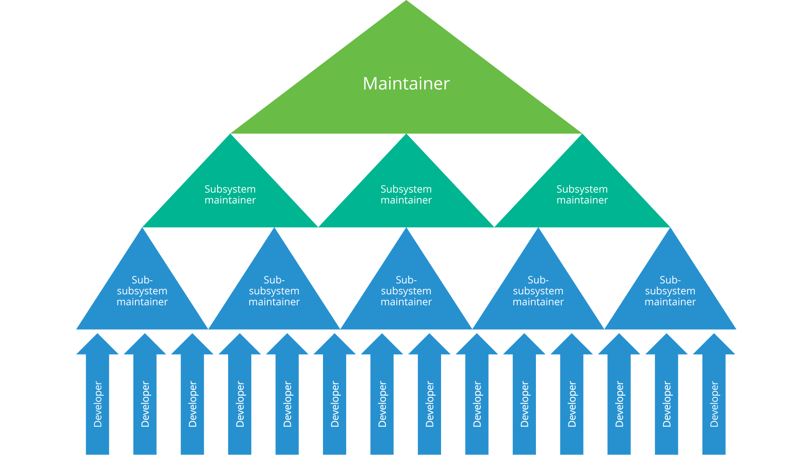

# 章节: 介绍开源

## 课程: 介绍

### 章节概述

在本节中，我们将提供开源、开放标准和闭源软件的定义，并对它们进行比较。我们还将概述这三种元素如何共同作用，提供我们都依赖的技术解决方案。

### 学习目标

在本节结束时，你应该能够：

* 定义开源、开放标准和闭源软件。
  
* 解释这三种概念的异同。

* 理解这三种概念如何协同工作。

## 课程: 定义

### 什么是开源软件？

根据[维基百科](https://en.wikipedia.org/wiki/Software_license)的定义:

**开源软件** (**OSS**) 是一种计算机软件，其源代码在许可证下发布，版权持有者授予用户研究、修改和分发软件的权利，且不限制任何人和任何目的。开源软件可按照公开、协作的方式开发。

我们来详细解析一下这个定义：

**计算机软件**

计算机软件指的是由作者编写的程序或固件。软件的作者可以是一个或多个人，也可能代表一个公司进行工作。程序以机器可读的格式在特定的计算机上运行，这种格式是通过将“源代码”转换为“二进制格式”来实现的。

**源代码**											

源代码指的是一组人类可读的指令，用于表示计算机执行的算法或想法。许多计算机语言可以用来编写源代码，源代码通过编译或实时解释的过程转换为机器可读的二进制格式。拥有源代码可以使你研究和有效修改软件。

**许可证**

许可证是一个**法律文件**，记录和正式表达与软件和/或源代码相关的一系列法律可执行的行为、过程或合同义务或权利。

**研究、修改和分发** 

开源软件的一个基本组成部分是各种开源许可证授予的自由，使个人可以研究软件，为自身目的进行修改，然后将修改后的版本重新分发给任何人用于任何目的。对修改版本的要求因所使用的开源许可证类型而异。有关更多细节将在本课程系列的后续模块中说明。

**协作的公开方式**

协作的公开方式很重要，因为许可证提供的自由允许围绕流行的开源软件形成大规模和多样化的社区，推动创新，并使公司能够贡献和获益于这些软件项目。Linux 就是这种社区的一个关键例子，但还有许多其他的例子，如 Apache Web 服务器、Kubernetes 和 OpenStack。 

### 什么是闭源软件？

不属于开源软件的软件就是闭源软件。根据[维基百科](https://en.wikipedia.org/wiki/Software_license)的定义，闭源软件的解释如下：

**闭源**软件，也常被称为**专有**软件，是非自由计算机软件，其软件发布者或其他人保留超过开源软件允许的知识产权——通常是源代码的[版权](https://en.wikipedia.org/wiki/Copyright)，但有时也包括专利权。

同样，我们来详细解析一下这个定义：

**闭源**

与开源相对，闭源软件的源代码不会由软件的作者提供。提供和安装在计算机上的仅是机器可读格式。例如，很流行的 Microsoft Office 就是这样提供的。

**非自由**

非自由指的是作者分发软件时所使用的许可证不是开源许可证，禁止研究、修改或重新分发程序给任何人。使用闭源软件可能会有费用，也可能没有费用。

**知识产权**

作者不仅保留对源代码的访问权，还保留了用于设计程序的想法和/或算法的访问权。

另一个主要区别是，闭源软件通常由开发团队（通常为公司工作，但不总是）设计和开发，这些团队通常不会与外部社区成员合作（而开源软件通常会这样做）。

### 什么是开放标准？

关于“开放标准”的定义有多种，我们可以在这里综合它们的要点：

**开放标准**是公开可用且免版税的，而“标准”指的是由正式委员会批准的技术，这些委员会对所有感兴趣的各方开放，并在共识的基础上进行运作。开放标准是公开的，并通过协作和共识驱动的过程进行开发、批准和维护。

此外，**开放标准**不应禁止符合该标准的开源软件实现。

让我们更深入地探讨一下：

**公开可用**

标准对公众免费提供。

**免版税**											

这是开放标准与非开放标准之间的重要区别。允许任何人使用标准而无需从实体处获得许可证（或支付实体费用），这种能力对于一个标准能够被广泛采用至关重要。

**协作和共识驱动的过程**

这应该是你从开源的定义中熟悉的，它在这里也很关键，因为它允许更多的观点，并且在各种公司和个人中广泛采用的机会更大。这也有时使得定义标准成为一个漫长的过程。

**符合性实现**										

这是开源倡议（OSI）提出的一个具体定义，OSI 是一个行业联盟，帮助维护已批准的开源许可证以及开源的正式定义。他们的开放标准要求（OSR）进一步明确标准的定义不应排除构建符合该标准的开源软件。遵守这一点可以给那些使用该标准的人带来信心，因为他们在选择实现标准时，既可以选择开源软件，也可以选择闭源软件。

我们每天都依赖许多标准，包括 **TCP/IP**（互联网通信的基础标准）、**HTTP**（万维网背后的协议）、**HTML**（网页作者用于格式化内容的语言）、**GSM**（世界大部分地区的手机通信标准）、**ODF**（用于不同文字处理器之间交换文档的开放文档格式）和 **PDF**（用于生成打印准备文档的便携文档格式）。

在许多情况下，这些标准有开源实现，允许许多个人和组织参与构建和推进这些技术。

**混合与匹配**

在今天的技术环境中，很少有这三种元素（开源、开放标准、闭源软件）是单独使用的情况。

通常，你会遇到开源实现的开放标准（例如 Apache Web 服务器对 HTTP 的实现），但你也会发现实施开放标准的闭源软件实例，例如实现密钥管理互操作协议（KMIP）标准的加密软件公司，从而允许多厂商之间的互操作性，甚至其他开源软件。

你还会看到闭源软件与开源软件一起使用，例如在封闭源操作系统如 Windows 和 Mac OS X 上使用流行的开源 Firefox 浏览器。即便是开源操作系统如 Linux，也用于运行闭源应用程序，如股票交易应用程序和其他金融软件。

# 章节: 开源软件的简短历史

## 课程: 介绍

### 章节概述

在本节中，我们将简要回顾自由软件运动的起源，以及随后的开源软件的诞生。我们将讨论实用主义与理想主义如何影响开源成为组织中业务和技术战略的关键组成部分。此外，我们还将简要讨论开放标准在这一领域的演变。

### 学习目标

在本节结束时，你应该能够：

* 解释自由软件运动如何催生了开源软件。

* 描述理想主义与实用主义的观念如何影响了开源软件的采纳。

* 阐述开放标准的演变及其在这一生态系统中的作用。

## 课程: 自由软件与开源软件

### 漫长而丰富的历史

自计算机时代开始以来，软件共享一直存在。事实上，不共享软件才是例外，而非规则。**开源软件**的概念早于这一术语的使用。有关早期软件的详细历史，有许多资源可以查阅，包括[维基百科](https://en.wikipedia.org/wiki/History_of_free_and_open-source_software)，但我们在这里提供一个简洁的版本。需要注意的是，对这一演变的某些细节存在很多分歧，但了解基本的时间线是很重要的。

在计算的早期（1950 年代至 1960 年代），软件主要由早期计算机公司的学术人员和企业研究人员制作。编写软件既困难又耗时，通常作为**公有领域**作品进行共享。这些作品不归个人作者或艺术家所有。任何人都可以在不获得许可的情况下使用**公有领域**作品，但无法拥有它。软件本身不被视为商品，因为它需要专门的（且昂贵的）计算机硬件才能运行。

在 20 世纪 60 年代末，随着计算机操作系统和编译器技术的发展，构建有效跨平台软件的过程变得更加简便，这些软件能够在多种计算机平台上运行。这直接导致了只专注于软件开发的公司的兴起。1974 年，软件获得了版权保护，这为软件成为重要的商品铺平了道路，这些公司为了保护自己的软件产品进行了不懈的斗争。

十九世纪 70 年代末到 80 年代初见证了仅分发机器可读代码而不提供相应的人类可读源码的趋势。1980 年代初，麻省理工学院的研究员 Richard Stallman 开始了一个项目，编写后来成为 GNU 操作系统的内容（该系统后来启发了现在流行的 Linux 内核）。在此期间，他创立了自由软件基金会（Free Software Foundation），并撰写了[自由软件定义](https://en.wikipedia.org/wiki/The_Free_Software_Definition)，以试图把在 MIT 开发的软件从已经改变和占有它的企业手中夺回。

自由软件基金会的另一个主要成就是创建了 GNU 公共许可证（GPL），该许可证使用“Copyleft”的概念，要求对自由软件所做的任何更改都必须提供给接收自由软件的用户。Linus Torvalds（Linux操作系统的创造者）在 1991 年发布了他的第一个内核，并使用 GPL 进行许可。正如我们现在所知，它已经成为全球大部分技术的基础。

1997 年，Eric S. Raymond 发表了《大教堂与集市》（*The Cathedral & The Bazaar*），这是对早期学术黑客社区和自由软件原则的分析，促成了1998年的一次战略会议，参加者包括了几个行业和自由软件界的个人，其中包括 Christine Peterson ，她创造了“开源软件”一词。在下一节中，我们将探讨这一“品牌”变化的原因。

### 实用主义 vs. 理想主义

“自由软件”和“开源软件”命名争议的核心在于英语中的一种奇特现象。很特别的是，“free” 这个词有两种不同的含义：

* 自由言论中的“自由”，即分发的自由。

* 免费，即“免费啤酒”的说法。

Christine Peterson 和其他支持“开源”的人试图在这里澄清“自由”的概念——明确表明源代码将对外开放以供检查、再分发和修改。随着越来越多的公司参与这些软件生态系统，开源软件的吸引力逐渐增强，很大程度上是因为“自由”软件没有像“专业”开发的软件那样被认为具有价值。事实上，优质的开源软件数量一直在不断增加，而且其中许多是由专业人员开发的。

然而，随着企业参与的增加，自由软件基金会的倡导者和开源社区在世界观上出现了分歧。具体来说，这主要围绕着理想主义与实用主义。

**理想主义**

在这里，“自由”意味着自由而非免费。人们深信，所有软件都应该开放，不仅仅出于技术原因，更是出于意识形态和道德原因。

**实用主义**

在这里，主要考虑的是技术因素，包括更快更好的开发，更多的贡献者和评论者，更容易的调试等。

需要注意的是，更具意识形态的观点同样具有强烈的技术动力，在很多情况下，两者的目标是一致的。例如：

* 用于拯救生命的医疗设备（如心脏起搏器或胰岛素泵）的软件是否应该保密？我们是否没有权利知道这些设备的控制机制？我们如何确定这些设备不会受到可能会对我们的生命构成威胁的外部攻击？

* 用于投票机的软件是否应该封闭？特别是在一项又一项实验表明封闭源代码的投票机存在大量安全漏洞的情况下，我们如何确保能够尊重计票结果的完整性？

不幸的是，这两种开源态度之间的冲突常常是尖锐和破坏性的。这种争论不太可能结束；但需要注意的是，由于企业的参与，实用主义方法拥有大部分经济资源，而更具哲学意义的阵营将始终拥有坚定的追随者。绝大多数开源工作发生在这两个极端之间，但重要的是两者的存在能够为提供有价值的界限。

### 开放标准的演变

在许多方面，标准的演变反映了从自由软件到开源的转变。在这种情况下，三种标准开始发展——封闭标准、*事实上的*标准和开放标准。

封闭标准不是公开的，要求实施者向第三方支付版税，或者两者兼有。例如，最常见的无线标准，包括 4G、蓝牙或 WiFi ，都是封闭标准。这些标准的规范要么因访问限制，要么因知识产权条款而受到限制。

随着软件市场的增长，以及客户需要解决的问题变得如此之大，以至于需要多个专业领域的协作，互操作性显然将成为各类企业的关键要求。

客户开始向供应商施压，要求他们允许异构系统结合最佳解决方案来解决问题。为了实现这一点，开放标准开始发展，允许许多人协作，提出在应用程序和系统之间有效传输数据的方法。一些开放标准一开始并不是有意成为标准的。一些标准始于开源项目，并通过广泛采用成为*事实上的*标准。最常见的例子是 Linux 内核，它已成为某些设备类别的*事实上的*标准，例如在高性能计算领域，Linux 为全球 100% 的 Top 500 超级计算机提供动力。

这里有太多开放标准无法一一列举，但您可以在[维基百科](https://en.wikipedia.org/wiki/Open_standard)上找到一个相当不错的列表。浏览这个列表，你会发现一些你可能知道的（TCP/IP, PDF），以及一些你可能依赖但不太了解的“开放标准”（HTML, USB）。

### 历史正在发生

提供这一历史背景的主要原因在于它既告知了过去的情况，也象征着在软件和技术行业中没有什么是静止的。永远会有如何在自由软件的理想主义方面与商业价值的实用主义方面之间取得平衡的问题。

此外，越来越多的思考围绕计算的伦理方面，以及它如何影响从许可证、知识产权到协作模式的一切。

了解我们在开源和开放标准方面的历史，可以让我们更好地评估未来要走的方向。

# 章节: 使用开源的原因

## 课程：简介

### 章节概述

在本节中，我们将概述开源的社区和协作模型如何确保企业级软件的持续高效开发。我们还将讨论一些将开源与开放标准有效结合以增加价值的潜在方法。

### 学习目标

在本节结束时，您应该能够：

* 描述开源的社区和协作模型。

* 明确阐述开源为企业提供价值的坚实的商业理由。

* 解释如何将开源和开放标准结合以增加技术解决方案的整体价值。

## 课程：为什么我应该使用开源和开放标准？

### 什么是开源社区？

并不存在某种神秘的“开源社区”，让所有开源开发神奇地发生。实际上，有许多不同的开源社区，它们具有许多不同类型的文化。然而，社区的构想可以追溯到计算机早期，植根于学术/企业/共享/黑客的心态。几乎所有社区都具有以下主要特征：

* 开发资源的地理分布。

* 去中心化的决策能力。

* 开发和决策的透明度。

* 精英管理——通过持续有价值的贡献获得影响力。

此外，大多数社区表现出紧密的垂直层次结构与松散的水平结构的结合，这使得小改动（开源的通用语言）可以通过许多快速审查周期向上流动，经过许多快速审查周期，从而提供一系列“制衡机制”以帮助确保软件质量。

一个社区组织结构的示例：

### 这种模型与其他开发模型有何不同？

虽然现代技术公司内部的软件开发团队可以分享上面所示的某些“敏捷”原则，但它们通常存在一些显著的差异。这些差异既不是好的也不是坏的，而是通常出于非常正当的原因存在。然而，它们确实给组织在迈向更多开源社区参与的旅程中带来了挑战。

以下是开源软件项目与企业开发团队最显著的不同之处：

* 影响力和地位不是通过头衔或职位来传达的——精英管理占据主导地位。

* 源代码和决策的透明性至关重要——没有私下的对话或决策。

* 对地理分布团队的支持是内置的——异步的通信模式和文化是常态。

一些组织已经从开源社区中借鉴经验，并将这些经验应用到他们自己的内部努力中（称为“内源”）以利用它们提供的速度和灵活性。这样做还可以帮助建立必要的机构文化，从而更容易参与上游开源生态系统。

### 商业视角

既然我们已经讨论了一些社区的开发模式，接下来让我们来看一下各类规模的企业选择开源作为一种有价值的技术工具来帮助他们解决实际问题的原因。

企业内部使用开源软件具有以下优势：

* 速度
  
* 低成本
  
* 可定制性
  
* 创新性
  
* 安全性
  
* 商业优势
  
* 许可灵活性

我们将在接下来的几节中详细讨论这些优势。

### 开源如何加快开发速度？

开源软件在加速软件开发周期方面发挥了重要作用。一个最显著的例子就是移动设备市场，主要的新产品在6到12个月的周期内发布。开源对于快速演化交付至关重要。

那么开源到底是如何加速开发的呢？

* 获取开源软件通常更快更容易——无需采购订单、合同、工作说明书或许可谈判就可以开始使用。
  
* 开源部署通常更快。与通常漫长且繁琐的商业安装、配置和实施周期不同，开源来自于一种下载即用的文化。

* 不同于收入驱动，领先的开源项目通过社区驱动快速演进。这种快速的决策方式（通常是一种[懒共识](http://community.apache.org/committers/lazyConsensus.html)）使项目能够非常迅速地整合新功能和修复问题。

* 由于广泛的社区测试，成熟的开源软件通常具有更高的质量。事实上，[Forrester Research 研究](https://fossbazaar.org/system/files/OpenSourceForTheNextGenerationOfEnterpriseIT.pdf)表明，软件质量在92%的情况下达到了或超出了预期。

* 开源支持通过源代码、协作社区、接口和工具进行定制。

* 使用渐进交付方法，开源通常可以在数小时内投入使用，而不是数周或数月。

### 为什么开源成本更低？

使用开源软件可以通过多种经过验证的方式显著降低开发成本：

* 最近的一项 [Red Hat 研究](https://www.redhat.com/cms/managed-files/rh-enterprise-open-source-report-detail-f21756-202002-en.pdf) 显示，开源软件的总体成本比商业/闭源解决方案低30%。

* 使用开源软件可以避免功能过剩。许多闭源产品具备的功能超出了客户的实际使用需求，而且这些功能通常是打包销售的，必须支付相应费用。

* 开源有助于防止供应商锁定并促进竞争。即使在使用商业开源供应商的情况下，您也可以自由更换供应商，甚至在不改变应用程序的情况下终止支持。

* 开源还可以降低咨询、培训和支持成本，因为技术并非独家使用。您可以经常从多个供应商获取支持，甚至可以从活跃的开发者社区获得支持。许多公司雇佣来自社区的开发者来支持他们的实现，并将修复贡献回上游项目。

* 活跃的社区通常提供比商业支持协议更高质量的支持，而且是免费的。

### 为什么开源更灵活？

开源提供了比任何第三方软件替代方案都更大的灵活性：

* 使用开源，您永远不会被供应商、其费用、购买结构或再分发条款所束缚。开源实现了供应商独立性和竞争选择。

* 开源通常在部署上有非常宽松的合同限制，或者根本没有限制，因此您可以在平台、用户数量、处理器数量上拥有最大的灵活性。

* 由于您可以访问源代码，您可以创建所需的任何定制，如果这些定制对其他人有价值，社区可能会在未来的版本中支持它们。

* 开源社区鼓励并促进定制，使其更容易扩展解决方案以适应特定用例或与其他产品集成。

* 健康的开源社区提供持续的支持，并鼓励改进的输入和建议。

### 开源如何支持创新？

开源软件最初被构想为通过协作促进开发和创新的一种方式。

开源方法在创新方面的有效性已被证明，因此许多前沿的软件技术都是由开源社区推动的。例如：

* 互联网主要是作为一大批开源项目开发的。

* 软件开发工具的创新和集成很大程度上是开源领域的。

* 移动通信领域的惊人创新速度只有通过开源才能实现。尽管 Android 是主要例子，但即使是像苹果的 iOS 这样的闭源平台也大量地使用了数百个开源软件库和组件构建。

* 像其他互联网部分一样，社交媒体软件平台是从开源软件中产生并通过开源软件发展的。

* 科学计算和大规模并行计算几乎完全是开源领域。

许多开源社区都展现出快速的演进，参与其中可以帮助你加速自身的创新。开源的自下而上式优胜者治理机制将所有权和责任重新引导回开发团队。

引入新软件理念、测试新功能并发展活跃用户群的最佳方式之一是通过开源社区。

最后，开源推动的创新不仅仅是技术创新。开源许可中合同限制的缺少为创造新的用途、新的分发方案、灵活和创新的包装和定价方式以及其他形式的商业和市场创新提供了空间。

### 开源软件的安全优势是什么？

不幸的是，攻击者正在全球范围内针对和攻击软件系统。开源软件和闭源软件都不一定总是更安全的。安全性取决于许多因素，如软件的设计、实现、验证（包括测试）和部署方式。

然而，开源软件确实带有一种*潜在的*基本安全优势。安全软件设计的一个关键原则是“开放设计”，即安全软件设计应假设每个人都知道其保护机制的工作原理。这样可以通过全球范围的同行评审来发现安全漏洞并在软件部署之前修复它们。

当然，潜在的并不总能实现。为了确保安全，开源软件项目必须在开发时考虑安全性，实际进行审查，并在软件部署之前修复这些问题。许多开源软件项目已经采取措施利用这一潜在优势，Linux 基金会也在与各种开源软件项目合作，帮助它们充分利用这一优势。

### 开源如何提供商业优势？

以上所有因素都为您的组织带来了软件竞争优势。

* 在当今快速发展的市场中，能够以最低成本最快速地开发出软件解决方案的公司将获得胜利。

* 目前，开源软件已成为如此主流的现象，如果**不有效使用**开源，几乎肯定会使您的组织处于不利地位。

研究公司 Gartner 对开源软件的看法是：

“**开源无处不在**，它是不可避免的……反对开源的政策是不可行的，并会使您的组织处于**竞争劣势**。”

最近的一份[麦肯锡公司报告](https://www.mckinsey.com/industries/technology-media-and-telecommunications/our-insights/developer-velocity-how-software-excellence-fuels-business-performance)指出，行业中位列前四分之一的公司在创新方面的“最大区分因素”是“开源采用”，这些公司从用户转变为贡献者。报告数据显示，前四分之一的公司采用开源对创新的影响是其他公司三倍。

### 架起开源和开放标准之间的桥梁

在过去几年中，标准领域和开源生态系统之间试图找到更好合作方式的趋势日益增长。尽管有时会遇到一些挑战（主要是在两者的执行速度上存在差异），但仍有许多充分的理由继续倡导两者之间的密切合作关系。

一些已经或正在起作用的项目是很好的例子：

* Linux 基金会的 JDF ([联合开发基金会](https://www.jointdevelopment.org/)) 的努力——如 GraphQL 等项目。

* OASIS Open 的[开放网络安全联盟](https://opencybersecurityalliance.org/)，该联盟为共享网络威胁数据提供现有开放标准的开源参考实现。

* [IETF](https://www.ietf.org/)的口号“粗略共识和运行代码”促成了许多开放标准与开源项目的合作，如 OpenDaylight、OPNFV、OpenStack 等。

标准和开源的进展速度不同，互操作性的实现方式也不同，但能够构建开放标准的开源实现有助于在传统上主要依赖标准的客户供应链中推动更多的开源使用——例如政府、金融和非政府组织等领域。

此外，通过支持标准，开源生态系统还能够与闭源软件进行互操作，这为企业提供了更多的选择和更大的灵活性。
