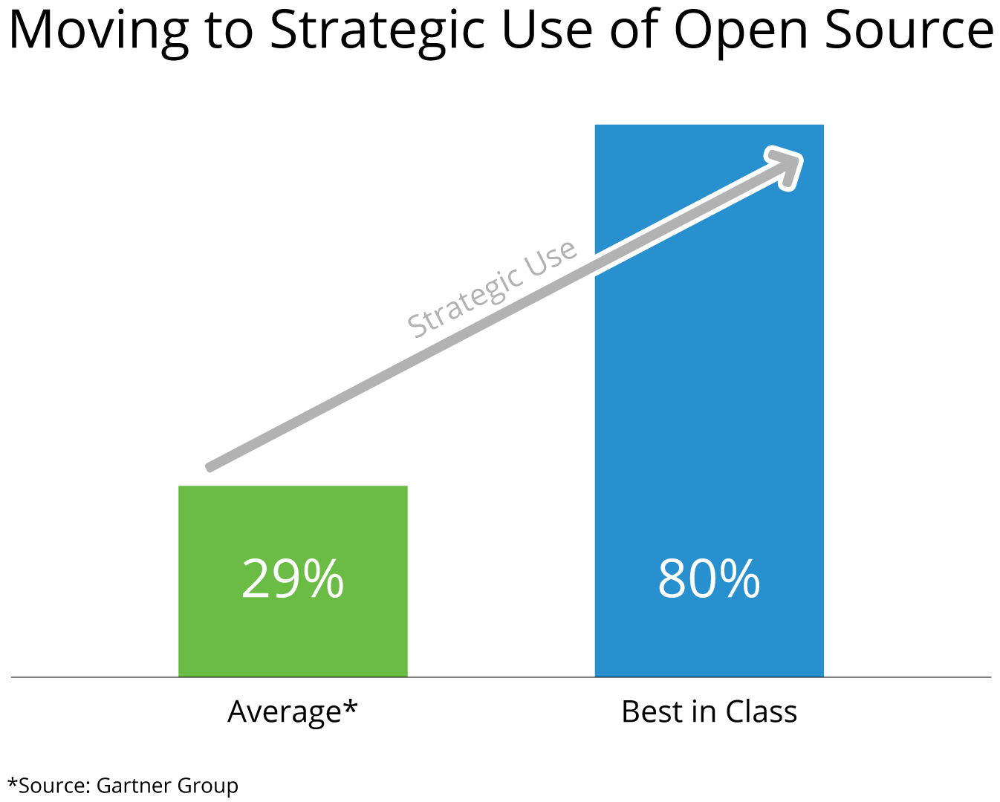

# OSPO 101 - 开源商业模式介绍

## 1. 介绍

### 1.1 课程简介

在本节中，我们将提供几个重要的开源商业模式的定义，以及它们之间的比较。 我们还将讨论每种方法的相对优势和劣势，并重点介绍哪些模型可以用于哪些业务场景。

### 1.2 学习目标

在本节结束时，您应该能够：

- 定义最常用的开源商业模式。
- 解释这些商业模式之间的异同。
- 了解哪些模型最适合哪些业务场景

## 2. 课程：定义

### 2.1 主要的开源商业模式有哪些？

有两种方法可以划分开源商业模式的概念——那些使用开源（大多数组织）的公司，以及那些主要生产开源的公司。 先说消费端。

**消费**

上文重点介绍的 Gartner 最近的一项研究表明，一流的软件和技术组织使用其产品中大约 80% 的软件来自开源，然后在该软件堆栈之上构建其余 20% 的附加值为他们的客户提供产品。这样做可以让他们将有限的工程资源集中在差异化价值上，同时与开源生态系统的其余部分分担通用代码的开发成本。

那些生产开源代码的公司通常分为以下类型的商业模式（尽管他们也可能战略性地使用开源）：

**许可**

这种模式依赖于商业许可和开源许可下的双重许可软件，通常会产生产品的 ”社区版“ 和 “企业版”，客户可以根据他们可能需要的功能进行选择产品。一个例子是 Oracle MySQL 数据库，它在商业许可证和 GNU 公共许可证下获得许可（后面的模块将更详细地介绍许可证）。

**托管**

在此模型中，公司在云托管的 SaaS（软件即服务模型）中提供开源产品。这方面的主要例子是亚马逊（亚马逊网络服务）和谷歌（谷歌云）等公司，它们以强化的、可扩展的、企业级配置托管开源技术。

**支持**

企业往往希望利用开源提供的技术创新，但更关心在开源产品上运行业务。在这种情况下，他们求助于 RedHat 和 IBM 等公司，它们提供支持、技术指导、专业服务和培训，以帮助企业在开源平台上运行业务应用程序。

**开放核心**

这通常涉及一个功能强大的核心产品，它是免费和开源的。围绕核心，商业实体提供闭源软件，以增加或扩展其功能。这些附加组件然后作为商业软件出售，它们也可以与支持模型结合以提供扩展的培训和技术支持。

### 2.2 比较开源商业模式

在比较这些开源商业模式时，重要的是要注意不同的企业选择特定模式的原因不同，并且如上所述，有时会出现组合模型的情况（例如 Open Core & Support）。以下是企业选择每种模式的一些主要原因：

**消费**

当您的企业拥有差异化的知识产权但需要降低成本和复杂性时，战略性地使用开源软件并在该开源基础平台之上构建您的产品或服务，您可以访问共享创新，您可以利用这些创新来构建引人注目的产品，而无需自己建造一切。

**许可**

利用双重许可策略，您有机会获得产品 “社区” 版本的消费和共享投入的价值，同时销售产品的“企业”版本以实现收入并继续资助 “社区版“。它还使您能够让客户 “先试后买”，并有可能发展他们的业务以要求访问您的付费企业版。

**托管**

提供开源项目 / 产品的托管解决方案允许已构建基础设施以支持代码的公司为自己的利益提供相同的软件作为服务给他们的客户。与许可模式类似，这允许组织从软件中获得收入，这有助于资助他们的托管基础设施，并允许他们继续开发开源项目。

**支持**

如果一家技术公司拥有内部专业知识并因为一个或多个开源项目做出贡献而享有盛誉，则提供这些项目的 “强化” 企业版本并与技术支持和培训捆绑在一起，使他们能够继续在该开源项目中工作项目，并让他们为客户提供一个坚实的基础平台，然后他们可以在该平台上可靠地运行业务软件。在 RedHat Enterprise Linux 上运行的股票市场就是这种模式的一个很好的例子。

**开放核心**

这种商业模式可以很好地运作，但如果社区认为在开源代码之上提供的闭源扩展理所当然地成为开源核心的一部分，它也会给组织带来不良声誉。这种模式需要一种微妙的平衡，即提供大型企业愿意支付的附加值，同时仍然允许项目的免费社区版本对个人以及中小型企业有用。
