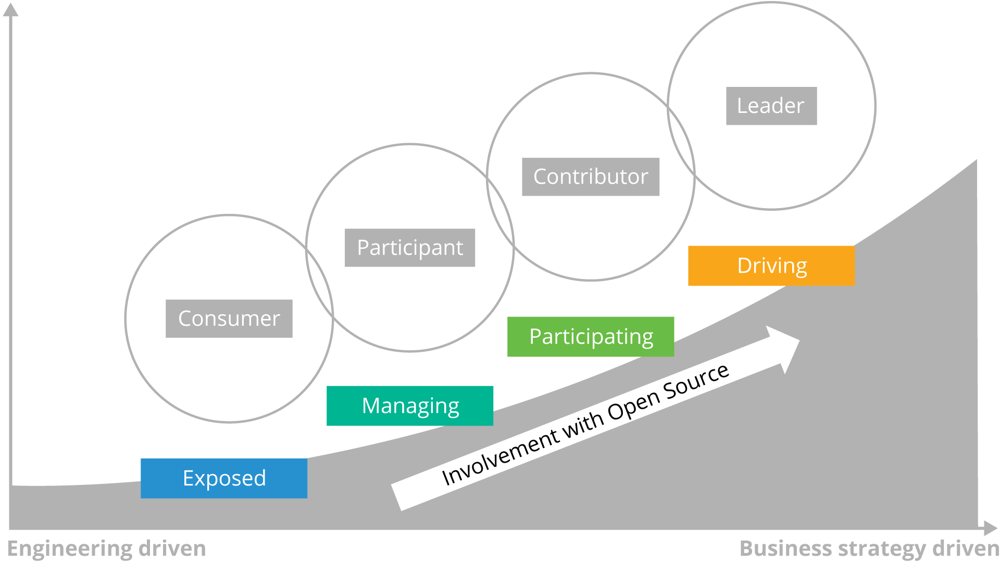
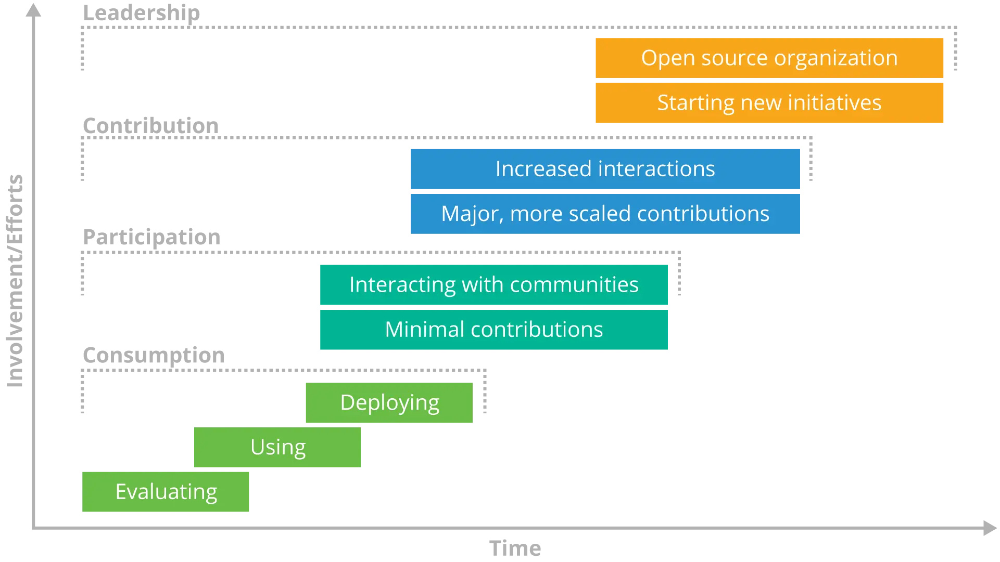

# Section: Developing an Open Source Strategy

## Lesson: Introduction

### Section Overview

In this section, we will show how to create an organizational open source strategy, discuss the value and need for doing so, and then discuss considerations for how the strategy will affect the implementation of open source policies.

### Learning Objectives

By the end of this section, you should be able to:

- Explain the need and value for creating an organizational open source strategy

- Describe the different types of strategies an organization might utilize

- Articulate a phased implementation plan to help turn the strategy into organizational policies

## Lesson: Overview of an Open Source Strategy

### What is an Open Source Strategy?

Strategy is a very broad term that we could discuss (or argue about) for hours, but we mean something very specific when we talk about Open Source:

- A concise, high level document

- Based on the organization’s business objectives

- Maps business objectives to open source software use and management directives

The strategy must be understandable to everyone that participates in open source related activities. It becomes the reference document for establishing agreement on future open source policies and processes. On an ongoing basis, it is an important tool for making new decisions, and for establishing program buy-in and commitment.

Many organizations also use an Open Source strategy as a vehicle to establish a mandate for implementing open source best practices and policies.

### Major Questions to Ask

In creating a practical open source strategy, three major questions must be answered. (The first two questions can be addressed in either order.)

**Where does the organization want to use Open Source?**

This question is critically important because the best practices for managing open source are quite different for various use cases. For instance, using open source tools internally poses little-to-no risk and does not require any license compliance regimen, but embedding open source in software that is distributed requires much more consideration and enabling elements.

**What business objectives are met by using Open Source?**

We’ve already talked about why companies use open source software. Getting clarity and buy-in as to which of these are important will greatly facilitate decision making on the next levels of detail.

**What will your organization do to ensure achieving Open Source business objectives?**

These are the decisions that create a mandate for an open source management program. Ideally they reflect industry best practices for getting the greatest advantage from open source while efficiently managing accompanying risks.

## Lesson: The Value of an Open Source Strategy

### Climbing the Open Source Ladder

Open Source can be a complex topic, when you factor in everything from licensing to community dynamics, talent acquisition and business dynamics. There are several stops on a typical organization’s journey in open source:

Let’s take each of these and break them down:

**Consumer**

The most common starting point for organizations is as an open source software user in their commercial products. Aggressively consuming open source components will increase your ability to differentiate and reduce overall time and cost to deliver commercial products. Here are the necessary components of the open source consumption strategy:

- A strategic classification scheme to guide decisions on what open source software to consume

- Ensure the company meets all obligations of its use of open source software

- Deploy automated workflow software for evaluating/approving open source usage

- Establish an Open Source Review Board (OSRB) to serve as a clearinghouse for all Open Source activities

- Create incremental investment in headcount and infrastructure in engineering, product management, and legal to manage a mix of closed source / open source software

**Participant**

Once your company is successfully using open source software in products or services, you can expand your strategy to participate in the open source community. Unless you have already hired experienced developers from the community, you will first need to engage more closely with the community to increase your visibility and to begin attracting the talent you need. Here are the necessary components of the open source participation strategy:

- Monitor community communication platforms like chat servers, mailing lists, forums, and websites to stay informed about project developments

- Attend relevant conferences and meetups to establish a relationship with the community

- Sponsor project events and foundations to improve visibility within the community

- Educate developers on how to participate in and contribute to open source projects

**Contributor**

As your company’s participation increases and you begin contributing code to an open source project, you need to selectively engage with targeted projects and communities to drive your company’s needs. Contributing to strategic open source projects can help your organization gain additional value as code contributions can help shape future features in the project that meet a company’s needs.

Here are the necessary components of the open source contribution strategy:

- Hire a staff director to lead open source strategy and manage the OSRB

- Hire contributors and committers to key open source communities that are critical to your products

- Deploy open source collaboration tools to support open source usage and contributions

- Add open source developer resources

- Incrementally invest in engineering, product management, and legal to engage with existing external communities

**Leader**

If a piece of open source technology becomes critical to your business or product, you’ll likely want a say in the strategic and technical direction of that project. Unlike traditional software however, you cannot necessarily ‘buy’ your way into or influence the leadership simply with money. In open source projects, those who do the work are the ones who get to help set the direction.

The final step in the open source strategy ladder is leadership. This scenario builds on all of the prior scenarios to capitalize on emerging trends in technology to establish a leadership position.

Leadership roles in existing open source communities are earned by establishing trust with the project members and by maintaining a high level of continuous contribution to the project.

This scenario requires significant investment in targeted open source communities and consortia to establish a leadership agenda. Here are the necessary components of the open source leadership strategy:

- Increase engagement with targeted open source communities

- Selectively engage with open standards to drive the company’s needs

- Engage with open source foundations

- Establish an open source project, organization, or foundation

- Significant investment primarily in engineering, product management, and legal to establish leadership in external communities and industry consortia

### Consider Your Current and Future Needs

As you can see, the natural evolution of an open source strategy is built on a series of steps that require an increased investment over time. It’s important to note that the decision for what role your organization should take is different for every open source project or codebase that you use.

In some cases, it may be acceptable to be a simple consumer of a small, solidly maintained open source project, but in other cases, if the open source project becomes a core element of your product or technology, you may need to consider being an active participant and/or contributor.

If the open source project is fundamental to your business and products, it’s a good idea to strive to be a leader for that effort, especially if it’s an open source project your organization helped to start.

Another important element to consider is that the level of involvement your organization may have in a project will change over time. Building a strategy is not a ‘one and done’ event. Be prepared to periodically review your open source strategy at regular intervals (6 months - 1 year is the typical time frame) to determine if you need to adjust your participation based on business or economic factors.

## Lesson: Implementation Considerations

### Phased Implementation

Open Source has an often quoted phrase ‘release early, release often.’ In the context of coding, this translates to many small changes that build upon each other over time, allowing for complete and easy code review of all changes, as well as more robust code because the changes provided are easier to test and debug.

The same model can and should be used when developing your open source strategy. By starting with a basic strategy that is tied to your short-to-medium term goals, you can begin to engage with open source projects and communities and then adjust your strategy (and the ensuing policies you’ll need to develop) as your organization becomes more comfortable and confident with the ways of open source.

In general, the phased approach usually follows the ladder graphic shown previously:

- Build a strategy (and policies) for consuming open source in an effective and efficient way

- Begin to participate in open source projects and communities by interacting/asking questions, reporting bugs, etc.

- Make small contributions at first (even if they are not code - documentation is a great way to get started)

- As you become more familiar and dependent upon an open source project, increase your contributions

- If you need a ‘seat at the table’ (or you helped start a project), make sustained and valuable contributions and investments in the open source project

### Implementation Considerations of Your Strategy

While we will cover the creation of open source organizational policies in the next section, this is a good opportunity to consider the ramifications of your strategy on policies you’ll be putting in place to implement your strategy.

The biggest considerations you’ll need to think about are time and money. How much time do you have to use when implementing your strategy? And how much resources (money and staff) are you prepared to put towards implementation of your chosen strategy?

**Time**

Like almost anything else in technology, working effectively with open source takes an investment of time - this is both in terms of human resources (staff) as well as effectively understanding and planning for the release cycles of the open source projects you’ll be using. Not every project has the same release cadence, and you’ll need to be cognizant of that as you put policies in place to determine which versions of code you consume, and when.

While we’ll cover security and keeping up-to-date with new open source releases in other modules, be aware that you’ll have to consider what time frames you’ll make decisions in regarding both consumption and staff participation in open source projects.

**Money**

In the Open Source Introduction module, we briefly covered that open source may be ‘free’ from a licensing cost, but by no means does that mean that it doesn’t have other costs associated with it.

Effectively participating in open source, whether simply consuming it effectively and strategically, or driving a particular standard costs money, primarily in the staffing area. You don’t need to start with a giant staff (more on that later), but you should be considering the needs you’ll have both in terms of software engineers and support staff (legal, business, project management) as you begin to put policies into place to help govern your organization’s open source efforts.

Considering time and money elements (and starting slowly with sensible plans to adjust over time) is the best method of making sure that the policies derived from your open source strategy succeed in the long run.

### Strategic Objective Examples

Here are some examples of objectives you may define as you go through the process of building your strategy - this is by no means an exhaustive list - your organization may have all of these, or potentially others not included in this list:

- Increase innovation through collaboration with technology leaders

- Speed deployment by using already developed and tested code

- Lower development costs by using free, already debugged code

- Lower deployment cost by using free alternatives to commercial tools and components

- Lower code maintenance costs by taking advantage of community maintenance

- Offer interoperability with other open source software

- Facilitate the creation of new capabilities by partners or customers

- Establish new markets or de facto standards

- Recruit and retain top technical talent

### Examples of Actions To Take

While we will go into more detail about how to define open source policies in the next section, here are some sample actions you could take in support of the objectives you define while building your strategy:

- An evaluation policy and acquisition process that

  - Chooses well among open source, available commercial and internal development options

  - Insures licensing terms compatible with your use and IP strategy

  - Considers support and lifecycle costs

- A code tracking policy and process that provides accurate knowledge of what software is used where

- An audit process that insures that you follow set policies

- A compliance process that insures that all OSS license requirements are consistently met

Action is where "the rubber hits the road" in an open source strategy. Targeting specific objectives creates the mandate for and shapes the open source management program.

The actions above are the most basic elements of a full open source management program; however, some organizations may not need all of these elements. For instance, an organization that never distributes open source in its products does not usually need to implement a license compliance process. Some organizations add other actions such as: software support and maintenance, steps to insure software security, objectives around open source contributions or leadership, or a specific mandate for executive involvement.

Some organizations will prioritize the actions in their strategy statement to indicate urgency or order of execution. Some organizations find it useful to assign owners to the individual actions.

As the development of your open source management program moves to the next phases, these action statements are driven into the policy and processes that implement this strategy.