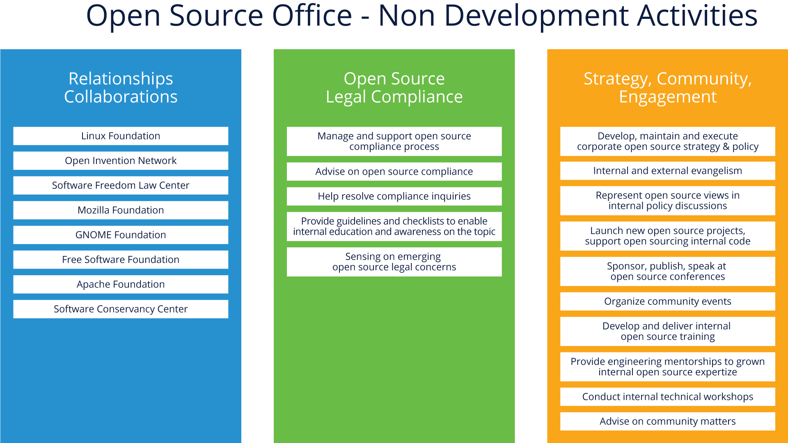
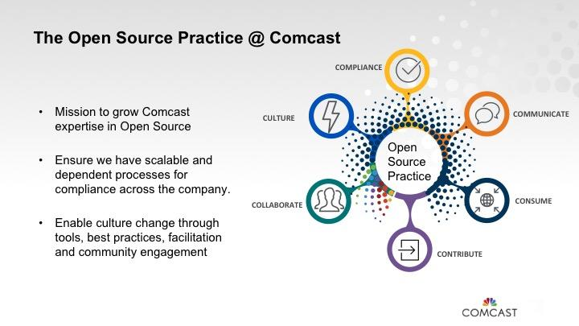
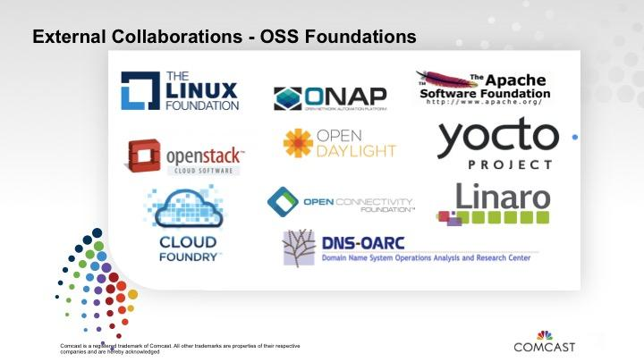

* 一、介绍

  ## 1.1 课程：简介

  在本节中，我们将定义和解释 OSPO 的组成，以及有关该构造在帮助大规模有效管理开源方面的作用和价值的信息。

  ## 1.2 学习目标

  在本节结束时，您应该能够：

  - 定义什么是开源项目办公室 (OSPO)
  - 解释 OSPO 在您的组织中扮演的角色
  - 阐明 OSPO 为企业带来的价值

  # 二、课程：定义

  ## 2.1 什么是开源项目办公室？

  如上面的介绍性文本中所述，开源计划办公室 (OSPO) 旨在成为贵组织与开源工作的中心纽带。但是，该定义（故意）留下了很大的可变空间。有些人可能会说这会降低价值，但事实上，OSPO 根据不同的组织有不同的定义，这一事实实际上是一种优势，因为它让您可以塑造此结构（并经常更改它）以满足各种需求你可能会在你的开源之旅中。

  例如，某些组织的大部分上游开源工作在其 OSPO 中由代表组织工作的特定开发人员进行，以便将产品支持所需的更改纳入开源项目。但是，在某些组织中，这些开发人员分散并嵌入产品开发团队中，并由 OSPO 人员提供建议和培训。

  没有“一刀切”的模型，OSPO 可以是任何东西，从拥有大量资源的高度集中到小而分散，依赖于整个组织的资源的影响和培训。可以在 TODO Group 的 github 存储库中的工作中找到有关 OSPO 是什么的很好的概述资源。

  ## 2.2 OSPO在企业中的作用

  开源项目办公室的主要职能是推动企业内部对开源的消费、贡献和创造，以获得战略优势。

  项目办公室的职责各不相同。这些包括：

  - 清楚地传达公司内外的开源战略
  - 拥有并监督战略的执行
  - 促进开源在商业产品和服务中的有效使用
  - 确保向开源社区高质量和频繁地发布代码
  - 与开发者社区互动并看到公司有效地回馈其他项目
  - 在组织内培养开源文化
  - 维护开源许可证合规性审查和监督

  重要的是要重申，并非所有 OSPO 都具有所有这些功能，或者必须均匀分配他们所从事的工作。项目办公室所做的很大一部分取决于组织的业务需求。

  应该强调的一件事是，OSPO 不仅仅与开发人员合作 - 他们还有许多可以协助的非开发活动，如下所述：

  图片来源：TODO Group OSPO 指南 (https://todogroup.org/guides/)

  

  ## 2.3 OSPO 的价值

  一个成功的办公室可以通过建立支持开发人员及其团队的政策、流程和指南来极大地受益于企业的开源使用。它鼓励标准编码和组织实践、流程和工具集。同时，项目办公室可以帮助避免或消除不必要的、僵化的流程，创意开发人员可能会规避或忽略这些流程，从而威胁项目的安全性和其他方面。

  当业务部门开始在其计划中考虑开源时，开源项目办公室会为对话带来实质内容和事实，以便充分了解考虑开源的原因、后果以及实现其目标所需的条件.通过让开源专家帮助构建对话，利益相关者知道从哪里开始以及在权衡他们的决定时要考虑什么。

  计划办公室还充当内部开发人员和开源用户社区之间的重要联络人，以解决和理解出现的问题或要求。项目办公室可以协助解决法律问题，为开发人员提供支持，并为基于公司开源项目的外部用户发声。项目办公室还可以帮助将这些信息传递给公司内部的其他人，包括产品管理团队，以有利于组织的方式进一步推进产品。

  # 3. 建立一个有效的开源项目办公室

  ## 3.1 简介

  在本节中，我们将展示如何创建一个有效的开源计划办公室，包括有关角色、治理、流程和结构的信息。

  ## 3.2 学习目标

  在本节结束时，您应该能够：

  - 描述形成新 OSPO 的主要步骤
  - 描述可能成为 OSPO 一部分的不同角色和结构
  - 阐明如何将治理和其他流程构建到 OSPO 中

  ## 3.3 创建开源项目办公室

  ### 3.3.1 从哪里开始？

  每家公司都是不同的，在启动 OSPO 时会有不同的需求。该过程可以自上而下开始，并得到高层管理人员的支持；或者自下而上，一小部分开发人员和开源爱好者一直在使用开源并希望看到它正式化。

  它可以表现为围绕法律问题和安全制定指导的愿望，或者可以从成熟的草根努力开始并吸引企业领导人的注意。它甚至可以从一位有远见的 CEO 或 CTO 开始，他们支持通过深化对开源的承诺来推动公司向前发展并增加价值的事业。

  这种共识和执行支持对于获得牵引力和推动启动 OSPO 的过程至关重要。您的开源计划办公室之旅的起点对您的组织来说是独一无二的。但是，我们将在接下来的页面中介绍您应该考虑的一些关键步骤。

  ### 3.3.2 寻找领导者

  无论您的计划如何开始，重要的是要找到合适的领导者来帮助开发并在公司内部运行刚刚起步的项目办公室。顶级候选人将对开源的工作原理有详细的了解，以及作为现有开源项目的开发人员、贡献者或提交者工作的一些技术印章。

  他们应该对贵公司的业务以及商业敏锐度和管理技能有广泛的了解，以帮助制定跨业务部门的战略和计划。他们需要善于交际，以便向他人传达热情、知识和信息，并帮助他们了解开源计划将如何为公司带来变革、改变和改进。

  项目办公室的负责人需要能够与人们谈论深层技术，但他们不必了解每一项正在发挥作用的技术的来龙去脉，因为他们的主要工作将是帮助制定详细的讨论将发生在多个利益相关者之间。

  ### 3.3.3 定义您的操作

  新项目办公室所需的预算、人员配备、技术工具和系统也是建立其业务需要解决的关键问题。一些公司从兼职经理开始，但了解到他们只能通过这种方法获得这么多。让某人担任全职工作是启动该计划的坚实一步，同时还有少量支持人员以保持其灵活性。

  一个定义明确的开源项目办公室的一个例子是推动所需的政策、流程和工具，同时还遵循消除摩擦的咒语，使用工具来自动化可以简化的内容，并委派需要的任务来完成。我们将在以后的部分中详细介绍如何设置策略和流程。

  项目办公室必须提供结构化的政策和流程，但也要保持灵活性。当开源用户和贡献者需要帮助时，该办公室更像是一家咨询公司，在提供指导的同时仍允许员工做出与其工作相关的个人或团体业务决策。

  ### 3.3.4 寻求反馈和支持

  建立开源项目办公室不是凭空而来的事情。因为它将在您的业务中发挥核心作用，所以成功创建它需要企业内部所有相关方公开、诚实的投入和反馈。确保从高管到开发人员的每个人在其创建过程中都有发言权，这将有助于为这项工作提供广泛的支持。

  了解您的公司正在使用开源做什么，需要从多个利益相关者的角度思考您的组织真正关心的核心问题。尽早寻求此反馈并确保将其反馈到您的 OSPO 部署计划中，这将对项目帮助定义的流程和策略的接受和成功大有帮助。

  ## 3.4 定义OSPO结构

  ### 3.4.1 OSPO 应该在哪里？

  那么开源项目办公室应该如何以及在哪里适合公司的组织结构呢？它应该在工程部门内部吗？还是在法律部门、CTO 办公室或其他特定业务部门？同样，这取决于您公司的主要业务和您的开源战略。

  让我们在此重申，对于您的 OSPO 应该驻留在何处，并没有“一刀切”的所有答案。在接下来的页面中，我们将讨论一些最常选择的项目办公室位置，但此列表绝不是详尽无遗的。

  ### 3.4.2 OSPO 作为法律团体的一部分

  对于拥有大量知识产权组合的公司，这可能意味着开源项目办公室可能非常适合法律办公室，在那里开发人员可以就出现的问题与法律团队密切合作。这可能非常适合硬件公司，因为它总是担心可能会遇到与 IP 相关的法律问题。

  然而，这种方法的一个挑战是，法律部门下属的 OSPO 最终可能会将他们的大部分时间集中在合规问题上，从而减少了鼓励开源贡献和与外部开源社区联系的其他机会，这些机会可能有益于从长远来看，该组织。如果您决定将您的 OSPO 托管在法律团队中，您将需要一位强大的领导者，他可以在团队角色的合规性方面与与开源社区互动的更具前瞻性和战略性的政策之间取得平衡。

  ### 3.4.3 工程中的 OSPO

  更受工程驱动的公司通常选择在其工程部门内维护其开源项目办公室。这使他们能够直接将精力集中在使开发人员在工作中更加有效和高效。

  在许多情况下，这些计划办公室向 CTO 或在某些情况下向 CIO 报告。在拥有强大/关联产品集的组织中，办公室可以向产品开发副总裁或工程副总裁报告。在拥有不同产品组合的公司中，通常最好将 OSPO 安置在 CTO 办公室内，因为这使其在帮助所有工程团队制定政策和教育工作方面拥有最广泛的视野和自由度。

  这种方法的一个缺点可能是不太关注合规活动（与与法律小组一起主持 OSPO 相比），但同样，强大的领导者可以在这里提供必要的平衡，如果做得好，它如果开发人员认为流程轻量级且不繁重，则可以提高开发人员的合规性。

  ### 3.4.4 OSPO 作为开发者关系/营销的一部分

  对于某些组织，开源办公室位于营销组内部，因为他们使用开源来汇集潜在客户，旨在销售他们使用开源构建的产品。如果一个组织需要与关键的开源开发人员和项目建立密切的联系，那么将 OSPO 托管在像开发人员关系这样的小组中可以提供这种支持。

  当然，OSPO 仍然必须能够根据需要在合规性和教育领域中执行其他所需的角色。

  ### 3.4.5 实施注意事项

  在决定将您的 OSPO 放置在组织中的位置时，另一个需要考虑的重要因素是您计划采用集中式还是分散式方法。

  在较小的组织中，拥有一个集中的开源程序办公室，将所有用于消费、协作和创建的工作流都集中在一个中心位置可能会很好地工作。它确保方法和合规性的最大一致性，但随着组织的发展，它也可能变得笨拙。

  中心化组织有时也会接待主要开发人员，他们将代表组织为上游开源项目做出贡献。这些开发人员通常充当产品团队的内部顾问，他们可能缺乏培训和专业知识，无法独自为开源项目做出贡献。

  但是，一旦您的组织变得足够大，分散的方法通常效果最好，因为您可以专注于教育和为开发人员和管理人员提供咨询资源，以做出与整体组织政策一致的关于开源的产品特定决策。这种方法还可以在整个组织中传播开源知识，并有助于培养更加开放和协作的文化，这是与更大的开源生态系统合作的重要特征。

  在本模块的后面部分，我们将分享案例研究，以举例说明其他组织如何做出这些结构性决策。

  ## 3.5 OSPO角色

  在创建开源项目办公室时，必须确定开源项目经理、公司法律团队以及任何由工程师和高管组成的审查委员会的角色和职责。此外，随着 OSPO 的发展，可能会有其他角色为组织提供价值。在接下来的几页中，我们将更详细地介绍这些角色。

  ### 3.5.1 项目经理

  为了获得最大的效率，项目经理应该被授权为行政级别的职位，直接监督和亲自管理公司在开源活动中的利益。这将为他们提供所需的工具，以引领企业内部朝着其开源目标和愿景迈进。

  一些公司选择使用类似于审查委员会的开源执行委员会。这样的小组通常由公司内部所有主要业务部门的高层领导组成，对政策变化和引入提供董事会式的指导，为开源计划设定优先级，并协助推动组织行为的变化。

  ### 3.5.2 法律

  与公司内部的所有其他职能一样，法律团队必须在开源项目办公室的运营中拥有发言权，以确保遵守法律、开源许可协议和其他法律细节。具体到开源，法律团队需要负责确保公司可以在内部使用代码并以可接受的条件回馈项目。

  较大的组织应考虑聘请或培训专职律师为其开源计划提供建议。但您也可以聘请兼职、知识渊博的工作人员或外部法律顾问。与在开源许可和知识产权方面知识渊博且经验丰富的律师合作通常很有帮助，因为它可能是与商业合同或标准相关的专门的、有时令人困惑的法律领域。

  ### 3.5.3 合规团队

  开源合规团队是一个跨学科的团队，由负责确保开源许可合规性的不同个人组成。核心团队，通常称为开源审查委员会 (OSRB)，由工程和产品团队的代表、一名或多名法律顾问以及合规官（通常是开源项目经理）组成。

  扩展团队由多个部门的不同人员组成，他们持续为合规工作做出贡献。这些可能包括文档、供应链、企业发展、IT、本地化和开源执行委员会 (OSEC)。但是，与核心团队不同的是，扩展团队的成员仅根据他们从 OSRB 收到的任务，兼职从事合规工作。

  ### 3.5.4 开发者关系、宣传和布道者

  开源开发人员关系和布道者对于刚刚起步的开源项目办公室很重要，因为他们可以在公司的开发人员社区中为特定项目建立兴趣和热情，这有助于增加工作量并增加工程师之间的团队合作。布道者经常参加会议和技术活动并解释什么是开源，以帮助观众了解如何使用它以及它提供哪些挑战和机遇，同时与开源社区分享他们的企业经验。

  ### 3.5.5 其他

  此外，创建其他工作角色对于开源项目办公室的成功也很重要，包括工具管理员、培训经理、工具和系统的集成开发人员、部署支持人员和实施项目负责人。例如，工具管理员需要帮助为从事开源项目的工程师选择、提供和集成所需的工具，同时还要确保这些工具满足企业的许可和其他要求。

  ### 3.6 定义OSPO流程

  ### 3.5.1 概述

  在解决 OSPO 的结构和人员配备要求后，下一步是制定明确定义的政策和流程，这将使贵公司的开源战略得以一致实施。

  这些政策应列出在整个公司范围内使用开源的要求和规则，以及记录和可执行的流程，以确保这些规则在日常基础上得到遵守。

  至关重要的是，这些流程应该需要最少的开销，并在审查现有开源政策和流程时努力反复消除、自动化和委派，以便不断质疑和更新规则以简化程序。这意味着要问为什么政策甚至到位以及如何为用户改进它们。

  即使这些规则是为开源项目办公室精心制定的，公司也必须准备好随着时间的推移，随着业务的变化以及开源项目的成熟和发展，根据需要发展和修改规则和程序。

  ### 3.6.2 要问的问题

  在起草开源政策和流程时，需要讨论的许多主题包括：

  - 贵公司的员工如何为开源项目做出贡献
  - 贵公司如何开源内部项目
  - 贵公司如何接受外部对其开源项目的贡献
  - 如何准备开源版本
  - 如何获得批准
  - 开发人员如何使用他们在 GitHub 和其他代码存储库中找到的开源代码
  - 解释如何将开源代码引入贵公司的程序和规则
  - 如何对传入的代码进行编目，以便其他人知道它正在被使用
  - 公司如何围绕其发展志同道合的外部开发人员社区以保持其蓬勃发展
  - 有助于确定代码何时应作为开源发布或作为知识产权保留的规则

  这些问题的答案有助于为未来的政策和流程提供信息 - 我们将在以下页面中介绍这些政策的一些示例。

  ### 3.6.3 代码发布政策

  OSPO 的一个重要目标是帮助开发人员成功地为开源项目做出贡献并发布他们自己的项目。指南和清单确保开发人员拥有将代码作为开源发布所需的一切，而不会遇到许可或保密问题。特别是对于新的贡献者，在做出贡献之前，将内部审查过程作为一个安全的地方来获得反馈也很有帮助。

  您的组织还应努力采用“上游优先”的发展政策。通过首先向上游开源项目提交补丁，然后将它们合并到您下游自己的产品中，您将避免在每次发布后花费大量时间和金钱进行重新设计。

  ### 3.6.4 接受捐款的政策

  如果您最终创建了自己的开源项目并且它们不是托管在一个中立的基金会，您将需要为您的公司创建程序以接收外部开发人员对这些项目的贡献。

  当然，这是将您公司的开源代码发布到其他社区并邀请其他开发人员对您自己的项目产生兴趣的好处之一。因为在宏伟的计划中，即使他们不是您的正式员工，您也可以让来自世界各地的优秀人才为您公司的代码工作，使其变得更好并扩展其能力。这种协作对公司很重要，也是许多开源项目办公室的共同关注点。

  ### 3.6.5 促进采用的政策

  您还想鼓励其他人在他们的产品和服务中使用您的代码。这是构建生态系统的关键，而生态系统反过来又有助于发展和维持您的开源项目。开源使用政策可以有多种创新形式。

  例如，Red Hat 有一个独特的政策，在大多数情况下，从一开始就默认将其新创建的代码开源。这意味着在公司内部开发每一款软件时，都假设未来它可能注定要作为开源发布。

  由于这种审查，开发人员在编写开源代码时倾向于以更好的方式构建事物，从而在他们的工作中创建具有更少或改进的代码依赖性的更清晰的代码。

  ### 3.6.6 内部消费政策

  其他需要的政策包括关于您的团队如何以及在何处为开源软件的使用和创建找到可信来源的规则、关于建立代码管理和维护程序的政策，以及为您的项目正规化社区互动的政策。

  开源使用政策确保进入产品库的任何软件（专有、第三方或开源）都经过审核、审查和批准。它还确保您的公司在您的产品之前有一个计划来履行因使用各种软件组件而产生的许可义务。

  # 4 附加信息和案例研究

  ## 4.1 简介

  在本节中，我们将提供一些已建立开源计划办公室的组织的案例研究，并提供一些指向其他信息的提示，这些信息将帮助您开始创建 OSPO 以实现更有效的开源计划管理。

  ## 4.2 学习目标

  在本节结束时，您应该能够：

  - 描述几个开源程序办公室实现之间的主要区别
  - 知道去哪里获取有关构建您自己的 OSPO 的其他信息

  ## 4.3 案例研究

  ### 4.3.1 概述

  如前所述，每个组织的开源项目办公室可能都不同。 这反映了不同商业模式的现实以及每个组织当前的开源成熟度和意识状态。

  为了给出一个相当广泛的视角，我们选择了三家公司及其 OSPO 创建历程作为案例研究。 这些组织慷慨地捐赠了他们的开源领导者和管理团队的时间来构建这些案例研究，希望它们对开始开源之旅的其他人有用。

  我们的案例研究来自：

  - 康卡斯特
  - 微软
  - Salesforce

  在这些研究中，您将看到不同的工具、组织甚至指标方法。 这些研究是在 TODO 组（Linux 基金会倡议）的支持下进行的，我们将在本模块后面提供指向其他信息的指针。

  ### 4.3.2 康卡斯特

  康卡斯特对开源的参与是一个逐渐演变的过程。该公司最终创建了两个开源项目办公室，一个用于 NBC 业务，另一个用于业务的有线电视方面，这是本简介的主题。

  Comcast 于 2006 年左右开始为开源做出贡献，当时首席软件架构师 Jon Moore 为 Apache HTTP 做出了补丁贡献。他向管理团队展示了将补丁整合到主项目中比单独维护它更具成本效益。

  摩尔与跨学科团队合作，成立了一个开源咨询委员会，该委员会由法律和技术主题专家组成。他们审查了贡献并创建了专注于良好开源实践和社区建设的内部指南。 2013 年，当他们开始跟踪这些贡献时，他们有 13 个。今年，他们计划将其增加近 10 倍。

  “当公司建立开源实践时，他们发出了一个重要信息，即我们对开源是认真的，我们想投资它。” – Nithya Ruff，康卡斯特开源实践高级总监。

   **开源程序实践的六个 C** 

  2016 年，康卡斯特聘请 Ruff 领导一项日益重要的开源战略。 这种做法得到了康卡斯特领导团队最高层的支持，他们想要一个能够提出问题、教育员工并提高意识的组织。

  开源项目实践有 3 名全职人员（截至 2020 年 6 月），同时依靠法律、工程、IT、公关等领域的功能专家来帮助扩展项目。 目标是指导、指导、建议、推荐和作为员工的顾问。 Ruff 用“六个 C”总结了开源实践的功能：消费、贡献、合规、沟通、协作和能力建设。

  

  开源实践有两个主要目标。

  - 让公司内部的人更容易在开源中工作。 无论是对开源的消费、对开源的贡献，还是与社区、基金会和组织的合作，目标都是消除法律、流程、工具、沟通和意识障碍。
  - 在开源和技术社区中对外可见。 许多人不知道 Comcast 是一家拥有数千名开发人员的技术公司，因此他们想提高认识并分享他们正在做的事情。

   **开源贡献** 

  除了对现有的开源社区（如 OpenStack）做出重大贡献之外，康卡斯特还开源了一些项目。 Apache Traffic Control 是在 Comcast 内部启动的，并已贡献给了目前正在孵化的 Apache 软件基金会。

  他们还在建立一个名为 RDK 管理项目的独立财团方面发挥了重要作用，该财团专注于围绕机顶盒创建标准。 RDK 软件使用 Yocto 构建系统来创建一个一致的层，这样从半导体供应商到 OEM 和 ISV 的每个人都可以使用一致的系统和结构来构建机顶盒和类似设备的内容。

  康卡斯特开源了它的 Speed-TestJS 工具，这是一个测试互联网速度的工具，因为该公司希望在他们如何测量速度方面对世界保持透明。该项目还允许人们自己使用该工具，以确保他们认为康卡斯特正在兑现承诺。这是一个很好的工具示例，它可以通过开放来创建更多信任。

  除了为项目做出贡献外，康卡斯特还是多个基金会的成员，包括 Cloud Foundry 基金会、Apache 软件基金会、Linux 基金会、Yocto 项目、Linaro、OpenStack 基金会、开放网络自动化平台 (ONAP) 和 OpenDaylight。

  

  通过这些贡献，康卡斯特已经从参与开源社区的善意中受益。康卡斯特的贡献还帮助该公司招募了新的开发人员。今天的开发人员希望为那些优秀的开源企业工作，而康卡斯特在各个社区的贡献表明，他们对开源的承诺是认真的。

   **与业务保持一致** 

  “作为一家公司，实践的建立、基金会层面的可见参与、增加的贡献、领导支持和工具支持使开源变得容易。” – Nithya Ruff，康卡斯特开源实践高级总监。

  确保贵公司的开源战略与其业务战略紧密结合非常重要。 开源办公室应该真正了解公司的目标，并在开源战略中启用它们。 这种战略一致性允许开源实践与康卡斯特更广泛的公司目标保持一致，以鼓励实践和整个公司的长期成功。

  ### 4.3.2 微软

  微软现在是开源领域公认的大玩家，但就在几年前，对于这家软件巨头来说，这样的角色似乎是不可想象的。 因此，当微软从其市场领先地位中脱颖而出，成为专有软件制造商，大举迈向开源时，许多人感到惊讶。 尽管该公司的故事令人瞩目，但它的开源之旅并不像看起来那么突然或出乎意料。

  “尽管有这样的看法，微软已经做了很长一段时间的开源。起初，它到处都是实验性的作品，但大约六年前，在 2011 年，我们将其中的大部分内容集中在一个名为 Microsoft Open Technologies 的实体中，” 微软开源项目办公室主任 Jeff McAffer 解释道。

   **真诚的开源** 

  McAffer说，这就是微软开始认真探索如何利用开源技术的时候。在早期，如果公司中有人对使用开放源码做任何事情感兴趣，他们就会到集中的小组寻求相关开放源码开发人员、贡献者和维护人员的帮助。

  大约三年前，情况开始发生变化。微软决定让开源在整个公司普及，并在主要的工程团队中推行开源。

  “如果这就是我们所做的一切，我们就会在如何进行开源方面留下一个难以维持的真空，”McAffer说。“有人必须考虑政策，以及如何协调所有的开源努力，他们将使用的过程和工具，我们如何跟踪项目，等等。所以，我们创建了现在的开源项目办公室来处理所有这些问题。”

  一些来自早期开源小组的技术人员搬到了新成立的项目办公室，而其他人则加入了与他们的工作相关的工程小组。事实证明，微软需要额外的人才，以确保所有项目和流程都得到充分的人手，因此，招聘工作，无论是内部还是外部，很快就开始了。今天，开源是微软全球工作中一个蓬勃发展的部分。

   **业务和规划目标** 

  微软没有一个中央的开源战略，也没有一个中央的批准机构。相反，开源程序办公室促进了整个公司的讨论和决定。团队仍然需要对他们的开源项目进行评审，但更多的是在本地进行。

  McAffer说:“他们了解自己的业务，他们知道他们希望如何让技术交互起作用，他们希望在生态系统方面推动什么，以及所有需要发生的各种细微差别。”

  “我们将大部分决策和方向交由当地管理层，但我们给他们一个架构，让他们思考这些决策和方向。我们有关于如何管理IP和如何处理安全问题的核心政策。我们为他们提供体现这些政策的工具和流程，让他们以连贯而具体的方式执行这些政策变得超级简单。”

   **管理工具** 

  Microsoft 的政策归结为流程，然后相应地使用工具来处理工作负载。一个例子是开源版本。根据政策，在 GitHub 上发布。

  “我们在 GitHub 上拥有大量工具，我们在 GitHub 上管理着大约 100 个组织的 10,000 多个存储库，大约有 12,000 名微软员工在该领域进行交互，”McAffer 说。

  “这达到了一个规模，你真的需要一个系统来管理多个方面。例如，当人们想要为我们正在运行的项目之一做出贡献时，我们需要工具来帮助管理贡献者许可协议或CLA。对于所有这些事情，我们要么自己构建解决方案，要么转向开源解决方案。”例如，对于 CLA 管理，Microsoft 使用 CLA Assistant，这是 SAP 发起的开源程序。

  “在 GitHub 管理方面，我们走向了另一个方向，因为没有一套现有的工具来帮助管理 GitHub 上的企业存在，”McAffer 说。 “所以我们最终创建了现在所谓的开源门户，它可以作为开源在 GitHub 上使用。”

  在 opensource.microsoft.com 上很容易看到其中的元素，但还有一个内部方面，Microsoft 员工在其中管理存储库和团队。

  McAffer 解释说：“我们已经将其开源，其他公司也在内部使用它，因此这是一个双向的事情。”

  GitHub 是一个非常丰富的环境，可以进行很多交互。与许多公司一样，微软发现很难跟踪正在发生的一切并了解其存储库发生了什么。

  “我们最终参与了 GHTorrent 项目。我们和他们做了很多工作，实际上我们现在正在赞助 GHTorrent 项目，所以我们为他们所有的 Azure 资源付费，你可以在 GHTorrent.org 上看到的一切，”他说.

  GHTorrent 帮助 Microsoft 了解 GitHub 上发生的事情，也了解其内部项目的情况。即便如此，有些事情 GHTorrent 没有设置，包括使用私有存储库和一些关于需要管理员权限的团队的更详细的数据。

  该公司最终创建了另一个名为 GHCrawler 的系统，它也开源了。此工具可跟踪 GitHub 上的所有内容，直至提交级别、团队和权限更改。然后将这些数据用于指标和跟踪分析，以发现洞察力，例如有多少拉取请求、他们采取行动的速度以及关闭或合并需要多长时间。 “它为我们提供了一种跟踪我们存在的方式，”McAffer 说。

   **简化开源使用** 

  在微软，开源的消费是完全不同的事情，也是不同的过程。该公司以多种方式使用开源，并且需要大量跟踪它们并管理法律安全方面。

  “我们做了大量的工作来简化开源使用的流程和政策，真正了解成为一个负责任的开源消费者的关键属性，如何正确地做到这一点，并确保我们遵守许可证，”麦卡弗说。

  “为此，我们在内部编写了很多工具来发现、跟踪和监控那里发生的事情并报告开源的使用情况，”他继续道。这些工具也往往有些专有，因为它们与 Microsoft 的工程系统深度集成。

  “我们一直在努力寻找可以梳理出这些问题的方法，并将更多的内容提供给更广泛的开源社区，但这有点困难，因为它在许多方面对我们的业务政策或工程系统非常具体，这不会和其他人一样，”麦卡弗说。

  多年来，微软的开源之旅一直很有趣，本着真正的开源精神，我们将继续与大家分享我们在这个过程中学到的东西，从工具到代码。

  ### 4.4.4 Salesforce 

  Salesforce 很早就了解到，当开源项目拥有多元化的利益相关者社区时，它们会保持健康，这些利益相关者有兴趣使软件取得成功。

  Apache Phoenix 在 Salesforce 开始作为其自己的开源 Phoenix 项目。但是直到 Salesforce 外部的人也得到投资并且该项目不再依赖于一家公司的需求和愿望之后，它才取得成功。在真正的社区努力中，来自其他公司的人加入并说，'这对我们很有用，我们希望做出贡献，'”最近在那里领导开源项目的 Salesforce 软件架构师 Ian Varley 说。 ，这个多元化的社区使它成为一个 Apache 项目并整合了公司自己的工程师永远无法想象的新功能。

  Salesforce 始终专注于培养不同兴趣以使用和参与其项目的概念。与此同时，它同样专注于将其内部利益相关者——从工程到法律、营销和公关——与其开源工作保持一致。

   **开源项目目标** 

  Salesforce 有许多围绕开源的优先事项。该公司的开源战略让每个人都保持一致。专门的开源项目团队将内部文件分发给公司的工程团队，提供战略指导并鼓励开源的创建和使用。这些文件为开源文化奠定了基础，并让团队毫不含糊地知道公司的领导者完全支持该战略。

  开源越来越多地成为每家公司中几乎每个软件项目的一部分。按理说，开源可以拥有的每一种可能类型的商业模式都会出现并在市场上尝试。

  Salesforce 是一家软件即服务供应商，不会发布其作为开源销售的面向最终客户的产品。相反，工程团队专注于开源共享基础架构组件、库和其他公司可能认为通常有用的工具，以及对其客户有益的示例和 SDK。

   **衡量开源的成功** 

  该公司开源项目的目标之一是在开发人员中建立声誉。可能不使用Salesforce产品的工程师有时会看着该公司的开源项目说，“嘿，这家公司确实参与了一些很棒的东西，”Varley说。

  “开源为(外部开发者)提供了一个窗口，让他们看到公司内部正在进行的伟大工程，否则他们无法看到。”——Ian Varley, Salesforce的软件架构师。

  开源项目还关注于扩大公司自己的开源项目背后的社区。社区不只是使用他们的软件，他们也为它做出贡献。因此，他们专注于为他们的项目创建“斜坡”，比如一个清晰的补丁审批流程、改进的文档、健康的论坛，以及欢迎和响应的维护人员。

  “当我们给人们提供参与我们项目的方法时，我们就成功了，这些方法不需要他们有博士学位，或者在类似领域工作了25年。你需要让他们迅速参与进来，”瓦利说。

  Salesforce还将自己的成功与开源行业的成功进行了对比。开源在各个方面取得的进步越多，每个人就越幸福，因为开源越多就意味着整个行业取得的进步越多。如果Salesforce能够提高什么是商品软件，什么是每个人都可以依赖的共享组件的基线，那么整个行业都会受益。

  **Apache Phoenix** 

  Apache Phoenix是一个开源大数据分析平台，现在是 Apache 软件基金会的一部分。但是当 Phoenix 开始时，它只是几个 Salesforce 工程师为一些特定的内部用例构建的项目。但是，不久之后，这个小团队意识到任何人都可以从该项目中受益，如果全世界都在为它工作，它的速度会提高。因此，他们努力将其开源并将其转变为社区项目。

  在创建开源 Phoenix 项目的第一年，Salesforce 工程师开始从发现 Phoenix 并希望加入该项目的两三个大公司那里获得重要的功能贡献。通过将项目开放给外部使用和贡献，Phoenix 项目的进展远远超出了原始工程师自己能够完成的工作。

   **5个关键经验** 

  回顾他在 Salesforce 管理开源的 4 年经验，Varley 为可能刚刚开始使用自己的开源程序的公司提供了五个关键经验：

  - 制定公司范围内的政策，强烈鼓励在内部使用和创建开源。
  - 认识到社区可以推进项目远远超出内部可以实现的目标。
  - 从许多不同类型的利益相关者那里寻求关于你的开源项目的意见。工程师不应该是唯一的利益相关者——例如，您的法律团队和执行管理层也应该直接参与。
  - 通过出色的设置文档和健康的论坛，专注于您的开源项目的良好“坡道”。
  - 认识到开源的成功可以推动整个行业的成功和更好的产品。

* https://blog.bitergia.com/2019/03/05/ive-got-an-open-source-program-office-now-what/)
