# 一、介绍

## 1.1 简介

在本节中，我们将探索开源开发和社区参与中使用的核心概念和实践，并将它们与传统的闭源开发进行比较。

## 1.2 学习目标

在本节结束时，您应该能够：

- 解释核心开源实践及其在有效的开源开发和社区参与中发挥的作用
- 与闭源软件开发相比，阐明这些概念的差异（和相似之处）

# 2. 需求与设计

## 2.1 开源软件开发的要求

需求是任何形式的软件开发的关键考虑因素，开源也不例外——然而，需求收集的形式和功能与许多传统软件开发环境中使用的“瀑布”需求过程有很大不同。

考虑一下典型的开源开发模型的一般概述：

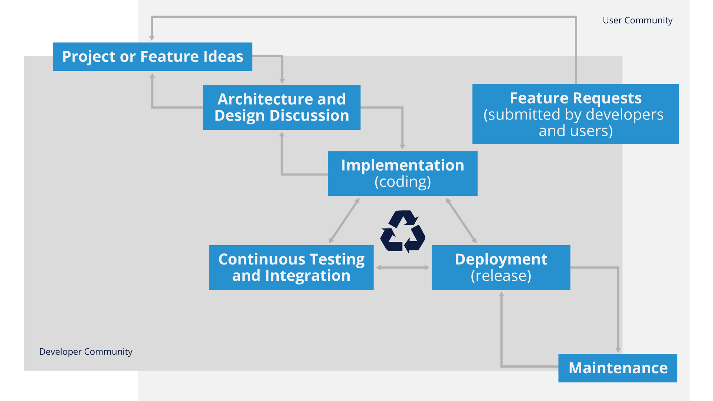

正如您从这张图中看到的，“需求”通常以来自用户或开发人员的“功能请求”的形式出现，并且由于开发的迭代/敏捷性更强（稍后会详细介绍），没有很长时间 , 开源软件开发的长期需求阶段。

这具有独特的优势，因为它利用了对不断变化的需求或项目运营所在的技术和业务环境做出快速响应的能力。 但是，它确实需要严格的开发人员纪律，以及帮助管理项目长期战略目标的核心开源维护人员。

应该指出的是，这些原则中有许多是敏捷软件开发方法论的一部分，并且确实有许多相似之处。 我们将在后面的部分讨论一些细微的差异。

## 2.2  传统封闭软件开发中的需求

虽然越来越多的软件开发采用敏捷和/或 DevOps 方法进行软件设计，但仍有大量传统的闭源或专有软件开发模型采用更“瀑布”的方法，如下所示：

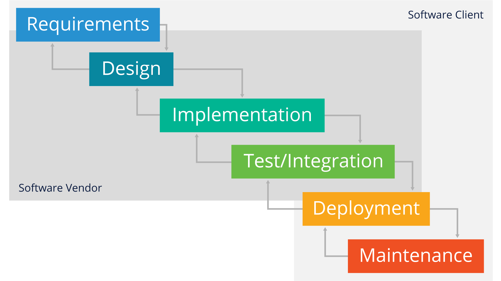

虽然这种方法在文档的完整性方面确实有一些优势（例如），但它通常被认为过于重量级，并且比开源软件项目采用的更具迭代性或敏捷性的方法要慢得多。 此外，大多数开源软件项目中存在的典型地理分散开发团队通常更难以实施。

## 2.3 开源项目特点

我们将在以后的模块中更详细地介绍与上游开源项目的合作，但是在您构建有效的开发实践以与这些社区互动之前，了解大多数开源项目的几个共同特征很重要。

虽然这不是一个详尽的清单，但这里列出了几乎所有开源项目的一些核心特征：

- 地域分布的开发团队
- 透明的沟通和开发实践
- 分布式和透明/公开的决策
- 精英文化（那些做工作的人有助于推动项目方向）
- 适应组织变革
- 自组织
- 可扩展的项目开发/管理模型
- 所有代码贡献的同行评审

## 2.4 可扩展的开发模型

成功的开源开发工作的一个标志是能够根据可用的参与量有效地扩展项目。 以下是使之成为现实的结构示例：

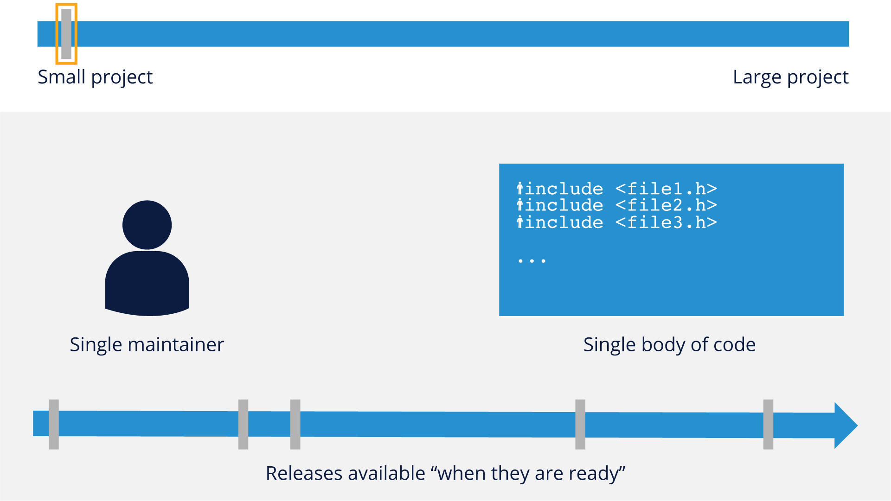

小型项目通常只有一个维护者和一小部分代码。 发布通常没有严格的时间安排，而是在“准备就绪”时发布。

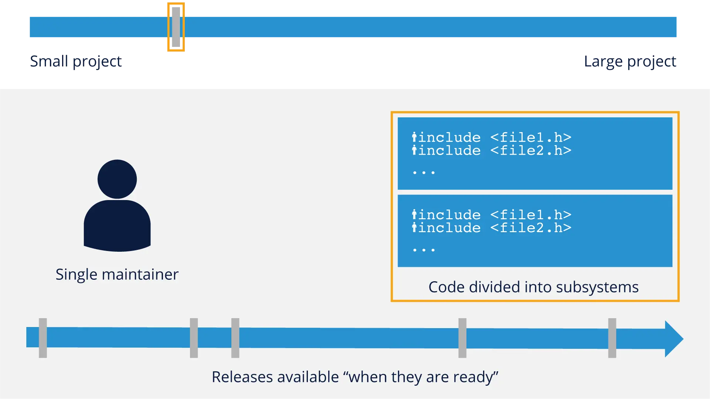

随着项目开始变得稍微大一点，它们仍然具有不规则的发布周期，但可能会开始将代码库划分为子系统。 在这个阶段，他们通常仍然只有一个维护者。

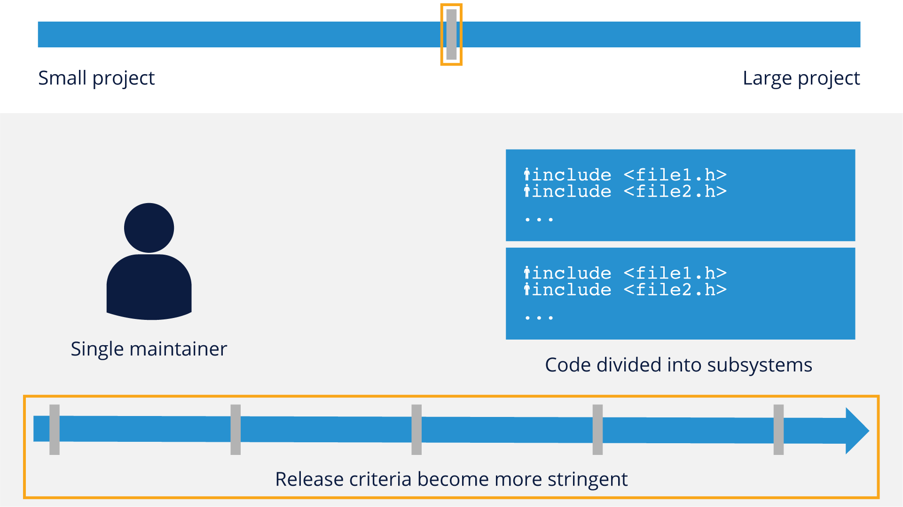

随着项目趋向于中等规模，它们通常仍然只有一个维护者，但它们的发布标准将开始变得更加严格，定期发布。

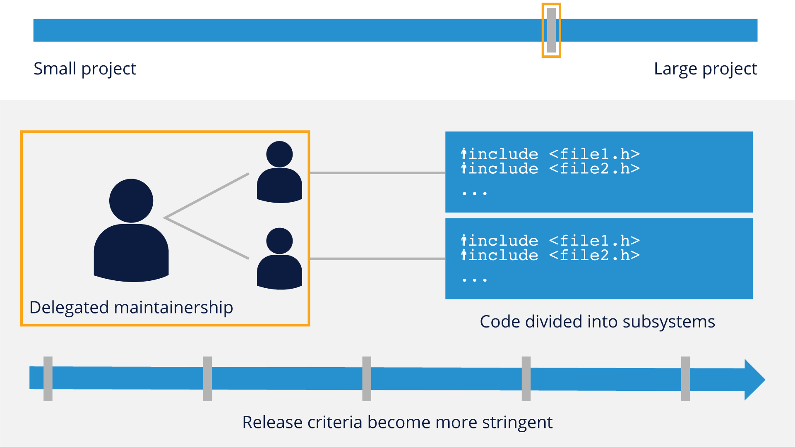

一旦项目通过了中等规模的标记，他们就会开始考虑委托维护，在这种情况下，主要维护者不能再照顾项目中的每个子系统。 可能对特定子系统具有专业性或热情的受信任的开发人员/贡献者被指定负责该特定的代码体。

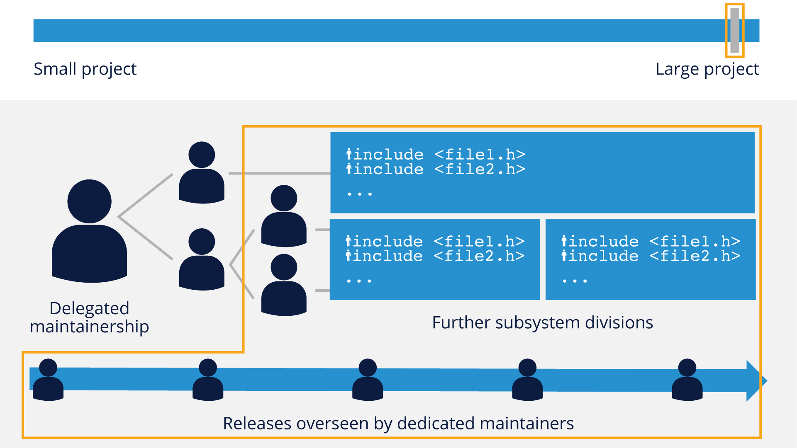

一旦项目升级到“大型”类别，就会发生一些变化——子系统的进一步划分（有时甚至分为更离散的部分）以及更详细的委派维护和发布级别，这些不仅是定期的，而且由一个 专门的维护者集，例如 Linux 内核的 LTE（长期演进）内核分支。

这些结构和开发模型的一个关键要素是，它们通过将不同项目子系统的责任委托给“维护者”来发挥作用，“维护者”对子系统中的代码负有最终责任。 这允许一定程度的专业化和监督，使整个项目维护者能够专注于项目的更大战略和架构图。

## 2.5 可扩展项目示例 - Linux

作为成功的项目如何在实践中实施这种可扩展开发模型的示例，请考虑世界上最成功的开源项目之一 Linux Kernel：

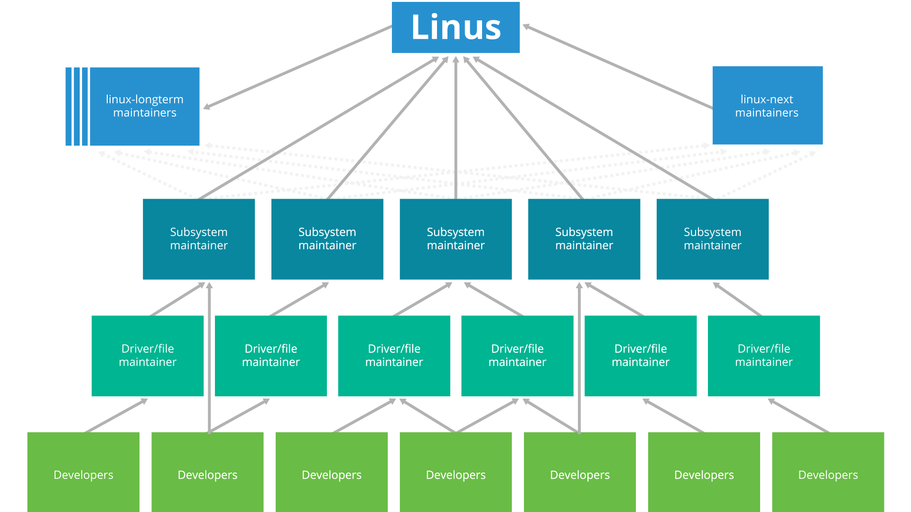

尽管 Linus Torvalds 仍然保持对该项目的整体影响力，但他严重依赖一组分布式维护者来维护作为内核一部分的不同子系统。 并非每个开源项目都发展到这种规模或需要这种级别的控制，但考虑如何在庞大且多样化的贡献者基础上实施有效控制是有益的。

## 2.6 开源中的设计注意事项

现在我们已经了解了一些开源项目的特征和组织模型，让我们考虑一下开源项目中成功设计实践的一些核心原则。

重要的是要考虑设计如何在开源项目中表现出来，以及它与更传统的软件开发有何不同。 主要考虑分为三个主要方面：

- 开放式设计
- 招聘其他人
- 验收设计

让我们在接下来的页面中更详细地了解这些。

###  2.6.1 开放式设计

开放和透明是开源开发的标志，设计也不例外。以下是“开放式设计”的一些最佳实践：

- 尽早并经常在项目首选的交流平台上进行交流
- 提供代码示例和可能的参考实现
- 预期反馈
- 承认良好的反馈并重新工作你的贡献
- 及时回复问题，尤其是来自潜在贡献者的问题
- 如果其他人愿意做这项工作，则表示愿意调整您的设计
- 计划模块化，即使最初的设计不是模块化的
- 灵活性也是这里的一个关键要素 - 与传统的闭源项目相比，了解您的代码正在被更多的人评估和查看对于帮助您做出最佳设计决策并使您的代码贡献被项目接受非常重要。

采用模块化方法（或至少规划如何使代码模块化）也与传统开发模型不同，在传统开发模型中，单体设计往往更为普遍。从一开始就考虑模块化不仅有助于整个开源项目，而且它本身就是一个很好的工程实践。

### 2.6.2 招聘其他人

协作是开源项目中的游戏名称，其方式比您在典型的公司或闭源开发工作中通常习惯的方式要深得多。

当您招募其他人来协助您进行开源时，需要考虑以下一些事项：

- 自己挠痒痒，没有人会为你挠痒痒……除非他们有同样的痒痒
- 为了减轻你的开发负担，编写能够吸引他人的代码
  - 确保您的贡献范围足够广泛以吸引其他开发人员
  - 如果有人表示对您的代码感兴趣，请积极响应
- 如果它是竞争对手，请不要感到惊讶
  - 通常，从开源项目的功能中获益最多的公司都在同一业务线中
  - 竞争对手之间有着丰富的开源合作历史

与范围更窄的开发实践相比，在设计代码时考虑到其他人确实需要更多的时间和精力，但是当您亲眼目睹有效的开源项目贡献者基础的倍增效应时，这最终是值得的。

### 2.6.3 验收设计

基于到目前为止所说的一切，此时应该很清楚，您参与开源的目标应该是考虑如何有效地接受您的设计和想法。

需要考虑的一些事项是：

- 将您的贡献设计为以尽可能小的部分编写和集成
  - 维护人员更容易集成较小的补丁
  - 开源项目偏爱模块化方法，因为它促进了可扩展性
- 适当地确定设计范围，并在必要时细分您的计划
  - 较大的更改更有可能被采用为具有具体里程碑的一系列较小的更改
  - 传达您的总体计划以提供背景信息，但不要期望立即获得普遍支持
- 尽可能不干扰其他项目子系统
  - 如果您认为需要更改核心系统组件，请提前沟通并在开始之前征求维护人员的意见

如果您将自己置于必须集成或稍后维护您的代码的其他开发人员或维护人员的位置，这将有助于为您提供正确的设计接受度。

# 3. 决策与发展节奏

## 3.1 决策过程和沟通期望

除了考虑以新的方式进行设计之外，了解在开源项目中如何制定（和传达）决策也很重要。通常，下面列出的原则与传统的软件开发方法略有不同：

- 通过任命受信任的代表（通常称为“子系统维护者”）来分散决策
- 信任是建立在过去良好参与和对较小问题的明智决策的记录之上的
- 去中心化性质需要额外关注透明度
  - 讨论总是公开进行
  - 示例：邮件列表、IRC、Slack 等。
- 通常讨论本身就是结果的文件记录（因此档案很重要）

简而言之，电子形式的交流不仅对开源项目至关重要，而且通常比在传统软件项目中的讨论频率和深度更高，在传统软件项目中，您可能只与直接的开发同行进行交流。

了解并准备好以这种稍微不同的方式进行交流很重要，我们将在本培训的后面部分详细介绍如何处理此问题。

## 3.2 开发过程和节奏

让我们将本培训中前面展示的图形带回来，以更好地了解开源开发过程如何与节奏相关：

开源项目遵循“尽早发布，经常发布”的口号。虽然根据上图这似乎很明显，但它具有影响开发过程和节奏的元素，特别是：

- 第一次不要期望代码完美
  - 当代码运行良好以实现您的目标时提交代码
  - 代码稳定是社区进程的一部分
  - 允许开发者社区帮助指导和塑造代码
- 以尽可能小的合理块实现功能
  - 小改动更容易测试和集成
- 准备好重新编写您的代码（可能多次）以使其被接受

开源项目中代码提交/返工的节奏对于习惯了更传统软件开发环境的开发人员来说通常是最大的不同，开源项目中使用的更高的速度可能需要一点时间来适应。然而，一旦你熟悉了这种工作方式，你可能会发现以这种方式工作变得更加自然，几乎是第二天性。

# 4. 与大型分布式开发团队合作

## 4.1 社区

从本培训的前面部分可以看出，与开源项目及其社区合作的动态与您习惯于严格的公司或内部开发工作的动态略有不同。

社区的概念并不难理解——我们大多数人都生活在社区中，并且在日常生活中经历过不同层次的社区。然而，当应用于开源项目时，有一些事情需要考虑：

- 没有两个社区是完全相同的
- 社区不适用于个别公司

有一些众所周知的开源项目社区，例如 Linux 内核或 Kubernetes，它们有一些相似之处，但“个性”不同，这通常是它们的启动方式、实施的治理模型以及经验的结果他们的创始成员。

虽然现在很多组织都在投资开源（例如，Kubernetes 是由 Google 创立的），但开源项目社区并不为个别公司工作，因此为您的组织完成工作就变成了持续的贡献和做得很好（稍后会详细介绍）。

了解开源项目不是您组织的“免费开发人员”非常重要，因为做出这种假设可能会在以后导致有问题的挑战。在接下来的几页中，我们将为您提供一些与开源社区互动的最佳实践，并向您展示一些基本的通信工具礼仪将如何帮助您与这些大型分布式开发团队有效合作。 

## 4.2 准备参与

在您开始直接与社区合作之前，花点时间研究并准备最佳方法来让您走上正轨，这通常是有益的。这项研究的一部分是着眼于您（或您的组织）准备做什么来支持社区。

 **确定您必须提供什么** 

开源项目不仅仅是代码 - 您可以在许多领域做出贡献：

- 软件开发
- 测试/质量保证
- 文档
- 用户体验/图形用户界面设计
- 布道/通讯

如果您在多个这些领域拥有专业知识，您当然可以在多个角色中做出贡献。

 **确定你的时间承诺** 

如果您和/或您的组织对您可以带来什么样的时间投入持现实态度，这会有所帮助。尝试致力于您可以实际交付的内容，因为大多数社区尊重已完成的工作，而不是空洞的帮助。

另请记住，您的承诺不仅体现在您身上，还体现在您所代表的组织上。

## 4.3 了解社区

在您制定与社区互动的计划时，重要的是要了解他们是谁以及他们如何工作的一些重要事项。

### 4.3.1 了解社区如何沟通

显然，了解社区动态的很大一部分是了解他们交流的地点和方式。一些社区仍然更喜欢电子邮件 - 其他社区已迁移到异步论坛，如 IRC（互联网中继聊天）、Slack、Github 问题、Discord 或其他论坛工具。

花一些时间不仅要弄清楚正在使用什么平台，还要潜伏一下，看看会问什么样的问题，如何回答，以及引用了哪些其他信息来源（错误跟踪器、维基等）在社区的回答中。

通过进行这项研究，并在您在社区中提问之前努力尝试找到答案，您向现有社区成员表明您是认真对待成为一名优秀社区成员的，这将大有帮助。

### 4.3.2 了解社区的治理方式

潜伏在交流论坛上并做功课还可以帮助您了解项目的适当治理模型。一些项目是具有清晰命令/报告链的层次结构。一些项目具有更扁平的组织模型。

了解治理的动态不仅可以帮助您更好地准备做出贡献，还可以帮助您了解社区中的哪些群体最适合回答您可能遇到的任何问题。

### 4.3.3 认识人

尽管开源项目默认使用地理分布的团队，但尝试亲自了解社区成员很重要，因为您经常需要帮助（或向他人提供帮助）以获取贡献或想法接受。如果可能，尝试参加许多项目组织的面对面或虚拟聚会，以帮助新项目成员了解已建立的项目老手。

## 4.4 让我们参与吧！

好的，您已经完成了研究，现在您已准备好与开源社区互动！您在参与时应该考虑四个主要方面。

### 4.4.1 沟通你正在做的事情

不要在“私下”为社区做一些事情，直到它完美为止。记住早先的建议“尽早发布，经常发布”。通常不仅检查沟通渠道以查看您的计划是否已经完成通常是个好主意，而且还可以表明您打算构建新功能的意图或者修复一个错误，以便社区（和维护者）可以帮助您规划让您的贡献被接受的最佳方式。社区希望看到您成功，因此在您准备贡献时让他们帮助您是一个好主意。

#### 4.4.2 承认您使用的人员和资源

很少有对开源的贡献没有您正在构建的其他代码。请记住感谢您在贡献中使用的任何其他工作/库/开发，并帮助社区找到这些资源，因为它们通常对整个项目有帮助。

### 4.4.3 回馈社会

除了代码的明显贡献之外，还可以考虑其他可以回馈社区的方式，例如安排来自组织的硬件礼物（如果可能），或为团队安排聚会，或者只是花时间为新成员回答问题在你之后。

代码绝对重要，但真正成功的开源项目也依赖于“非代码”的贡献。

### 4.4.4 计划退出策略

社区是周期性的——最终，您和/或您的组织可能需要退出社区。尝试让社区保持比进入时更好的状态。您可以做的一些简单的事情是：

- 确定接班人或某人来接管您的代码
- 将该继任者介绍给社区的其他成员
- 尽快通知社区，以便他们有时间计划因您退出而可能需要进行的任何更改。

请记住，即使在退出社区时，您的行为也会影响您和/或您的组织。

## 4.5 沟通礼仪

大多数项目中使用的两种主要通信工具类型是某种消息传递系统（电子邮件、Slack、IRC 等）和某种问题或错误跟踪软件（JIRA、Github 问题等）。以下是有效使用每种平台的一些一般提示：

### 4.5.1 消息传递

- 大多数消息/通讯都是英文的
- 反馈很可能是短时间/集中爆发的
- 尽量不要对代码进行个人批评，而是接受好的建议并重新编写代码
- 如果你正在审查代码，批评代码/想法，但不要批评这个人
- 注意时区，不一定期望立即响应
- 如果提出问题，请尝试“展示您的工作”，以便社区可以为您指明正确的方向

### 4.5.2 错误/问题跟踪

- 保持错误报告简洁而全面
- 检查错误/问题系统以查看您报告的内容是否已经存在
- 提供足够的相关信息，包括触发错误的任何测试代码
- 了解没有社区义务来修复错误 - 为您可能需要自己修复它的事实做好准备
- 如果您修复了错误或找到了解决方法，请对信息进行任何相关更新

## 4.6 最重要的四件事要记住

当您第一次开始与开源社区合作时，有很多事情需要考虑。 但是，如果您牢记以下四点，它们应该涵盖大多数情况：

### 4.6.1 了解社区治理

每个社区都不同，但您的所有“补丁”都需要融入整体。

### 4.6.2 了解社区动机

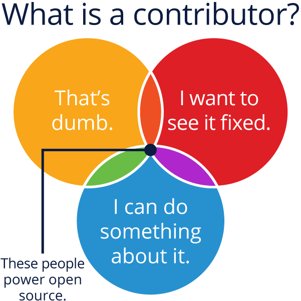

成功的社区由积极进取的人提供动力——他们并不总是严格由金钱驱动——同行认可和地位通常是开源中的强大力量。

### 4.6.3 社区需要培育

社区参与是一个循环——期待变化并准备好定期帮助引入新成员。

### 4.6.4 谦虚但大胆

开源领域的领导力是赢来的，而不是授予的，你工作的组织及其声誉不一定会赋予你在特定项目中的影响力。

重要的是要记住领导力和控制力之间存在很大差异。 大多数开源社区都会拒绝过度控制项目方向的尝试，但希望参与者在获得领导权之前做出有价值的贡献。

在大胆和积极参与之间取得适当的平衡，同时谦虚地接受反馈和返工您的代码贡献需要时间和练习，但牢记这种平衡有助于指导您朝着正确的方向前进。

# 5. 持续集成和测试的作用

## 5.1 简介

在本节中，我们将讨论持续集成、测试和部署在开源中的作用，包括与这一关键概念相关的工具、最佳实践和成本。

## 5.2 学习目标

在本节结束时，您应该能够：

- 描述持续集成、测试和部署
- 描述一些用于实施这些实践的不同工具
- 阐明实施这些概念的成本和收益

## 5.3 持续集成、测试和部署在开源中的作用

### 5.3.1 为什么要持续集成？

曾几何时，大多数软件是由相对较小的开发人员团队编写的，他们通常在同一地点工作并经常联系。协调和责任分工可以以一种直接的方式进行。

很久以前就开发了修订控制系统，以适应一个项目的多个贡献者。通常有一个存储项目的主副本的存储库，一个或多个开发人员拥有进行更改然后签入的能力。

当有许多开发人员在许多不同的地点在一个具有许多子系统的项目上工作时，事情会变得更加复杂。 Linux 内核是第一个真正庞大的分布式开发项目，它的创建者 Linus Torvalds 发明了 git** ** 系统来合理化分布式开发。

然而，修订控制系统并不能解决确保不同的贡献者群体正在做的事情实际上协同工作的问题。一组新代码或错误修复不会与另一组冲突。这只能通过测试来完成。

甚至测试也需要多个步骤，例如：

- 是否可以同时应用重叠的更改集，或者它们是否会发生冲突（一个好的修订控制系统，如 git 可以处理大部分工作，但它仍然经常需要人工干预）。
- 应用所有更改后，项目甚至可以编译吗？例如，一个补丁集可能会删除另一个需要的头文件。这不会被版本控制系统接收到。
- 它适用于所有可能的目标吗？这可能意味着不同的硬件（例如 x86 与 ARM）或不同的操作系统（例如 Linux 与 MacOS 或 Windows）或不同的库、语言或实用程序版本。
- 工作是什么意思？是否有非平凡的测试套件可以锻炼具有代表性的工作量，足以让人们相信一切都很好？

 **持续集成技术** 确保测试如此频繁，以至于任何问题都不会持续很长时间，这有助于分布式开发人员保持一致。

项目快速和实时地（通常每天多次）吸收变化，运行自动化测试以确保事情协调一致。 一般来说，这个过程是这样的：

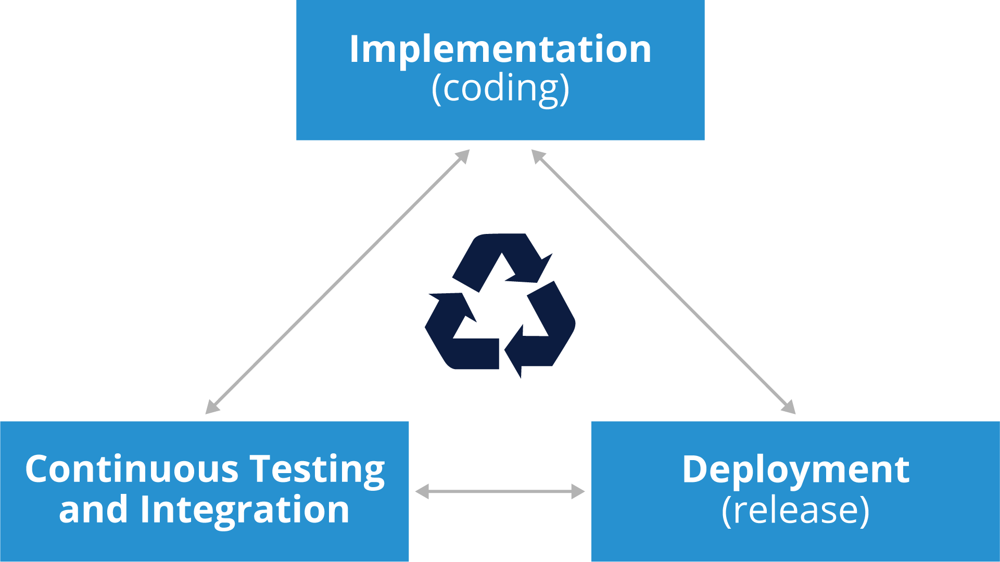

### 5.3.2 持续交付和持续部署

持续交付和持续部署的整个过程可以划分为三个独立的步骤或阶段：

-  **持续集成** 

更改将尽可能多地合并到主分支（“master”）中。自动构建** ** 在尽可能多的软件和硬件变体上运行。冲突一出现就解决。

-  **持续测试/交付** 

发布过程是自动化的，项目已准备好交付给构建的使用者。在所有相关平台上都进行了彻底的测试。

- **持续部署** 

产品再次以自动化方式发布给客户。

这些步骤之间的时间间隔应尽可能接近于零。在一个完美的世界中，开发人员的更改可以在同一天甚至几分钟内到达最终用户客户。这些术语的定义可能有所不同；例如，可以认为持续集成包括交付和部署。

-  **持续测试** 

持续交付和部署周期的一个关键组成部分是在开源代码库上频繁运行的自动化和持续测试。 重叠测试周期的概念用于确保通过持续集成（请记住，在小的更改集中）集成的代码经过彻底测试，并且很容易发现潜在问题。 一个示例可能如下所示：

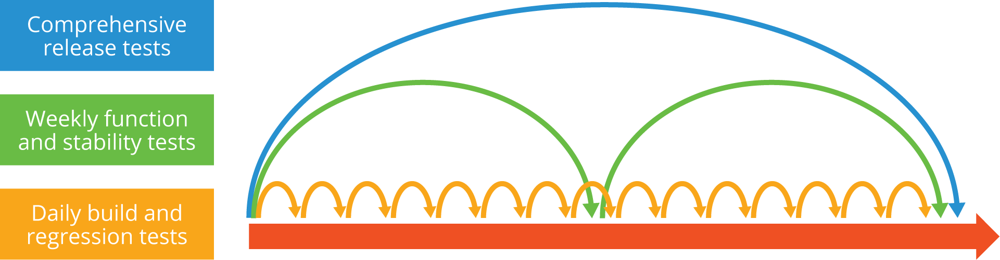

开源项目的重叠发布周期使其能够经常发布，同时对整体软件质量保持更严格的控制：

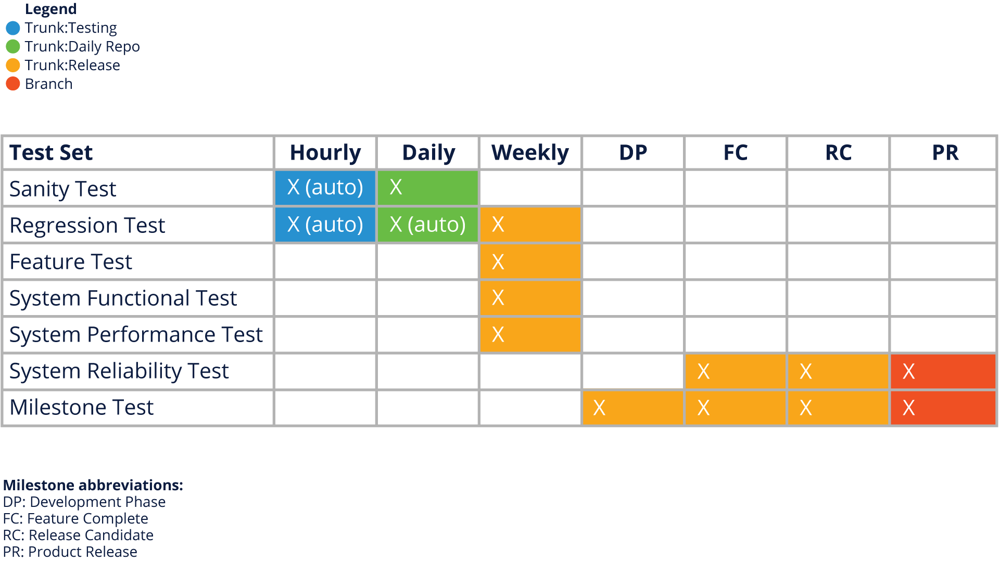

### 5.3.3 成本和收益

显然，软件开发中没有免费的东西，因此考虑持续交付和部署所涉及的成本和收益非常重要。以下是一些成本和收益的示例：

-  **费用** 

-  必须经常合并更改，可能至少每天一次，这可能会给开发人员带来压力。
-  存储库必须由持续集成服务器监控** **每次做出贡献时都会运行脚本化的自动化测试。必须分配工作人员来做到这一点。
-  必须运行脚本和其他工具来执行自动化测试并报告其结果并采取适当的措施。准备这个基础设施可能需要很多工作。

-  **好处** 

-  开发人员不会走错路并复合可修复的错误，也不会妨碍对方，这最终节省了宝贵的时间。
-  构建步骤是完全自动化的，所有工作都预先完成，而不是每次都需要完成构建测试。
-  回归（破坏工作产品的错误）可以被最小化，这意味着发布的软件应该有更少的错误。
-  设置持续集成管道并非易事，需要相当多的经验和努力才能做好。但是“一盎司的预防胜过一磅的治疗。”有许多现有的工具和服务可以帮助减轻工作的艰巨性。

### 5.3.4 工具

有许多完善的持续集成软件工具。 有关此类产品的摘要，请参阅 https://www.softwaretestinghelp.com/tools/24-best-continuous-integration-tool/。 请注意，其中一些是免费工具，而另一些则不是。

以下是一些最常用的工具：

- Jenkins - https://jenkins-ci.org
- Circle CI - https://circleci.com/
- Travis - https://travis-ci.org/
- Github Integrity - http://integrity.github.io/

要记住的一件事是，总是有新的工具正在开发中，因此最好检查一下

Google 和/或与其他开发人员讨论他们正在使用哪些工具进行持续集成。

### 5.3.5 持续交付基金会

跟上持续交付最新动态的另一种方法是查看持续交付基金会 (CDF)，这是 Linux 基金会于 2019 年 3 月宣布的一个项目。它旨在成为供应商中立的合并CI/CD（持续交付和集成）领域中的重要项目。

通过建立和记录最佳实践、制定指南和提供培训，目标是宣传和传播 CI/CD 和 DevOps 实践并改进产品发布流程。

**创始项目**是：

- Jenkins：一个 OSS CI/CD 系统
- Jenkins X：用于 Kubernetes 的 Jenkins
- Spinnaker：OSS 多云 CD 平台
- Tekton：CI/CD 组件的 OSS 规范

该基金会的 TOC（技术监督委员会）有一个开放的治理模式，欢迎贡献。

该倡议的创始成员包括：

Alauda、阿里巴巴、Anchore、Armory.io、Atos、Autodesk、Capital One、CircleCI、CloudBees、DeployHub、GitLab、谷歌、汇丰银行、华为、IBM、JFrog、Netflix、Puppet、Rancher、Red Hat、SAP、Snyk 和 SumoLogic .

了解如何参与，或在 https://cd.foundation 上关注基金会的进展。

# 6. 在内部应用开源方法

## 6.1 介绍

在本节中，我们将提供有关如何将开源原则应用于内部或通常“封闭”的开发工作的信息，这个过程称为“内部源代码”。我们将介绍实施这种做法的实际原因，以及它如何 可以通过支持与外部受众更好的开源参与来使您的组织受益。

## 6.2 学习目标

在本节结束时，您应该能够：

- 描述什么是内部源代码以及它如何用于改进内部项目以及外部开源参与。
- 解释在您的组织中实施内部源实践可以采取的一些实际步骤。

## 6.3 为什么是内源？

### 6.3.1 什么是内源？

根据维基百科，内部源被定义为：“使用开源软件开发最佳实践，并在组织内建立类似开源的文化。 该组织可能仍然开发闭源软件，但在内部开放其开发。 这个词是 Tim O'Reilly 在 2000 年创造的。”

重要的是要注意这个定义中类似开源的文化部分。 简单地采用开源开发实践（正如我们在本培训中所描述的）仍然会在内部使您的开发过程受益，但要实现 Inner Source 的全部好处，在您的开发组织内部建立更加开放和透明的文化非常重要（ 并支持法律、财务、人力资源和管理等组织）。

### 6.3.2 为什么是内源？

内源原则对内部开发有意义的原因有很多，我们将在下面列出一些最重要的：

-  **The list** 更高效更有效的开发

   - 更快的上市时间
   - 通过软件重用降低开发成本

-  **The list** 更好的跨组织协作 

   - 组织单位之间的成本和风险分担 
   - 全计划信息交流

-  **更成功的软件重用**

   - 使用组件供应商缺少的能力
   - 减轻组件供应商的负担

-  **加强知识共享**

   - 基于社区的学习
   - 知识的开放性和可用性

-  **更好地参与外部开源** 

   - 开发人员不必在内部和开源开发实践之间进行上下文切换
   - 开源开发人员的招聘/入职变得更容易

我们接下来将介绍传统和内部源代码开发实践之间的一些主要区别，根据我们在本模块中迄今为止所涵盖的内容，其中一些应该已经很熟悉了。我们还将尝试提供一些有关如何在您的组织中实施这些实践的实用技巧。

## 6.4 内在源头的沟通

正如我们在本模块前面介绍的那样，透明通信对于开源项目的成功至关重要，它们对于内部源代码同样重要。

它们也往往是面临最大文化挑战的领域，因为私人电子邮件、面对面会议和私人电话会议通常是大多数内部开发项目的常态。使用 IRC、Slack 和透明论坛等异步工具开放您的内部沟通实践，不仅可以帮助促进跨项目协作，还可以让您的组织准备好在外部开源项目中更有效地工作。

无论您选择什么工具（即使它是电子邮件别名），请确保有可用的开放档案，并且在公开讨论有关项目方向的决策，以便将项目决策记录在每个人都可以访问的地方。

### 6.4.1 开放参与内在源头

与通常由核心团队在封闭存储库中完成的传统内部开发不同，根据定义，内部源项目需要在开放环境中构建。这不仅意味着如上所述的开放交流，还意味着开放的软件存储库、已发布的路线图和文档，以及简单的“入口”和清晰的贡献治理模型。

此外，清晰透明的错误和问题跟踪是必须的。许多团队发现，不属于核心团队的开发人员和用户的这种公开参与是内部源代码最具挑战性的方面，因为它使您的项目和代码接受外部审查。然而，这样做的积极一面是，它迫使您编写更好的代码、更清晰的文档，并从外部角度思考您的架构。

### 6.4.2 内源同行评审

由于内部源实践意味着您涉及不属于核心项目团队的用户，因此同行评审的概念变得非常重要。虽然您可能已经建立了代码审查甚至结对编程的实践，但让“外部”开发人员查看您的代码是完全不同的。

他们可能会为项目的代码审查带来新的观点（以及一开始的很多问题）。但是，它们也带来了新资源，您的团队在提交代码之前可能不必执行严格的审查。此外，随着以前的外部贡献者越来越熟悉您的代码库，您的团队也越来越熟悉他们，这有助于建立一个信任和思想交叉传播的网络。

### 6.4.3 内部源中的迭代发布

我们已经在本模块中介绍了开源的迭代性质和“尽早发布，经常发布”的口头禅——这通常与大多数内部开发工作形成直接对比，后者使用固定发布周期和定义的路线图变化很快。

通过使用更具迭代性或敏捷性的开发方法，并将较小的更改集成到代码库中，您不仅可以更轻松地适应不断变化的需求，还可以防止大量回归或成本高昂的错误，这些错误曾经编入项目架构中很难修复。

利用本培训中前面提到的持续集成/测试/部署实践，不仅可以让您的内部源项目更有效地工作，而且还可以培训开发团队与使用这种开发风格的外部开源项目合作。

### 6.4.4 内源人员配备

Inner Source 的人力资源方面有时在组织中非常具有挑战性，在这些组织中，传统的层次结构或文化将开发人员分配到特定项目，而不允许他们为公司内部的任何其他工作做出贡献。

重要的是要考虑如何激励开发人员参与组织内部的项目并为其做出贡献，他们可能会将这些项目作为其代码库的一部分使用。确保管理团队完全支持并激励他们自己允许这种跨团队协作也很重要。

当然，这里有一个平衡行为，开发人员需要确保他们有效地为他们的核心项目做出贡献，同时找到他们也可以做出有价值贡献的相关项目。出于这个原因，通常最好考虑让项目开发人员为通用基础设施或平台编码做出贡献——我们将稍后介绍。

允许这种跨团队协作的一个主要好处是，如果工程师觉得他们可以为自己团队以外的组织做出有价值的贡献，那么开发人员的知识、士气甚至保留率都可以提高。

### 6.4.5 实施注意事项

实施内部源的所有建议都是可能的，但有时在存在传统命令和控制层次结构的组织中也极具挑战性。因此，开始实施客栈通常是个好主意.
