# 1. 开源许可和合规基础

## 1.1 课程简介

在本节中，我们将解释开源许可证的作用，描述最常见的许可证类型，并就如何为特定情况选择正确的许可证提供指导。 我们还将介绍软件中知识产权和版权的基础知识，因为这些是理解一般许可的关键概念。

## 1.2 学习目标

在本节结束时，您应该能够：

- 描述软件中的知识产权和版权以及它们与许可的关系
- 解释开源许可证，包括当今使用的最常见的许可证类型
- 阐明在为您的组织和/或项目选择特定许可证时应使用的标准

# 3 知识产权和版权

## 3.1 什么是知识产权？

知识产权是一个核心要素，需要了解它才能围绕开源和其他软件许可类型做出明智的选择。 知识产权分为以下几类：

- 版权：保护作者的原创作品
  - 保护表达（不是潜在的想法）
  - 涵盖软件、书籍和类似作品
- 专利：新颖且非显而易见的有用发明
  - 创建有限的垄断来激励创新
- 商业秘密：保护有价值的机密信息
- 商标：保护标识产品来源的标记（文字、标志、标语、颜色等）
  - 消费者和品牌保护：有助于避免消费者混淆和品牌稀释

出于本课程的目的，我们将重点关注版权和专利，这两个领域与开源许可合规性最相关。

## 3.2 软件中的一般版权概念

版权是告知开源许可合规性的两个关键要素之一（另一个是专利）。 以下是版权的一些基本要素：

- 版权保护创意作品，例如书籍、电影、图片、音乐、地图
- 软件被视为创造性作品并受版权保护
  - 不是功能（受专利保护）而是表达（实施细节中的创造力）
  - 这种保护包括二进制或源代码形式的软件
- 版权所有者只控制他或她创作的作品，而不是其他人的独立创作
- 未经作者许可转载可能构成侵权

## 3.3 软件中最相关的版权

有一些与软件版权相关的重要权利。这些权利的授予方式与许可有关（我们将很快介绍）。具体而言，因司法管辖区而异的相关权利是：

- 复制软件的权利——制作副本
- 创作“衍生作品”的权利——进行修改
  - 衍生作品一词来自美国版权法
  - 一般而言，它是指基于原创作品的新作品，并添加了足够的原创作品，因此新作品代表作者的原创作品而不是复制品
- 分配权
  - 分发通常被视为以二进制或源代码形式向另一个实体（您公司或组织之外的个人或组织）提供一份软件的副本

重要的是要注意，对什么构成“衍生作品”或“发行版”的解释在开源社区和开源法律圈内存在争议，因此这是一个会随着时间不断发展的领域。

## 3.4 软件专利概念

专利也是一个重要的领域，可以对开源合规性产生重大影响（取决于许可证类型，我们稍后也会介绍）。

专利的一些关键要素包括：

- 专利保护功能——这可以包括操作方法，例如计算机程序
- 他们不保护抽象的想法或自然法则
- 专利申请必须在特定司法管辖区提出，才能在该国获得专利。 如果专利被授予，所有者有权阻止任何人行使其功能，无论是独立创造的
- 希望使用该技术的其他方可能会寻求专利许可（可能授予使用、制造、制造、销售、要约销售和进口该技术的权利）

需要注意的是，即使其他方独立创造了相同的发明或软件，也可能发生专利侵权。

## 3.5 许可证基础知识

虽然我们将很快介绍许可证的更详细方面，但重要的是对许可证的作用和提供的内容有一些基本的了解。

- “许可”是版权或专利持有人向他人授予许可或权利的方式
- 许可证可以限于：
  - 允许的使用类型（商业/非商业、分销、衍生作品/制作、已制作、制造）
  - 排他性或非排他性条款
  - 地理范围
  - 永久或限时
- 许可证可以对赠款设置条件，这意味着您只有在遵守某些义务的情况下才能获得许可证
  - 例如，提供归属，或给予互惠许可
- 还可能包括有关保修、赔偿、支持、升级、维护的合同条款

# 4. 开源许可证类型

## 4.1 总体许可证类别

有了前面几页的信息，您应该对许可证的用途有了基本的了解。 让我们来看看下面的整体许可证格局（包括闭源许可证）：

此图提供了开源和闭源许可证的一般概述。 虽然我们很快将深入研究开源许可证类型的更多细节，但最好了解一下普遍可用的不同类型的许可证。

在开源方面，许可证通常分为两大类：

**宽容的** 

这些许可证只对重新发布软件时必须做的事情施加了最低限度的要求。这些需求通常仅限于保留或交付属性通知之类的事情。

**CopyLeft/互惠**

Copyleft许可有时被称为保护许可或互惠许可。他们有关于如何重新分发软件的需求，以及可能影响如何分发派生工作的需求，例如要求发布您可能对软件进行的所有更改/增强。

开源计划(https://opensource.org/)是一个重要的书签资源，该组织负责跟踪和审查已批准的开源许可。在他们的网站上有更多关于开源许可的定义和类型的细节。

## 4.2 宽松的开源许可证

如前所述，如果您进行更改和重新分发软件，宽松许可证通常对您必须执行的操作的限制最少。 出于这个原因，它们通常（但不总是）在公司内部预先批准的列表中，指定组织中的工程师可以使用哪些开源软件许可证类型。

让我们以 BSD-3-Clause 许可证为例。 本许可是一个许可许可的例子，它允许出于任何目的以源代码或目标代码形式无限制地重新分发更改，只要维护其版权声明和许可的免责声明即可。

但是，该许可证包含一个条款，限制在未经特别许可的情况下使用贡献者的姓名为衍生作品背书。

其他许可许可的例子包括：MIT、Apache-2.0。

## 4.3 Copyleft/互惠许可

某些许可证要求如果分发衍生作品（或同一文件、同一程序或其他边界中的软件），则该分发与原始作品的条款相同。

这被称为“左版”或“互惠”效应，如果您的衍生作品是用于为您的公司提供独特优势的高度专有软件，则可能会产生重要后果。在某些情况下，这可能需要您将与开源软件结合的专有作品的源代码发布给您向其分发作品的编译版本或二进制版本的任何人。

以下是 GPL 2.0 版的许可互惠示例：

> 您必须根据本许可的条款使您分发或发布的任何作品（全部或部分包含或源自程序或其任何部分）获得许可 […]。

其他包含互惠或 Copyleft 条款的许可包括 GPL、LGPL、AGPL、MPL 和 CDDL 的所有版本。您可以在 https://opensource.org/licenses 上查看更多详细信息。

## 4.4 许可证兼容性

许可兼容性是确保许可条款不发生冲突的过程，这可能会变得特别具有挑战性，因为许多软件（包括内部开发的软件）可能会相互构建并由具有不同许可的软件构建而成类型。

以下是一些示例：

- 如果一个许可证要求您做某事而另一个许可证禁止您这样做，则如果两个软件模块的组合触发了两个许可证下的义务，则许可证会发生冲突并且不兼容。
  - GPL-2.0 和 EPL-1.0 各自将其义务扩展到已分发的“衍生作品”。
  - 如果 GPL-2.0 模块与 EPL-1.0 模块组合并且合并的模块是分布式的，则该模块必须
    - （根据 GPL-2.0）仅在 GPL-2.0 下分发，并且
    - （根据 EPL-1.0）仅在 EPL-1.0 下分发。

在这种情况下，分发者无法同时满足这两个条件，因此模块可能不会分发，从而造成许可证不兼容的示例。

请记住，“衍生作​​品”的定义受开源社区的不同观点的影响，其在法律上的解释可能因司法管辖区而异，因此重要的是您要检查适当的资源以针对您的特定情况做出决定案例。 

## 4.5 通知

通知（例如文件标题中注释中的文本）通常提供作者身份和许可信息。 开源许可证还可能要求在源代码或文档中或旁边放置通知，以表明作者（归属）或明确软件包含修改。

例如：

- 版权声明 – 放置在作品副本上的标识符，用于告知世界版权所有权。 示例： 版权所有 © A. Person (2020)
- 许可通知 – 指定并承认产品中包含的开源许可条款和条件的通知。
- 归属通知 – 产品发布中包含的通知，确认产品中包含的开源的原始作者和/或赞助商的身份。
- 修改通知 – 您对文件的源代码进行了修改的通知，例如将您的版权通知添加到文件顶部。

## 4.6 多重许可

在某些情况下，版权所有者可能会选择在多个许可下提供代码，这种做法被称为“多重许可”。

例如，软件可以是“双重许可”，版权所有者可以让每个接收者选择两个许可。

重要的是要注意，对于许可方强加多个许可的情况，不应混淆这一点，并且您必须遵守所有许可。

# 5. 选择正确的许可证

## 5.1 概述

有了到目前为止提供的所有信息，弄清楚如何为您希望在组织中使用的开源代码选择正确的许可证，最终贡献功能或更改，或者创建一个全新的开放源代码似乎令人生畏。 自己的源项目。

值得庆幸的是，有一些常见的问题需要询问和遵循的流程，以帮助您做出明智的选择。 以下是一般概述：

在对现有项目做出贡献时，除非该项目使用具有不同入站许可证的贡献机制，否则通常的做法是根据整个项目所受的许可证条款做出贡献。

在参与或创建新项目时，明确要求使用代码的人（必须）做什么、允许做什么（可以）以及禁止做什么（不能）是非常重要的 . 选择的许可证是您指定此信息的方式。 通过选择标准和常用的开源许可证，您可以帮助其他人更轻松地了解他们的权利和义务是什么。

 **要考虑的属性** 

在选择许可证时，重要的是要明确发布代码的目标。您希望谁（什么类型的人/组织）采用该准则？您想看到人们在重新分发代码时对您的代码所做的任何更改吗？您是否希望其他人能够出售您的代码以获取利润？

您还应该考虑以下常见属性：

- 发布许可、版权声明、更改摘要？
- 公开源代码？
- 修改后的工作分配？
- 转授权？
- 私人用途还是商业用途？
- 专利授权？
- 可以使用商标吗？
- 代码可以保修吗？
- 能否承担损害赔偿责任？
- 许可范围：作为一个整体工作还是只针对特定文件？

页面上的列表包含一些常见问题，您应该在公开代码之前了解答案，并选择反映您答案的许可证。这有时是一项可怕的任务，但在过去的几年里，已经创建了一些网站来帮助解决这个问题，这些网站列在下一个屏幕上。

## 5.2 许可证帮助资源

下面是一些流行的网站，它们讨论了在为您的代码或其他创意作品选择许可证时要考虑的许可证类型和属性。 它们的目的是帮助您选择许可证，并解释一些选项背后的更多背景。

### 5.2.1 源代码

来自开源计划的按类别划分的开源许可证列出了已批准的开源许可证。

选择开源许可证由 GitHub 赞助。它会引导您了解您必须考虑的属性，帮助您确定哪种许可证有意义。

许可证文本有时会被视为“太长，未阅读” - 表示为 TL;DR。 tl;dr Legal 正试图将法律文本澄清为标准属性。网站创建者与志愿律师合作​​，对与特定许可证相关的属性进行分类和颜色编码，以帮助您更轻松地浏览并更好地了解现有许可证。

- 蓝色 - 您必须遵守的规则。
- 绿色 - 您可以遵循的规则。
- 红色 - 你不能做的事情。

这是理解一些常见许可条款的非常有用的工具。例如，对于 Mozilla Public License version 1.0，您不能追究贡献者的责任，但如果您使用它，则必须包括版权、许可、声明任何更改并披露来源。

来自自由软件基金会的许可和合规实验室的各种许可证和关于它们的评论提供了许多许可证的描述和关于它们的评论。

### 5.2.2 其他创意作品

知识共享许可可帮助您了解图像和文档的许可选项。这方面的一个例子是 CC-BY-SA 4.0 许可证。我们鼓励您单击知识共享站点的链接，并阅读法律代码文件。它指定了与此许可相关的归属、类似共享和其他属性。

### 5.2.3 其他资源

此外，您可以查看此在线资源：来自 Jilayne Lovejoy 和 FINOS（金融科技开源基金会）的开源许可证合规手册。该手册提供了“自助服务”信息，以帮助开源软件的用户和再分发者了解遵守各种许可的具体要求。

SPDX 许可证列表是另一个用于识别许可证的有用资源。它提供了公共分发软件中使用的常见许可证的精选目录。并非所有许可证都必须是开源的；许可证列表表明哪些已被开源计划批准，哪些已被自由软件基金会列为免费/自由。

许可证列表不包括许可证的解释。相反，它在搜索与特定许可证名称或标识符对应的许可证文本时会很有用。许可证列表贡献者还维护许可证文本的版本，其中标记了许可证文本的某些部分，这些部分被认为是可替换的，同时仍然是基本相同的许可证，这在自动检测源代码中的许可证通知时非常有用。

如果您正在寻找有关如何将许可证信息结构化到您的项目中的指南，我们建议您参考欧洲自由软件基金会的 REUSE 软件指南。它们提供了有关如何将标识符和许可证全文添加到项目中的详细示例，以及用于检查是否符合准则的脚本。

如果您尝试使用不在 SPDX 许可证列表中的许可证，他们也有关于如何记录它以便工具可以找到信息的很好的建议。

# 6. 建立有效的合规计划

## 6.1 简介

在本节中，我们将提供有关有效合规计划背景的信息，以及如何建立此类活动并为其配备人员，包括工程领导和法律合作伙伴关系的重要性。

## 6.2 学习目标

在本节结束时，您应该能够：

- 描述建立开源合规计划的原因
- 解释整个合规流程应该如何运作
- 阐明领导和法律团队在合规框架内的作用

## 6.3 开源合规性简介

### 6.3.1 合规目标

虽然“合规”这个词在某些情况下可能看起来霸道或可怕，但在这种情况下，它可以分解为两个非常具体的目标：

 - **了解您的义务** 

您应该有一个过程来识别和跟踪软件中存在的开源组件。

 - **满足许可义务** 

您的流程应该能够处理因您组织的业务实践而产生的开源许可义务。

虽然这两个目标当然包含了许多细节（稍后会详细介绍），但重要的是要记住，组织围绕合规性的所有流程决策都可以追溯到这两个总体目标。

### 6.3.2 义务

由于合规领域中的义务很重要，因此了解必须满足哪些义务非常关键。

根据所涉及的开源许可证，您的合规义务可能包括：

 - **归属和通知** 

您可能需要在源代码和/或产品文档或用户界面中提供或保留版权和许可文本，以便下游用户了解软件的来源以及他们在许可下的权利。您可能还需要提供有关修改的通知或许可证的完整副本。

-  **源代码可用性** 

您可能需要提供开源软件的源代码、您所做的修改、组合或链接的软件以及控制构建过程的脚本。

- **互惠**

您可能需要在管理开源组件的同一许可下维护修改后的版本或衍生作品。

- **其他条款**

开源许可可能会限制版权所有者名称或商标的使用，可能需要修改版本以使用不同的名称以避免混淆，或者可能会因任何违规行为而终止。

### 6.3.3 合规问题：分发

在许多开源许可案例中，“分发”是触发许可义务的东西。 但分布究竟意味着什么？ 一般而言，“分发”是指向外部实体分发材料。 有时这可能是一个具有挑战性的领域，即使在法律界也是如此，但这里有几个例子：

- **分发事件**

  - 下载到用户机器或移动设备的应用程序
  - 下载到用户机器的 JavaScript、Web 客户端或其他代码
  - 对于某些开源许可证，通过计算机网络访问可能是“分发触发器”事件

一些许可证将触发事件定义为包括允许访问在服务器上运行的软件（例如，如果软件被修改，则所有版本的 Affero GPL）或在“用户通过计算机网络远程与其交互”的情况下。

### 6.3.4 合规问题：修改

修改源代码时可能会发生许可义务的另一个主要因素，例如修复您发现的错误或添加新功能。 此外，将开源代码与您自己的代码或什至其他开源组件相结合可能会产生潜在影响。

在某些开源许可证下，修改可能会导致分发时承担额外的义务，例如：

- 提供修改通知
- 提供随附的源代码
- 在管理开源组件的同一许可证下许可修改

在本模块的后面，我们将介绍如何构建适当的流程来跟踪和管理分发和修改事件的结果。

### 6.3.5 合规优势

重要的是要注意，虽然偶尔会出现与开源合规性相关的挑战，尤其是在修改或分发方面，但正确构建和运行的合规性计划很简单，可为您的组织带来许多好处，例如：

- 加深对开源的好处及其对您的组织的影响的理解
- 加深对与使用开源相关的成本和风险的了解
- 增加对可用开源解决方案的了解
- 减少和管理侵权风险，增加对开源开发商/所有者许可选择的尊重
- 培养与开源社区和开源组织的关系

## 6.4 合规管理流程概述

### 6.4.1 合规计划的总体结构

在开源合规性方面取得成功的组织已经制定了他们的政策、流程、培训和工具，以：

- 促进在其产品（商业或其他）中有效使用开源
- 尊重开源开发者/所有者的权利并遵守许可义务
- 贡献并参与开源社区

需要注意的是，这些政策、流程、培训和工具需要提供监督，但不能变得霸道，这一点非常重要。理论上，您可以构建世界上最好的开源合规性计划，但如果它对于工程团队来说过于复杂和繁重而无法使用，那么它很可能不会被利用，或者会因团队在该过程中寻找方法而受到严重阻碍。

此外，开源合规性计划应根据您自己组织的性质和要求进行定制。每个组织都以不同的方式开发和构建软件，您的组织可能能够遵守其许可义务，而无需遵循此处描述的确切流程集。

### 6.4.2 合规实践概述

虽然我们很快会详细介绍，但您在构建合规实践时应考虑的主要领域是：

- 识别所有内部和外部软件的来源和许可
- 在开发过程中跟踪开源软件
- 执行开源审查并确定许可义务
- 产品发货时履行许可义务
- 监督开源合规计划、政策创建和合规决策
- 培训

### 6.4.3 开源审查的关键组件

开源审查期间的一个重要考虑因素是考虑您计划如何使用相关开源软件组件。

常见场景包括：

- 公司成立
- 链接
- 修改
- 翻译
- 分布

我们将在接下来的几页中更详细地介绍这些内容。

### 6.4.4 合并

开发人员可以将开源组件的某些部分复制到软件产品中。

有关条款包括:

- 集成
- 合并
- 粘贴
- 适应
- 插入

### 6.4.5 链接

开发人员可以将开源组件与您的软件产品链接或加入。

相关条款包括：

- 静态/动态链接
- 配对
- 结合
- 利用
- 包装
- 建立相互依存关系

### 6.4.6 修改

开发人员可以对开源组件进行更改，包括：

- 在开源组件中添加/注入新代码
- 修复、优化或更改开源组件
- 删除或移除代码

### 6.4.7 转换 

开发人员可以将代码从一种状态转换为另一种状态。

例子包括：

- 将中文翻译成英文
- 将 C++ 转换为 Java
- 编译成二进制

### 6.4.8 开发工具的作用

除了人类工程师执行其中一些任务之外，重要的是要注意出于合规性目的，一些开发工具也可以在幕后执行这些功能。

例如，一个工具可以将它自己的代码的一部分注入到工具的输出中。

### 6.4.9 分发的合规性注意事项

如前所述，重要的是要考虑如何分发特定的开源组件，特别是：

- 谁收到软件？
- 客户/合作伙伴
- 社区项目
- 业务集团内的另一个法人实体（这可以算作分配）
- 交付形式是什么？
- 源代码交付
- 二进制交付
- 预加载到硬件上

## 6.5 开源审查流程

### 6.5.1 开源审查基础

在程序/产品管理和工程师审查了提议的开源组件的实用性和质量后，应启动对与使用所选组件相关的权利和义务的审查。

开源合规计划的一个关键要素是开源审查流程。 在此过程中，公司可以分析其使用的开源软件并了解其权利和义务。

该过程包括以下步骤：

- 收集相关资料
- 分析和理解许可义务
- 提供符合公司政策和业务目标的指导

### 6.5.2 启动开源审查

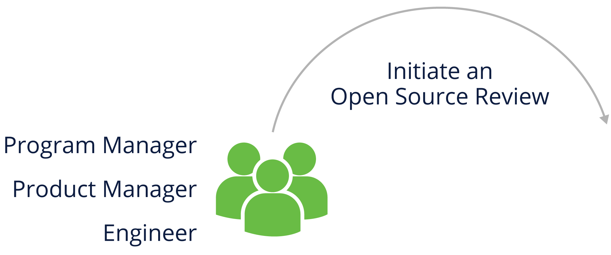

在公司中与开源工作的任何人都应该能够发起开源审查，包括程序或产品经理、工程师和法律团队成员

注意：当工程或外部供应商选择新的基于开源的软件时，该过程通常会开始。

### 6.5.3 收集组件信息

在分析您的开源使用情况时，您需要收集有关相关组件的身份、来源以及组件的使用方式的信息。 这些信息可能包括：

- 包名
- 包周围社区的状态（活动、多样化的成员、响应能力）
- 版本
- 下载或源代码地址
- 版权所有者
- 许可证和许可证 URL
- 归属和其他通知和 URL
- 拟进行修改的说明
- 依赖列表
- 在您的产品中的预期用途
- 将包含该软件包的第一个产品版本
- 将维护源代码的位置
- 在其他情况下可能的先前批准
- 如果来自外部供应商：
  - 开发团队联系人
  - 版权声明、归属、供应商修改源代码（如果需要以满足许可义务）

### 6.5.4 开源审查小组

组建一个团队来有效地运行开源审查需要多个利益相关者的参与。

开源审查团队包括支持、指导、协调和审查开源使用的公司代表。 这些代表可能包括：

- 识别和评估许可义务的法律
- 源代码扫描和工具支持，以帮助识别和跟踪开源使用情况
- 从事商业利益、商业许可、出口合规等工作的工程专家，他们可能会受到开源使用的影响

在为问题提供指导之前，开源审查团队应评估其收集的信息。 这可能包括扫描代码以确认信息的准确性。

考虑因素包括：

- 代码和相关信息是否完整、一致和准确？
- 声明的许可证是否与代码文件中的内容相符？
- 许可证是否允许与软件的其他组件一起使用？

### 6.5.5 源代码扫描工具

我们将在后面的部分中更详细地介绍不同类型的扫描工具以及选择工具时应考虑的标准，但这里是一个总体概述。

有许多不同的自动源代码扫描工具，所有解决方案都满足特定需求——因此——没有一个能解决所有可能的挑战。 因此，大多数公司都会选择最适合其特定市场领域和产品的解决方案。 一般来说，大多数公司尝试同时使用自动化工具和人工审查来抽查扫描结果。

免费提供的源代码扫描工具的一个流行且很好的例子是 FOSSology，这是一个由 Linux 基金会主办的项目。

### 6.5.6 通过开源审查工作

需要注意的是，开源审查过程跨学科，包括工程、业务和法律团队。 为了获得最大效率，它应该是互动的，以确保所有这些组正确理解问题，并可以创建清晰、共享的指导。

### 6.5.7 开源审查监督

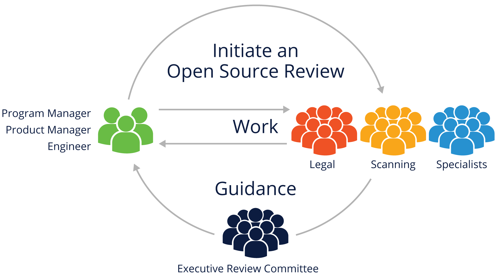

开源审查过程应该有执行监督来解决分歧并批准最重要的决定。

将审查过程视为组织中的跨学科活动至关重要，因为简单地将其描述为“工程问题”或“法律问题”不仅会降低重要性，还会对工程生产力产生不利影响 和法律风险。

将流程视为协作伙伴关系确实需要更多的前期工作来让所有利益相关者参与进来，但随着您的组织越来越熟悉端到端合规管理流程，这会带来好处。

## 6.6 端到端合规管理示例

### 6.6.1 简介

合规性管理是一组用于管理产品中使用的开源组件的操作。 公司可能对专有组件制定了类似的流程。

此类行动通常包括：

- 识别所提供软件中使用的所有开源组件
- 识别和跟踪由这些组件创建的所有义务
- 确认所有义务已经或将要履行
- 小公司可能会使用一个简单的清单，而企业可能会使用一个详细的过程

### 6.6.2 示例公司清单

这是一个示例清单，可用作您自己组织的合规性管理流程的基础。

正在进行的合规任务：

- 在采购/开发周期的早期发现所有开源软件组件
- 审查和批准所有使用的开源组件
- 验证满足开源义务所需的信息
- 审查和批准对开源项目的任何对外贡献

支持要求：

- 确保配备足够的合规人员并指定明确的责任线
- 调整现有业务流程以支持开源合规计划
- 为所有人提供有关组织开源政策的培训
- 跟踪所有开源合规活动的进度

### 6.6.3 示例企业流程

下面是一个典型的开源企业合规流程的图形概述：

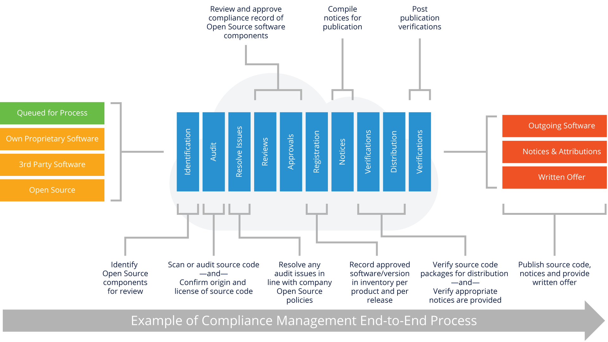

我们将在接下来的几页中介绍此过程的重要部分。

### 6.6.3.1 识别和跟踪开源使用

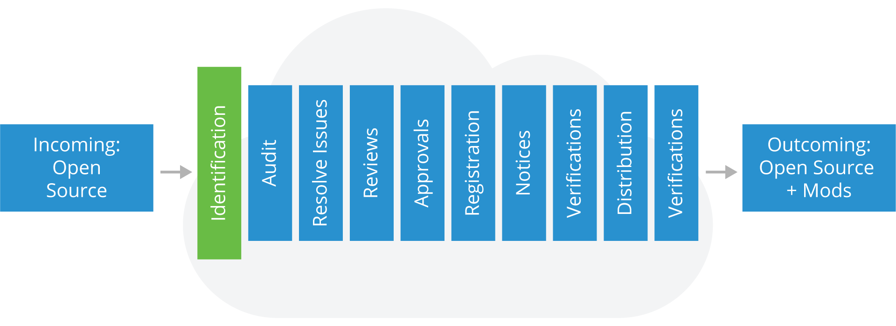

该过程的第一步是识别代码中的开源组件。

以下是此阶段预期的步骤和结果：

**步骤**

- 来自工程的传入请求
- 软件扫描
- 第三方软件的尽职调查
- 手动识别添加到存储库的新组件

**结果**

- 为开源创建（或更新）合规记录
- 要求审核以根据开源政策要求在定义为详尽或有限的范围内审查源代码

#### 6.6.3.2 审计源代码

识别后，进行代码审计，具有以下步骤和结果：

**步骤**

- 确定审计的源代码
- 可以通过软件工具扫描源
- 审核或扫描中的“命中”将被审查和验证代码的正确来源
- 根据软件开发和发布生命周期迭代执行审计或扫描

**结果**

- 审计报告确定：

  - 源代码的来源和许可
  - 需要解决的问题

#### 6.6.3.3 解决问题

审计完成后，需要分配时间来解决在审计过程中发现的任何问题。 步骤和结果包括：

 **步骤** 

- 向适当的工程师提供反馈，以解决审计报告中与您的开源政策冲突的问题
- 然后合适的工程师对相关的源代码进行开源审查

**结果**

- 报告中每个标记文件的解决方案以及任何标记的许可证冲突的解决方案

#### 6.6.3.4 执行审查

此时，您需要查看已解决的问题以验证解决方案是否符合您的公司开源政策。

**步骤** 

- 在审查人员中包括适当的权限级别
- 参考您的开源政策进行审查

**结果** 

- 确保审计报告中的软件符合开源政策
- 保留审计报告结果并将已解决的问题标记为为下一步做好准备（即批准）

#### 6.6.3.5 批准

根据之前步骤中软件审计和审查的结果，软件可能会或可能不会被批准使用。 批准应指定批准的开源组件的版本、组件的批准使用模型以及开放源代码许可下的任何其他适用义务。

此外，应在适当的权限级别（必要时可达并包括执行审查委员会）进行批准。

#### 6.6.3.6 注册和批准跟踪

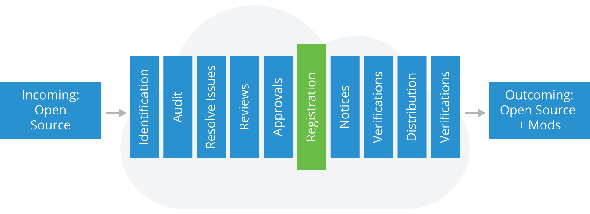

一旦一个开源组件被批准在产品中使用，它应该被添加到该产品的软件清单中，并且批准和它的条件应该在跟踪系统中注册。

跟踪系统应明确说明，开源组件的新版本需要新的批准，或者是否提出了新的使用模型。

#### 6.6.3.7 通知

注册后，您需要为产品发布中使用的任何开源准备适当的通知：

- 通过提供完整的版权和归属通知来承认使用开源
- 告知产品的最终用户如何获取开源代码的副本（如果适用，例如在 GPL 和 LGPL 的情况下）
- 根据需要复制产品中包含的开源代码的许可协议的全文

#### 6.6.3.8 预分发验证

    在使用任何软件之前，您需要运行高强度的步骤，包括：

 **步骤** 

- 验证用于分发的公开软件包已被识别和批准
- 验证审查的源代码与产品中提供的单一实例匹配
- 确认已接受所有适当的通知，以告知最终用户他们为已识别的开源请求源代码
- 努力对其他已确定的坚毅立场

**结果**

- 分发包仅经过审核和批准的软件
- “传播合规性对象”（在 OpenChain 规范中定义），包括适当的通知文件，包含在分发包或其他交付中

#### 6.6.3.9 随附的源代码分发

在流程的这个阶段，您已准备好提供随附的源代码，以满足所用开源代码的许可规定的任何许可义务。 您需要确保：

- 提供随附的源代码以及任何相关的构建工具和文档（例如，通过上传到分发网站或包含在分发包中）
- 用标签标识随附的源代码对应的产品和版本

#### 6.6.3.10 最终验证

在这最后的验证步骤中，您需要通过以下方式验证您是否遵守了所有适当的许可义务：

- 验证随附的源代码（如果有）已正确上传或分发
- 验证上传或分发的源代码与批准的相同版本
- 验证通知已正确发布并提供
- 验证其他已确定的义务得到满足

# 7. 选择正确的许可证合规工具

## 7.1 简介

在本节中，我们将更详细地研究许可证合规性工具，包括提供有关工具将解决哪些类型的问题以及在为您的组织确定最佳合规性工具和扫描软件时应考虑哪些类型的标准的上下文。

## 7.2 学习目标

在本节结束时，您应该能够：

- 描述整体合规性工具格局和适当的工具用例
- 解释可用的不同类型的合规工具
- 知道去哪里获取有关不同类型合规工具的更深入信息

## 7.3 工具用例

### 7.3.1 简介

毫无疑问，您已经从本模块的内容中确定了这一点，从概念上讲，合规性相当简单。 挑战来自可用于开源世界的软件数量，以及它可以与您自己组织的软件结合的各种方式。

因此，跟踪和建立有效的合规流程需要各种形式的工具，以帮助减少可能的人为错误并加快实现合规的过程。 但是，在考虑可能的工具时，有一些重要的事情需要考虑：

- 先了解需求和流程，再确定工具
- 工具不能提供（困难的）决策，而只能提供这些决策的数据
- 很多情况下都需要专业知识，即使是使用工具

### 7.3.2 关于工具

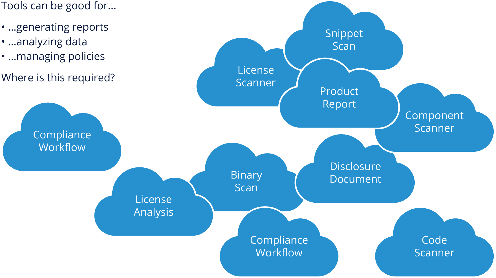

如您所见，工具可用于许多不同的合规领域。 然而，抵制将所有这些工具构建为整体堆栈的冲动。 确定您最大的潜在痛点是什么让您有机会以开源/敏捷风格（例如，随着合规性需求的增长以迭代方式）构建工具。

### 7.3.3 软件情况

当您考虑工具时，重要的是要考虑您将要解决的不同类别的软件和情况。 如上所述，您基本上需要考虑三类：入站、您自己的和出站软件。

### 7.3.4 来自 10k 英尺的合规工具箱

在高层次上，您需要考虑上面提到的情况以及在考虑工具需求时需要什么。

对于入站软件，记录实际情况（许可类型、义务等）至关重要。 对于您自己的软件，您需要在了解链接或调用开源包的方式和原因方面进行质量控制。 对于组合的 Outbound 软件，您需要了解您的可交付成果在您的软件和开源组件的组合包中的样子，并确保您遵守与分发相关的所有许可义务。

在分析入站软件时，有几个方面需要考虑，其中最重要的是，即使入站商业软件本身也可以包含开源（其分发的一部分）。 考虑以下事项也很重要：

- 确定涉及哪些开源组件
- 识别与开源组件相关的许可证
- 确定作者身份和版权
- 确定许可义务
- 导入、依赖项、使用的库等的声明。
- 软件中包含的任何二进制文件的来源和内容

### 7.3.5 入站软件

#### 7.3.5.1 识别入站许可证

确定入站软件的许可证可能相对容易，或者可能非常具有挑战性。 这是工具可以提供很大帮助的原因之一。 以下是有关简单案例和更具挑战性的案例的一些详细信息。

#### 7.3.5.2 简单案例

- 随软件提供的许可、复制或通知文件
- 在基础设施、主页或项目页面内
  - 例如 Github 或其他存储库元数据
- 项目定义文件
  例如 在 Java pom.xml 中
  已提供许可证信息
  例如 debian-copyright 或机器可读的文档

#### 7.3.5.3 具有挑战性的案例

- 许可证激增，现有 350 多个“主要”许可证（还有更多）
- 不同语言的许可证（例如法语 CeCILL）
- EULA（最终用户许可协议）等商业许可缺乏标准化
- 由于大量重用，开源组件并不（总是）同质化
- 代码可以来自具有不同许可的许多来源
- 项目可能不会对所有贡献强制执行通用许可
- 由于没有标准格式，识别许可证声明可能具有挑战性

#### 7.3.5.4 识别版权

一些许可证要求提供版权声明或作者列表，导致有义务提供这些，但正如您在下面看到的，有时解析和解开版权声明可能会出现问题，因此这通常是软件（以及像 SPDX 这样的项目，我们 稍后会详细介绍）进来。

#### 7.3.5.5 使用二进制文件识别许可证

二进制文件是已编译的应用程序、库、软件，无需访问源代码即可使用。 二进制文件可以是开源组件分发的一部分，并且本身可以包含开源。

这里的主要问题围绕如何理解二进制文件中包含的内容：

- 主要问题1：不同的二进制技术和硬件架构
- 主要问题2：源代码的微小变化可以生成全新的二进制文件

### 7.3.6 您自己的软件

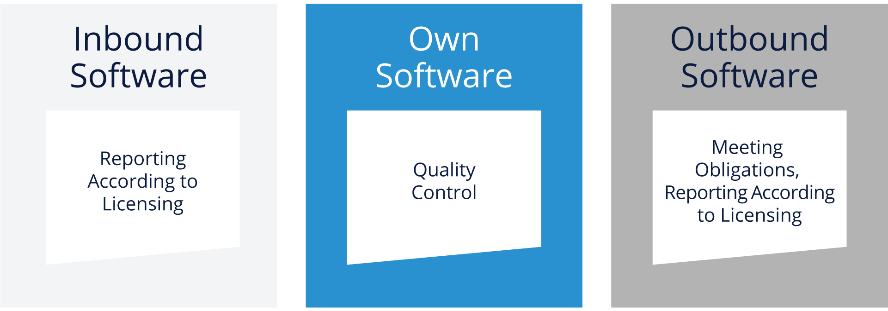

虽然希望您的组织能够养成良好的编码和工程习惯，但总是有“复制和粘贴”解决方案进入您的代码库的诱惑。 造成这种情况的原因有很多，包括：

- 开源项目是公开可用的
- 但其他文件也很有价值：脚本、图标、图像、css 文件
- 从网站复制的小段代码以获得最佳实践和片段更容易

可以将 Internet 上的源代码复制并粘贴到您的代码中，因为重用通常比每次都重新发明轮子要好。 但是，通过遵守任何许可或版权义务来尊重作者的利益很重要.

### 7.3.7 出站软件

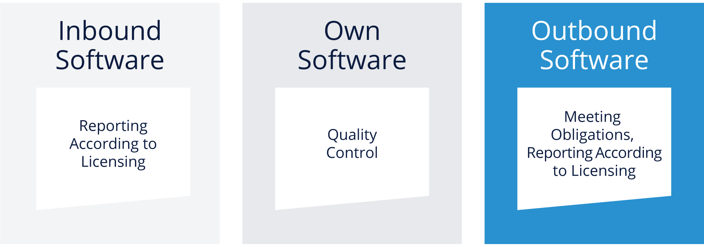

当您开始打包产品以进行销售或分发时，您需要关注组合的出站软件堆栈在开源合规性以及其他辅助任务的背景下是什么样子。 我们将在接下来的页面中介绍这些项目。

#### 7.3.7.1 开源代码的分发

如果您的项目或产品将分发开源作为您交付的一部分，您需要:

- 通知文件，由
  -所有许可的清单
  -所有版权通知的清单
- 提供开放源代码的书面提议

为了能够提供所有这些，您将需要收集以下信息的工具:

- 您的软件中有哪些开源组件
- 哪些许可和版权声明附加在这些组件上

#### 7.3.7.2 保障发行权

由于您的合规性目标是确保您对所使用的开源代码履行所有适当的义务，因此您需要考虑对出站软件中的许可证进行工具和人工审查。

例如，某些许可证不兼容，例如 GNU 公共许可证 (GPL) 和 Eclipse 公共许可证 (EPL)，基于包含 GPL 和 EPL 许可证的代码的作品可能会出现问题。

此外，即使使用工具，一些许可声明也是模棱两可的，例如“在 BSD 下许可”。在这种情况下，让您的法律团队和利益相关者参与决定如何进行是很重要的。

#### 7.3.7.3 物料清单 (BOM)

代码扫描或合规性工具可以提供的最关键的事情之一是一种确定您要交付的软件或产品中的内容的编程方式。这是材料清单 (BOM) 的形式。

BOM 提供了软件包交付内容的详细说明，包括确定该软件包中有多少由开源组件组成，以及这些组件使用了哪些许可证。

软件包数据交换 (SPDX) 项目指定了如何表达物料清单的一种实现。

#### 7.3.7.4 工具支持摘要

我们将在下一节中介绍不同类型的工具，但重要的是要了解哪些工具可以提供合规性，以及在选择解决方案之前需要考虑哪些方面。

从本节中可以看出，建立有效的合规性需要一些东西，工具绝不是可以消除所有合规性负担的“灵丹妙药”。工具非常擅长分析、报告和帮助推动管理决策，但它们不能孤立运行——它们需要一个有效的流程，结合一套明确的期望和政策来使用开源，以及分发你自己构建的软件基于开源包。

请记住，也不一定有满足所有需求的单一工具，因此您可能会处理不同系统/工具的集成，并且您应该清楚地了解工具提供的 API 和接口，以减少手动操作整合努力。

# 8. 工具类型

## 8.1 概览

开源合规领域有许多类型的工具，包括（但不限于）：

- 源代码扫描
- 许可证扫描
- 二进制扫描
- 开发运营集成
- 组件管理

我们将在接下来的页面中介绍这些领域中的每一个。

## 8.2 源代码扫描

由于组织可以访问自己的源代码以及用于构建其产品的开源包，因此源代码扫描工具是合规领域使用最广泛的工具之一。

有许多商业工具（和一些开源工具）可以执行此功能。通常，这些工具依赖于现有开源代码库（或者，如果添加到扫描数据库的潜在内部组件）的“散列”指纹来确定哪些软件组件是分发的一部分。他们最大的优势之一是构建我们之前提到的物料清单 (BOM)。

一些扫描工具还可以识别“代码片段”，这在确定是否使用了来自特定开源包的“复制和粘贴”代码时通常很有帮助。然而，片段扫描是有代价的——对源代码运行完整的片段扫描分析通常需要更长的时间，而不仅仅是依赖散列指纹。

许多这些工具的最大区别在于它们的数据源——它们的数据库多久更新一次，以及它们的数据中有多少开源代码。构建环境的成本、复杂性、集成能力和报告功能也是您在选择工具之前需要评估的关键功能。

还有可能出现“误报”或需要引入专家知识（法律、工程）来确定源代码扫描结果的相关性的情况。

## 8.3 许可证扫描

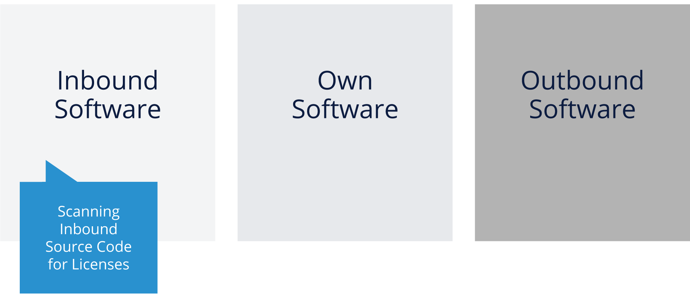

虽然我们将许可证扫描工具作为一个单独的项目进行介绍，但实际上，大多数商业源代码扫描工具也包括许可证扫描功能。

许可证扫描依赖于搜索相关关键字和/或机器可读标记（例如 SPDX 块）的源代码来确定附加到每个文件或包的相关许可证。这些扫描还可以识别版权、作者声明和有时的致谢。

虽然开源许可证数据库不如在 BOM 中构建组件标识部分所需的开源组件数据库大，但它仍然需要访问现有开源许可证的知识库。一般来说，许可证扫描很难识别非 OSS 许可证，因为这些类型的许可证种类繁多。

如前所述，许可证扫描的主要用途是检查入站开源软件以验证正在使用的许可证。这通常是在验证用于您的组织的开源组件之前执行的第一步（在评估技术目的的适用性之后）。

即使采用最佳模式匹配或机器可读标记的使用，也可能存在需要利用法律或工程利益相关者来澄清可能不明确的许可证标识的情况。

## 8.4 二进制扫描

二进制扫描的目的类似于源代码扫描（识别开源组件及其版本），可以帮助创建 BOM，以及识别进入组织的特定软件包的潜在漏洞。

当然，这里的挑战是，如果没有可读的源代码，二进制扫描是一种启发式方法，它依赖于二进制文件的一些特征元素，例如字符串变量、文件名，有时还有来自具有运行时代码的语言的方法和字段名称（例如 爪哇）。 由于硬件架构和编译器会随着时间的推移而变化，因此必须经常调整二进制扫描器以尝试并考虑这些变化。

在某些情况下，特定二进制文件无法完全获得可靠的扫描。 但是，如果可以尝试在没有源代码的包中识别开源，扫描二进制文件仍然是一个好主意。

## 8.5 DevOps集成

使用定制软件和定制流程的 DevOps 集成可用于增强前面提到的其他扫描机制，并从用于构建软件的流程中获取更多信息。

由于 DevOps 构建系统能够在构建期间确定依赖关系，因此它可以将该信息与其他工具的输出相结合，以帮助创建更强大的 BOM。 对于可能具有复杂依赖关系或软件中可能无法被商业或开源扫描技术正确识别的遗留包的开发组织来说尤其如此。

一个缺点是这些自定义配置/系统确实需要努力构建和维护，但如果您的组织已经有一个与 DevOps 基础设施相关联的构建系统，则可能将外部扫描工具集成到此环境中，并可能有助于减轻相当多的负担 人工审查/合规工作。

## 8.6 组件管理

组件管理系统是一个方便的合规工具，可帮助您整合各种相关的物料清单 (BOM) 并提供文档和报告。 有各种商业供应商和一些开源项目（搜索 github.com）提供这种功能。

一些组织甚至选择为自己编写这种数据库程序，但重要的是它可以在很多方面提供帮助，包括漏洞管理、开源组件的审批、许可证的跟踪以及识别哪些开源组件 用于组织中的所有软件。

将此作为 Web 门户实施可以帮助多个利益相关者，尤其是法律、安全甚至工程团队，当他们必须解决许可证合规性、安全漏洞或跟踪组织中使用的开源组件版本等问题时。

## 8.7 法规遵循工具的行业计划

### 8.7.1 概览

围绕合规性工具出现了许多行业计划，包括用于扫描的 FOSSology、Microsoft 的 ClearlyDefined 和 tl;dr Legal 用于许可澄清和审查，以及许多其他计划。

在接下来的两页中，我们将重点介绍两个对自动化和供应链工作很重要的举措，以帮助使开源在组织中更具可持续性和更容易使用——SPDX 和 OpenChain。

### 8.7.2 SPDX

软件包数据交换 (SPDX) 是一个项目、一个标准和一组许可数据，有助于将机器（和人类）可读的许可信息嵌入到源代码中，而且还可以在不同的合规工具和系统之间进行交换。

SPDX 还是一个精英社区工作组，开发了一套抵押品，可用于以标准/可重复使用的方式更清晰地传达完整的许可证信息并促进合规性。这样做的优点是：

- 建立通用数据格式（SPDX 文档）可以减少在许可证合规性方面的多余工作。只有在特定代码库中识别出所有软件和相关许可证后，许可证合规性才能开始。
- SPDX 文档的内容通常包括明确标识软件包、包级别以及文件级别许可和版权信息的信息。它还提供有关分析本身的元数据：谁创建了文件、何时创建以及如何创建。
- 标准格式允许创建工具以提高流程效率并允许进行更复杂的合规操作。

到目前为止，在我们的工具讨论上下文中，最后一点可能是最重要的——对于商业、开源或定制的合规性工具，拥有标准格式来交换许可证数据的能力绝对是至关重要的——没有这一点，将有大量的手动工作和审查来保持有效的开源合规性。 

### 8.7.3 OpenChain

OpenChain 项目是质量开源合规计划关键要求的行业标准。 该项目提供了一个规范和认证计划，涉及源代码、构建脚本、许可证副本、归属通知、修改通知、SPDX 数据和其他管理软件可交付成果的开源许可证可能需要的材料的供应链交换。

此外，该项目提供了一套课程，以及一个免费的评估工具，可以帮助您的组织确定可以改进哪些领域以帮助您自己的开源合规性。

也许最重要的是，OpenChain 是一个不断壮大的社区，他们是刚刚开始开源合规之旅的组织的重要资源。

# 9. 开源审计在并购活动中的作用

## 9.1 课程简介

在本节中，我们将解释开源审计在兼并与收购 (M&A) 活动为您的现有产品带来新代码时所起的作用。 有效的审计可以帮助遵守法律，同时也是识别软件重用领域的战略手段。

## 9.2 学习目标

在本节结束时，您应该能够：

- 描述最常用的开源合规审计方法
- 解释作为收购目标或收购公司如何准备审计

## 9.3 概览

### 9.3.1 介绍

我们已经确定该软件，特别是开源软件，不仅在技术公司中发挥着重要作用，而且在许多以前不涉足软件或技术业务的公司中也发挥着重要作用。到目前为止，在本模块中，我们已经详细介绍了为入站软件、您自己的软件和出站软件构建有效的合规流程意味着什么。

当一个组织即将获得另一家公司的知识产权（软件方面）时，会出现 Inbound Software 的一个特殊情况。这种软件尽职调查过程，在该过程中，收购方对目标的软件及其合规实践进行全面审查，正成为任何合并或收购的标准部分。在此过程中，经常会遇到开源软件，这会带来一系列不同于专有软件的验证挑战。

在本节的其余部分，我们将概述并购 (M&A) 交易中的开源审计流程。

### 9.3.2 为什么要进行审计？

虽然每笔并购交易都不同，但验证获得开源义务的影响的需求是不变的。进行开源审计是为了了解使用深度和对开源软件的依赖。此外，他们还提供了有关任何合规性问题甚至目标工程实践的深刻见解。

开源软件可以影响所收购资产的方式示例包括：

- 根据 GNU 通用公共许可证 (GNU GPL) 许可的任何软件也需要在同一许可证下提供衍生产品或组合，这可能会影响使用开源代码的任何专有代码。
- 其他许可证需要文档中的某些通知或对产品的推广方式有限制。
- 未能满足开源许可义务可能会导致可能的诉讼、昂贵的重新设计、产品召回和不良宣传。

一个常见的问题是是否需要进行开源审计。答案因公司、收购目的和源代码库规模而异。例如，对于小型收购，一些公司更愿意只查看收购目标提供的开源物料清单 (BOM)（假设它可用），并与他们的工程负责人讨论他们的开源实践。即使收购的目的是获得人才，审计也可以帮助发现是否存在由于已经发货的产品的历史许可义务而导致的未披露负债。

### 9.3.3 输入和输出

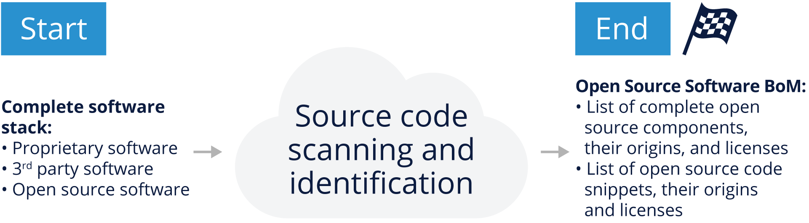

审计过程有一个主要输入和一个主要输出（见上图）。 该流程的输入是正在进行的并购交易的完整软件堆栈主题。 这包括专有、开源和 3rd 方软件。

在流程的最后，主要输出是一份详细的开源软件材料清单，其中列出了：

- 所有用作组件的开源软件、它们的来源和确认的许可证
- 专有或第三方软件中使用的所有开源代码片段、它们的原始组件和确认的许可证

### 9.3.3 评估审计范围

审计的规模、范围和成本因事务而异，并且通常随着源代码的大小和复杂性而增加。为了确定开源审计的成本和时间，审计人员需要对代码库的大小和特征，以及项目的紧迫性有一些基本的了解。

第一个问题将与代码度量相关，例如源代码库的大小、源代码的行数以及需要审核的文件数。审计员还会询问代码库是否仅由源代码组成，或者它是否包含二进制文件、配置文件、文档和其他可能的文件格式。有时，审计人员了解受审计的文件扩展名也很有帮助。正如我们在本模块中已经学到的，了解这些内容将有助于团队选择正确的工具来支持审计。

由于审计价格讨论在流程的早期根据规模和范围进行，因此收购方可能无法访问上述所有信息。审计员至少需要在继续之前了解要扫描的文件数量，尽管附加信息将有助于改进估计。当审计师有足够的信息来了解工作范围时，他们还需要了解紧迫性，因为这对审计成本有重大影响。

## 9.4 审计方法

### 9.4.1 概览

根据审计员在初始采购讨论阶段发现的情况，他们可能不得不依赖多种类型的工具（扫描、许可证识别、组件管理）来执行审计。

有两种审计方法：

- 传统审计，其中审计员可以完全访问所有代码并远程或现场执行审计。
- “自己动手”审计，目标公司或收购方使用工具自行执行大部分实际审计工作，并可选择对审计公司的结果进行随机验证。

### 9.4.2 传统审计

这种方法被称为传统方法，因为它是用于开源合规性目的的源代码扫描的原始方法。传统审计是第三方审计公司的合规审计员通过云系统远程访问源代码或在访问现场时物理访问源代码并执行源代码扫描的审计。

请注意，不同服务提供商的流程可能略有不同。典型的传统审计流程遵循以下步骤：

- 审核员向收购方发送问题，以便更好地了解工作。
- 收购方做出回应，让审计师更好地了解审计范围和审计参数。
- 审核员根据答复提供报价。
- 就报价达成一致。接下来是签署服务协议、工作说明书、保密协议等（请注意，所有数字中的“开始”均假设所有协议签署后审计过程实际开始。）
- 审核员可以通过安全的云上传或访问公司进行现场审核来访问目标代码。
- 审计员扫描目标的源代码，清除任何误报，并评估结果。
- 审计员生成报告并将其交付给客户。
- 随后通过电话或面对面的会议与审核员一起审查结果并解决任何问题。

这种方法在大多数审计服务提供商中都很常见，它允许有机会为同一审计工作收集多个投标，并能够根据您的要求选择最佳投标。

为了使这种模式有效，目标公司必须愿意将代码传输给审计员或允许他们访问他们的办公室以完成现场工作。

### 9.4.2 自己动手 (DIY) 审计

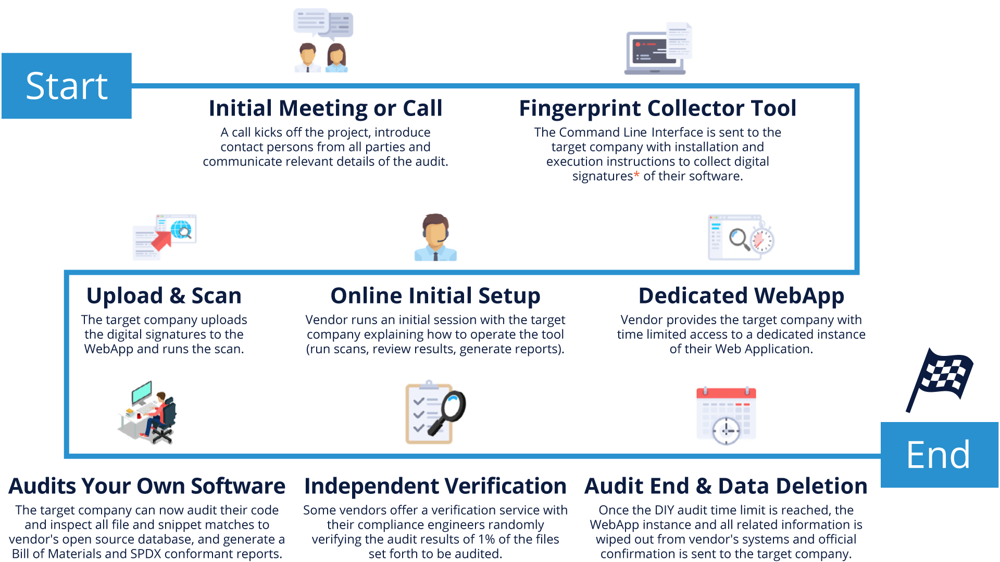

Do-It-Yourself (DIY) 审计为收购方或目标公司提供了对合规云工具的限时访问，使他们能够自己运行扫描。然后，他们可以通过完全访问知识库和所有报告工具在内部执行审计。

对于拥有足够经验来解释扫描结果和建议补救程序的内部员工的公司来说，这是一种特别有趣的方法。对于每年经历多次并购过程的公司来说，它可以很快变得更具成本效益。审计工具服务提供商可以进行独立认证以验证结果，进一步确保审计的完整性。

这种方法有几个优点，例如能够在需要时立即开始审核，因为它使用内部资源并且不依赖于第三方审核员的可用性。这种方法可能会缩短时间并减少外部成本来源。

任何合规性问题都可以立即解决，因为它是由可以直接访问代码并可以直接应用修复程序的人员进行的。最后，审计可以由审计工具的提供者进行验证，以确保正确性和完整性。

### 9.4.3 最终审计报告说明 

许多审计工具也可以调整以突出潜在问题。 仔细查看结果后，您可能会发现许多结果都不是问题，但您应该预料到初始报告中可能会出现大量“噪音”。

噪音可能来自代码树中但未使用的剩余代码之类的东西。 因此，初始报告可能很长，您应该准备好花时间过滤报告以找出真正的问题。

请注意，通常按需提供软件包数据交换 (SPDX) 一致性报告。 因此，如果您希望您的审计服务提供商提供这样的报告，您将需要请求它，如果您已经投资了与 SPDX 兼容的工具，这将使导入和跟踪您的审计结果变得更加容易。

### 9.4.4 获取前和获取后的补救措施

到此为止，收购公司应该清楚目标公司如何使用和管理开源软件，以及他们在满足开源许可义务方面取得了多大的成功。收购者和目标应该使用此信息协商任何开源遵从性问题的补救措施。

如果在审计中发现任何问题，有几个选项可以解决这些问题，作为挂起事务的一部分。第一种选择是简单地删除任何违规代码。如果开源软件只是增加专有代码，那么完全消除它是可能的。另一种选择是围绕违规组件进行设计，或者使用洁净技术重写任何代码。

如果代码部分确实是必要的，或者它之前已经发布过，那么剩下的唯一选择就是使代码符合要求。每个期权的成本可以用来确定目标的估值。无论选择何种方案，关键是要确定参与合并开放源代码的个人，并让他们参与补救工作。他们可能拥有有助于解决问题的额外文档或知识。

## 9.5 作为收购方准备审计

### 9.5.1 考虑您的需求

作为收购方，您必须在委托审计之前采取行动并做出决定，并且在收到结果后您还有额外的义务。 因此，重要的是考虑您的需求，以及前面提到的哪种审计方法最适合您的组织和特定情况。

就审计结果而言，确定组织最关心什么也同样重要。 源代码审计报告可能会提供大量信息，具体取决于扫描代码的复杂性。 因此，在获得结果之前确定哪些许可证和用例被认为是关键的很重要。

在审核前后明确您的需求不仅会使审核过程更顺畅，而且从长远来看也更具成本效益。

### 9.5.2 提出正确的问题

开源审计报告提供了大量有关目标源代码和所涉及许可证的信息。但是，许多其他数据点需要进一步调查，以澄清或确认与合规性相关的问题。在本节中，我们提供了一系列问题，以此作为起点来确定对您而言重要的内容，以及您应该向目标公司解决哪些问题。

- 目标公司是否使用了可能危及目标公司或收单方知识产权的许可代码？
- 是否有任何来源不明和/或许可证不明的代码片段？
- 目标的开源合规实践是否足够成熟和全面？
- 目标公司是否跟踪其开源组件中的已知漏洞？
- 在分发产品时，目标是否提供所有必要的材料来满足开源许可义务（书面报价、各种必要的通知和适用的源代码）？
- 目标公司的合规流程是否与开发速度保持一致以满足产品发布计划？
- 目标是否有适当的流程来及时响应对源代码的请求？ 

### 9.5.3 确定要解决的项目

在某些情况下，开源审计可能会发现收购方不可接受的许可或合规实践实例。 然后，收单方可以请求减轻这些情况，作为结束交易的条件。

例如，目标公司可能使用使用许可证 A 的代码组件，但收购公司有严格的政策禁止使用许可证 A 下许可的任何源代码。

在这种情况下，双方需要讨论并找出可能的解决方案。

### 9.5.4 制定收购后合规改进计划

当收购方是一家大公司，收购一家将继续作为子公司运营的小型初创公司时，制定合规改进计划尤为重要。 在这种情况下，收购方通常会帮助目标公司建立正式的合规政策和流程，提供有关其自身实践的培训，并提供持续的指导和支持。

也可能有机会通过改进工具/流程和/或人员配备来协助收购。

## 9.6 准备作为收购目标的审计

### 9.6.1 做好准备

如果您准备好了，通过开源合规性审核并不难。但是，如果您仅在收购方表现出兴趣后才开始准备，这种情况就不太可能发生。这些活动旨在与您的日常业务和发展活动齐头并进。目标是确保公司跟踪所有开源组件并遵守因使用开源组件而产生的开源许可义务。如果您的公司成为公司交易的目标，这些相同的措施可能会大有帮助，因为它们最大限度地降低了意外风险。

正如您将在接下来的几页中看到的，这些实践与我们在本模块中学到的内容一致。

### 9.6.2 了解您的代码中的内容

了解代码中的内容是合规性的黄金法则。您需要维护所有软件组件的完整软件清单，包括它们的来源和许可证信息。这包括由您的组织创建的软件组件、开源组件和源自第三方的组件。最重要的一点是有一个识别和跟踪开源组件的过程。您并不总是需要复杂的合规计划，但是，您应该具备五个基本要素：政策、流程、员工、培训和工具。

### 9.6.3 政策和流程

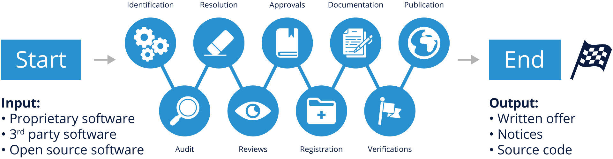

这个数字重申了我们已经涵盖的一些内容，但在这里重新审视它很重要。

开源合规政策是一套管理开源软件（使用和贡献）的规则。流程是关于公司如何每天实施这些规则的详细规范。合规政策和流程管理开源软件的使用、贡献、审计和分发的各个方面。

此图说明了一个示例合规性流程，其中包含每个软件组件在构建产品或软件堆栈时作为尽职调查的一部分将经历的各个步骤。

- 识别所有传入的源代码
- 审计源代码
- 解决审计发现的任何问题
- 完成适当的审查
- 获得使用开源的批准
- 在软件清单中注册开源
- 更新产品文档以反映开源使用情况
- 对分发前的所有步骤进行验证
- 分发源代码并执行与分发相关的最终验证

该过程的输出是您可以发布的开源 BoM，以及一份书面报价和各种版权、许可和归属通知，以履行您的 BoM 中组件的法律义务。

有关开源合规性流程的详细讨论，请下载由 Linux 基金会出版的免费电子书《企业中的开源合规性》。

### 9.6.4 工作人员

在大型企业中，开源合规团队是一个由不同个人组成的跨学科团队，其任务是确保开源合规性。核心团队通常称为开源审查委员会 (OSRB)，由来自工程和产品团队的代表、一名或多名法律顾问以及一名合规官组成。

扩展团队由多个部门的不同人员组成，他们持续为合规工作做出贡献：文档、供应链、企业发展、IT 和本地化。但是，在较小的公司或初创公司中，这可能就像由法律顾问支持的工程经理一样简单。

### 9.6.5 培训

教育是合规计划的重要组成部分，可帮助确保员工充分了解管理开源软件使用的政策。提供开源和合规培训的目标是提高对开源政策和策略的认识，并建立对开源许可问题和事实的共同理解。它还应涵盖将开源软件纳入产品和/或软件组合的商业和法律风险。

正式和非正式的培训方法都可用。正式的方法包括讲师指导的培训课程，员工必须通过知识考试才能通过课程。作为新员工入职培训的一部分，非正式方法包括网络研讨会、棕色包研讨会和向新员工介绍。

### 9.6.6 工装

到目前为止，您已经在本模块中了解到，有许多不同类型的工具可以在合规流程中使用。要记住的重要一点是，工具不能替代良好的流程，知识渊博的员工根据政策和工具提供的数据做出决策。

考虑对您的工具采用“开源”方法也很重要 - 对现有工具进行持续评估，以及在必要时进行调整的能力对于维持健康的合规计划至关重要。 

### 9.6.7 合规

如果您发布了包含开源软件的产品（无论是有意还是无意），您都需要遵守管理这些软件组件的各种许可证。 因此，了解代码中的内容非常重要，因为完整的材料清单使合规性变得更加容易。

合规性不是一项简单的任务，它因产品而异，具体取决于许可证和代码结构。 在较高的层面上，合规意味着您：

- 跟踪所有开源软件的使用。
- 为产品发货图像中的所有软件编译最终的开源 BoM。
- 履行开源许可证的义务。
- 每次发布软件更新时重复该过程。
- 快速、认真地回应合规查询。

### 9.6.8 了解最新版本的安全性

全面合规计划的好处之一是可以更轻松地找到具有不安全版本的开源组件的产品并替换它们。大多数源代码扫描工具现在提供标记旧软件组件中披露的安全漏洞的功能。

升级开源组件时的一个重要考虑因素是始终确保该组件保留与先前版本相同的许可证。开源项目偶尔会更改主要版本的许可证。鼓励公司与开源项目社区合作，以帮助避免他们使用具有安全漏洞的版本的情况。

积极参与您使用的所有开源项目是不合理或不可行的，因此需要一定程度的优先级来确定最关键的组件。不同级别的参与范围从加入邮件列表和参与技术讨论，到贡献错误修复和小功能，再到做出重大贡献。至少，对于从事特定开源项目的公司开发人员来说，订阅和监控与安全漏洞和可用修复相关的报告的邮件列表是有益的。

### 9.6.9 衡量您的合规工作

对于各种规模的组织来说，最简单、最有效的第一步是参与 OpenChain 项目（前面提到过）并获得“OpenChain Conformant”状态。这是通过在线或手动填写一系列问题来完成的。

用于 OpenChain 一致性的问题有助于确认组织已经创建了开源软件合规性流程或政策。 OpenChain 是一个行业标准，类似于 ISO 9001。它专注于“大局”，为每个组织提供精确的流程和政策实施。

OpenChain Conformance 表明存在开源合规流程或政策，并且可以在供应商或客户要求时共享更多详细信息。 OpenChain 旨在在全球供应链中的组织之间建立信任。

### 9.6.10 结论

开源尽职调查通常是并购交易中需要成功完成的一长串任务中的一项。 然而，鉴于软件和潜在知识产权风险的核心作用，它仍然是一般尽职调查工作的一个重要方面。

尽管开源尽职调查似乎是一个漫长的过程，但它通常可以很快完成，特别是如果双方都做好了准备，并与快速的合规服务提供商合作。

### 9.6.11 你如何做好准备?

如果你是目标，你可以通过确保你的开发和业务流程包括:

- 识别所有内部和外部软件的来源和许可。
- 跟踪开发过程中的开源软件(组件和代码片段)。
- 对进入构建的新代码或更新代码执行源代码审查。
- 当产品交付或软件更新时，履行许可义务。
- 为员工提供开源遵从性培训。

如果你是收购方，你应该知道要寻找什么，并具备快速解决问题的技能:

- 与目标公司一起决定使用合适的审计方法，以及聘请哪一家第三方进行审计。
- 注意，有些不具备盲测试的能力，有些不支持DIY，还有一些不具备发现代码片段的能力。
- 如果可能的话，获得多个投标的审计和了解更多关于您的审计服务提供商。这一步不只是关于成本，而是关于获得精确的输出，以帮助您解决可能存在的任何问题。确保你有内部专家对每个投标进行平等的比较，并包括所有审计参数，如:
  - 审核方法、输入和输出
  - 与目标公司和收购公司的主要联系人迅速讨论出现的问题
  - 时间安排和物流，特别是如果涉及到现场访问
  - 机密性参数
  - 代码漏洞和版本控制分析
  - 成本，流程正常，加急

开源遵从性是一个持续的过程。维护良好的开源遵从实践使公司能够准备好任何软件转手的场景，从可能的收购、销售或产品或服务发布。出于这个原因，我们强烈鼓励公司投资构建和改进他们的开源遵从性程序。

