# 1. 课程简介

## 1.1 简介

在本节中，我们将解释上游在开源项目上下文中的含义，并讨论治理模型及其对您的贡献策略的影响。

## 1.2 学习目标

在本节结束时，您应该能够：

- 描述什么是上游开源项目及其重要性
- 解释一些典型的治理模型和成功贡献的策略

# 2. 上游开源简介

## 2.1 我们所说的上游是什么意思？

我们已经在本模块中使用了上游这个术语，但这是什么意思？

这是一个快速定义：

 **上游（名词）** 

衍生品所基于的原始开源软件项目

这个术语来自这样一种想法，即水和它携带的货物漂浮在下游并惠及那些接收它的人。

 **上游（动词）** 

“将更改推送到上游项目”的简写方式，即将您对源代码程序所做的更改贡献回专用于该程序的原始项目。

如果你在供应链的背景下考虑上游，它会是这样的：

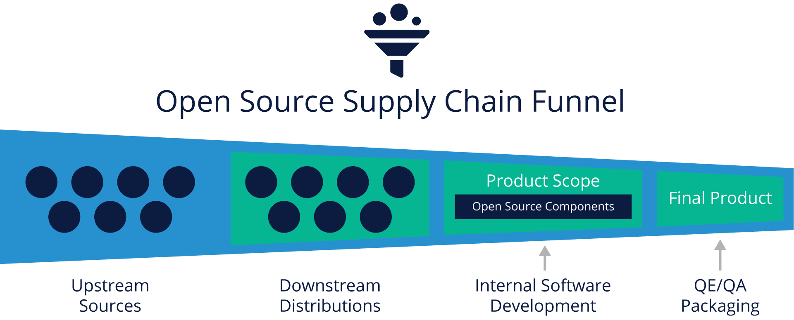

## 2.2 为什么要向上游贡献？

组织经常提出的最大问题是为什么还要从一开始就为上游做出贡献。 虽然只是消费而从不回馈似乎更容易，但您应该考虑做出贡献的原因有很多，包括：

- 公共开发从不考虑私有代码
- 将您的更改集成到上游意味着其他人知道它们，并且可以围绕它们进行规划
- 降低您自己的代码意外损坏的风险 - 如果您进行与上游项目不兼容的本地更改，则需要时间和资源来修复这些问题
- 将变更集成到上游项目中可以减少构建成品的工作量
- 贡献的代码经过审查，可能会吸引外部资源来更改您在上游项目中需要的更改
- 贡献加强项目，让你有机会影响未来的项目方向

## 2.3 你什么时候应该贡献上游？

刚接触开源的组织往往在合适的时间开始为上游做出贡献而苦恼。 以下指南很好地概述了上游贡献的原因/时间：

- 当保持代码与上游项目同步的成本（时间或美元）超过单独工作的便利性时
- 当您希望其他人（包括客户）使用您的代码时
- 当您希望您的代码成为事实上的标准，或推动主线项目的采用时
- 如果您预计在即将推出的产品中重复依赖某个代码库来补充上游项目

## 2.4 示例：没有上游的开发

为了让您更好地了解如果您没有有效地参与上游项目会发生什么，这里有一个图形示例：

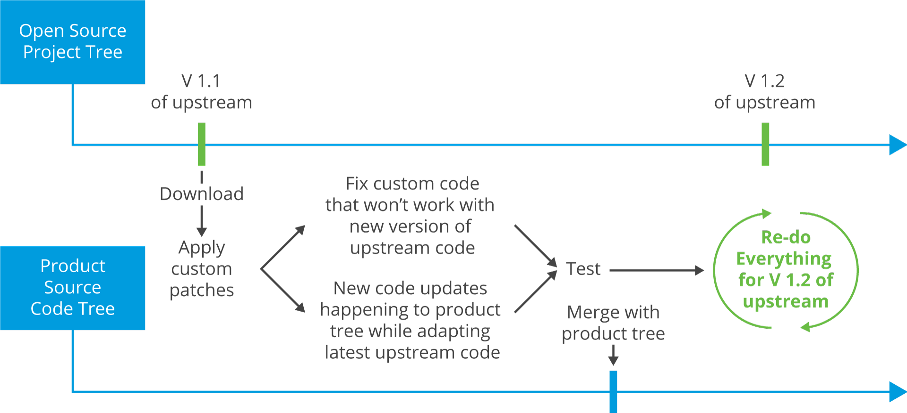

如您所见，当您需要引入上游开源项目的“主线”时，例如当您需要的安全漏洞或功能发布时，它会变得非常繁重。 定期跟上上游项目的主要版本意味着您正在逐步支付该成本，而不是一次性支付。

## 2.5 示例：上游开发

作为一个反例，以下是采用有效上游贡献策略的开发情况：

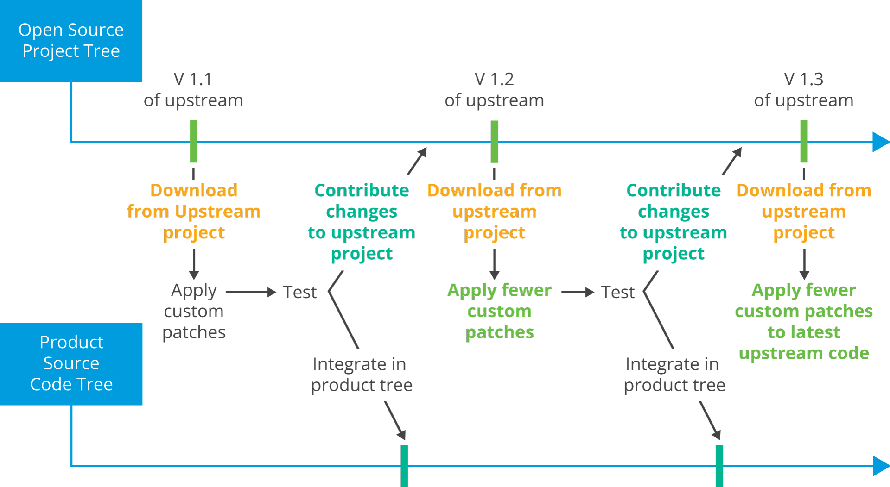

这里要注意的重要一点是应用较少的自定义补丁，因为在频繁地进行上游贡献并更好地与上游项目保持同步时，可以更快地发现问题和集成问题。

## 2.6 上游治理模型

上游开源项目使用的治理模型并不缺乏。 它们因集权程度、一个或几个组织实体的强大影响以及受民主启发的决策机制和领导选择的存在而异。

模型的选择和执行的好坏对项目的质量，以及它被采用和发展、改进和成功的速度有着深远的影响。 没有一刀切的模型，每个模型都有其支持者和反对者。 此外，不同的项目有不同的内在需求，一种特定的模式可能会更好地满足这些需求。

在接下来的页面中，我们将介绍最常用的治理模型。

### 2.6.1 公司主导的治理

公司主导的项目有一个基本封闭的过程，具有以下特点：

- 发展是由一个公司或组织的利益强烈引导的
- 一个实体控制软件设计、发布
- 可能会也可能不会征求贡献、补丁、建议等。
- 内部讨论、争议，可能不会播出太多
- 下一个软件版本的确切内容尚不确定
- 发布后，所有软件都完全开放

示例：Google Android、Red Hat Enterprise Linux (RHEL)

可以想象，很难影响这些项目的方向，除非为这些工作的上游项目做出贡献——例如，Linux 内核是 Google Android 和 Red Hat Enterprise Linux 的上游，并且在那里获得了接受的功能（ 如果合适）是影响 Android 和 RHEL 的一种方式。

### 2.6.2 仁慈的独裁者

具有这种治理类型的项目通常由一个或几个关键人物强有力地领导。 它们还具有以下特点：

- 一个人对每一个决定都有压倒一切的影响
- 项目的质量取决于仁慈的独裁者的质量
- 可以避免无休止的讨论并加快步伐
- 随着项目的发展，成功在很大程度上取决于独裁者的能力：
- 处理许多贡献者
- 使用健全、可扩展的版本控制系统
- 任命子系统维护人员并与之合作
- 仁慈的独裁者的角色可能是社会和政治的，而不是结构性的：分叉随时可能发生
- 随着项目的成熟，维护者编写的代码越来越少

示例：Linux 内核

### 2.6.3 理事会

具有理事会结构的项目具有以下特点：

- 一个机构（组）在公开邮件列表上进行讨论
- 关于设计、发布日期等的决定是集体做出的
- 关于谁可以贡献、如何接受补丁和新软件的决定由管理机构做出
- 在治理结构、组织规则、所需的共识程度等方面存在很大差异。
- 倾向于不那么频繁地发布，但希望调试良好的版本

示例：FreeBSD、Debian

具有这种治理形式的项目可以由业余爱好者或企业开发人员组成，但与基金会/联盟模式相比，其公开的企业影响力往往要小一些（见下文）。

### 2.6.4 基金会/财团

基金会或联盟内的项目混合了先前讨论的治理模型，通常具有以下独特特征：

- 业务/战略治理监督委员会/董事会
- 提供整体业务和战略方向
- 成员通常由项目的企业赞助商组成
- 单独的技术指导委员会进行技术决策
- 用于技术讨论的公共决策/邮件列表
- 由企业赞助商技术资源组成的领导层
- 能够任命/投票给非公司附属技术资源
- 定期发布，测试/验收周期更长

示例：Open Stack、Kubernetes、Academy Software Foundation

我们将在未来的培训模块中更多地介绍 Foundations 和开源合作伙伴关系。

### 2.6.5 参与注意事项

很多人问以上哪种治理模式最好，或者他们的组织应该参与哪个。现实是每种模式都有优点和缺点，但在很多情况下，你可能无法选择参与哪种模式，特别是如果该项目是您的产品或业务的核心。

作为一个组织，您应该考虑的最重要的事情是确保您拥有合适的人员配备（工程和领导力）以有效参与您需要使用的项目的任何模型。许多组织面临的最大挑战是参与太多或很少的工程或管理资源。

了解您的组织从项目中需要什么——如果您需要战略投入，做出持续的工程贡献以及资金支持或领导可能是您最好的选择。如果您主要是技术的消费者，只是偶尔需要做出上游贡献，那么采用主要由工程驱动的资源方法可能会更好。

# 3. 有效的上游贡献策略

## 3.1 简介

在本节中，我们将讨论如何最有效地与上游开源项目合作，包括了解与开发社区互动的最佳方式、成功策略以及应避免的行为。

## 3.2 学习目标

在本节结束时，您应该能够：

- 描述与上游社区有效合作的最重要因素
- 解释成功的上游贡献的最佳实践
- 了解您需要在组织中解决哪些流程和注意事项才能成为有效的上游贡献者

## 3.3 上游合作

### 3.3.1 贡献的地方

在了解为上游项目做出贡献的重要性之后，下一个最重要的决定是找出您应该在何处做出贡献。正如我们在模块 2，开源业务战略中所述，从工程和业务角度清楚了解哪些开源项目对您很重要，这将有助于指导您做出这一重要决策。

一般来说，您应该根据为您的组织提供最大整体价值的因素来评估开源项目和您的贡献，以及您必须花费多少工程资源来实现这些贡献。

一些重要的问题和考虑包括：

- 我们在组织内使用哪些开源项目？花一些时间来评估哪些开源项目已经在整个组织中使用，以确定哪些对您的业务具有战略意义。您可能希望将评估重点放在几个地方：关键业务基础设施（运营）、影响您发布产品能力的开发和部署工具，以及对面向客户的产品或服务很重要的软件。
- 我们应该针对哪些项目做出贡献？大多数组织使用许多开源项目，因此确保您的计划只关注最重要的项目非常重要。仅仅因为一个项目不在目标列表中并不意味着人们不能为该项目做出贡献；这只是意味着它不是您组织的关键焦点。如果开源项目对您的业务至关重要，并且有可能导致严重停机或中断您为客户服务的能力，那么它可能是一个很好的贡献候选人。

### 3.3.2 贡献什么

除了应该为上游项目做出贡献之外，最重要的问题之一是“为什么这些贡献很重要？”

很容易进入并开始谈论你计划做的所有伟大的事情，但不要忘记包含令人信服的论据，说明为什么这项工作对组织很重要和具有战略意义，以及你计划如何实施任何和所有战略价值的贡献。

有时，这些贡献对于支持您正在构建的产品很重要，有时它们对于保持整个上游项目的强大和健康很重要，以便您可以在下游工作中依赖它。您还需要从上游项目的角度考虑这一点 - 您的计划贡献需要对上游项目的更广泛社区有价值。

重要的是要避免提出可能对您的组织具有战略意义的贡献的不良行为，但仅对您自己的用例有用，并且通常不适用于整个上游项目社区。

### 3.3.3 如何贡献

关于您如何为上游开源项目做出贡献的技术流程，有很多很好的资源，但是，让我们在高层次上集中讨论在考虑您的组织将如何做出贡献时可以使用的一些最佳实践。

以下是您开始贡献之旅时需要考虑的一些事项：

- 采用“上游优先”的理念
- 始终计划与主分支合并
  - Fork 和 side branch 都可以，只要有与上游合并的计划
- 使内部开发工作与上游分支发布节奏保持一致
- 要求正确记录所有代码，以便上游审查人员更好地理解，这可能有助于加快验收周期
- 尽早关注发布并经常练习。不要构建庞大的代码库，然后决定将其上游化。共享设计、早期代码并在相互构建的较小的独立补丁中提交大量贡献。
- 跟踪您选择不上游的代码：抓住每一个机会重新评估。如果您发现内部维护代码的大小呈上升趋势，则需要对先前的决定进行讨论和重新评估。

### 3.3.4 有效的贡献政策

尽管将有效的合规政策作为开源战略的一部分实施很重要，但让您的法律和领导团队参与以帮助建立快速批准上游贡献的轻量级政策也很重要。

这些政策不应该是关于规则和条例的，而应该更多是帮助人们成功地为开源项目做出贡献。如果人们有指导方针和清单，以确保他们拥有做出成功贡献所需的一切，而不会遇到许可或保密问题，这会有所帮助。

特别是对于新的贡献者，在做出贡献之前，将内部审查流程作为一个安全的地方来获得反馈也很有帮助。

在许多情况下，贡献政策已经预定义了上游项目使用的已批准开源许可证列表，并与开发人员采取“沙盒”方法，如果他们为使用以下项目之一的项目这样做，则允许他们为上游项目做出贡献预先批准的许可证。

目标是平衡开源的公司治理与促进与上游开发人员交互的流程。

### 3.3.5 人员配备注意事项

人员配备是成功的上游贡献的关键因素。如果您的工程团队做出了一些小的上游贡献，您可能已经在您的组织中拥有相关的专业知识。但是，当您开始查看对您的业务至关重要的上游项目时，您需要确定您是否拥有相关的内部专业知识来做出持续贡献，或者您是否需要为此聘请。

如果您必须从外部招聘，重要的是要确保找到不仅具备做出贡献的技能的人，而且还能够找到能够让社区接受上游贡献的人。

招聘的一种方法是考虑从上游项目社区招聘关键开发人员和维护人员。请注意，这些人的需求量很大，因此您不仅要准备好提供适当的薪水，还要准备好让他们能够继续从事他们所参与的上游项目的工程文化。

目标是找到具有足够同行认可度以在社区中具有影响力的人。这通常有三个支柱：领域专业知识、开源方法和工作实践。您还需要将公司利益与个人利益结合起来：当高级开源开发人员的个人利益与给定项目中的公司利益不符时，很难激励高级开源开发人员工作。例如，Linux 内存管理专家可能对处理公司优先事项的文件系统不感兴趣。因此，找到一个兴趣匹配的人对于一段长久的关系来说是至关重要的。

### 3.3.6 时间表/时间注意事项

在项目时间表中为上游贡献提供足够的时间至关重要。如果您的内部开发人员正在为上游做出贡献，则您需要在他们的日程安排中预算时间，以允许做出这些贡献。如果您正在聘请外部开源开发人员到您的组织中工作，并在您的产品上工作，您还需要考虑如何平衡他们的日程安排。

招聘开源开发人员的核心原则是支持你的开源开发和上游活动。还期望他们应该在他们的专业领域支持产品团队。然而，产品团队利用他们的影响力试图通过让他们尽可能多地从事产品开发来劫持开源开发人员的时间并不少见。如果发生这种情况，许多开源开发人员将上门寻找新工作，让他们在您意识到刚刚发生的事情之前就可以从事上游项目。

因此，创建和维护上游工作和产品工作的分离很重要。换句话说，建议为您的开源开发人员提供有保证的时间来满足他们的上游愿望和责任，特别是如果他们是维护人员。对于在产品组件中使用开源的初级开发人员或其他内部开发人员，与上游社区的这种互动将增加他们的语言、沟通和技术技能。

在没有这样的上游时间保证的情况下，这些团队成员很容易被吸进成为产品团队的延伸，导致他们的上游重点枯竭而转向产品开发，这在短期内可能会有所帮助，但可以最终会导致您的组织在上游社区中的声誉受损，这会对您在对您的组织有益的领域帮助指导上游项目的能力产生负面影响。

### 3.3.7 培训注意事项

即使您聘请了最好的外部开源开发人员，您也需要考虑为您现有的工程人员提供培训机会，因为与上游社区合作的体验可能与他们过去习惯的体验大不相同。

您应该考虑哪些类型的培训？

- 做出上游贡献的最佳实践
- 关于开源、许可证、治理等的一般培训。
- 解决冲突或应对具有挑战性的人的培训

为了随着时间的推移扩大你的努力，在你的培训计划中包括一些编程，这些编程提供经验丰富的开源贡献者作为新贡献者的导师。指导是在与您的产品相关的特定技术领域培养开源人才的有效方式。

从公司外部聘请一些资源很容易，但这种方法有几个限制。另一种方法是通过技术领域和开源方法的培训，将您现有的开发人员转变为开源贡献者。然后，这些开发人员可以与导师配对，以进一步扩展他们的技能。

建立一个导师计划，让经验丰富的资深开源开发人员为初级、经验不足的开发人员提供指导。通常，导师计划会持续 3 到 6 个月；在此期间，导师应监督受训者的工作，分配任务，并确保得到适当的结果。导师还会对受指导者产生的任何东西进行代码审查，并在受指导者将代码推送到上游项目之前提供反馈。

目标是增加公司为上游项目贡献代码的开发人员数量，并通过提高代码质量和上游项目接受代码的百分比来提高个人效率。一般来说，给定导师分配的学员不应超过 4-5 人，理想情况下，他们应该与导师在同一领域工作，以提高代码审查效率。

### 3.3.8 工具注意事项

提供灵活的 IT 基础架构非常重要，它允许开发人员在没有任何挑战的情况下与开源社区进行交流和工作。此外，您应该考虑建立与上游社区外部使用的工具相匹配的内部 IT 基础设施。这有助于弥合内部团队和上游项目社区之间的差距。

大部分基础设施会自然而然地随着您组织的开源文化而发展，但重要的是要意识到其实施的必要性和计划。开源开发中使用了三个主要的 IT 服务领域：

- 知识共享（维基、协作编辑平台和公共网站）
- 沟通和解决问题（邮件列表、论坛和实时聊天）
- 代码开发和分发（代码存储库和错误跟踪）

这些工具中的部分或全部需要在内部提供，以正确支持开源开发。这有可能与现有的全公司 IT 政策相冲突。如果是这样，解决这些冲突并允许开源开发人员使用他们熟悉的工具至关重要。这些开源实践通常需要一个不受许多标准限制的 IT 基础架构。

### 3.3.9 其他形式的贡献

请记住，上游社区还需要其他类型的可能与代码无关的支持。查看您感兴趣的项目的治理模型，以确定是否可以选择公司会员或赞助项目或负责该项目的基金会。这提供资金以帮助项目取得成功，并且在某些情况下，它可以帮助您的组织更多地参与咨询角色或对项目产生一些影响。

除了直接资助项目外，还可以考虑赞助相关会议。这些对于宣传您的工作和结识您可能想招聘的人来说非常有用。特别是，不要忽视您在有员工的本地用户组中的参与。赞助那些当地团体并派遣贡献者进行演讲是招募对特定开源项目充满热情的当地人的好方法。

### 3.3.10 评估您的上游工作

由于您在时间、人员和金钱方面进行了大量投资，因此考虑如何评估您的上游工作非常重要。您可以按照与任何会计投资一样的标准方式跟踪非代码贡献，例如赞助资金，但您应该认真考虑跟踪您关心的项目的贡献。

贡献可以包括上游代码开发、支持产品团队、知识转移（指导、培训）和可见性（出版物、演讲）。

有几个工具包可以帮助跟踪源代码贡献；例如，Linux 基金会使用名为 gitdm 的工具，该工具生成 Linux 基金会年度 Linux 内核报告中报告的数据。这可用于跟踪个人开发人员以及团队的整体绩效。可以跟踪个别开发人员提交的补丁数量、补丁接受率（提交的补丁除以接受的补丁）和补丁类型（例如，如果它是新功能、现有功能的增强、错误修复、文档、等）。

GrimoireLab 等其他工具也可用于绘制和可视化您要跟踪的指标。有关您应该跟踪的具体示例，请参阅有关指标的下一部分。

## 3.4 跟踪进度的指标

一旦您开始实施这些开源最佳实践，您将需要适当的开源指标来推动所需的开发行为。 但是产品组织中经常使用的传统指标不适用于开源开发环境。

例如，跟踪变更集或代码行的数量可能是衡量开源开发影响的一个很好的指标。 但是您可能有多个所需功能的实例在上游实现，因为您的开源开发人员游说社区的支持。 在这种情况下，变更集或代码行的数量几乎没有团队成员提供的技术领导力以获取上游代码并减少公司下游维护工作的重要性。 因此，您跟踪的指标应考虑到这两项活动。

### 3.4.1 随着时间推移的提交和行代码

要跟踪的最基本的事情之一是在特定时间段(如每周、每月或每年)中提交的数量和代码更改行数。

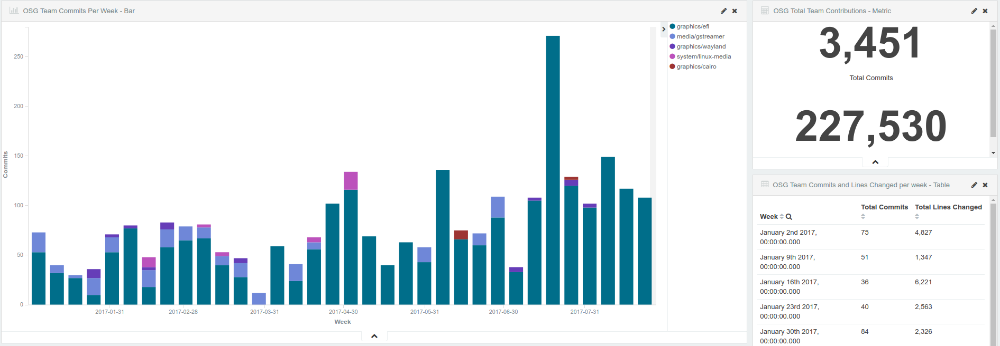

### 3.4.2 每周每个项目的总提交和更改行数是开始跟踪指标的好地方。

图1：使用此数据，您可以比较各个内部开发团队的贡献，以确定源代码贡献的来源，并帮助确保资源得到适当分配。

从这里您可以创建图表，比较各个内部团队的累积贡献、总贡献的百分比以及将代码提交到上游所需的时间（请参阅以下图表）。

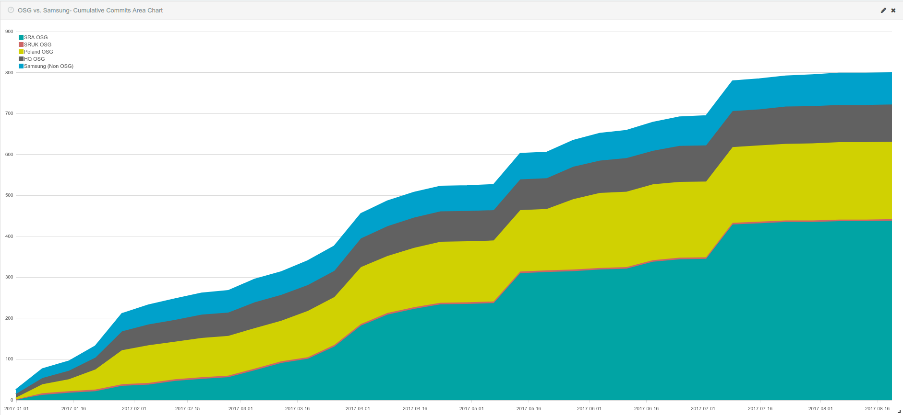

图2：可以跟踪一段时间内的累积贡献，以比较内部团队并确定增加他们在特定开源社区（在此图表中，是 Linux 内核）中的参与度的团队。

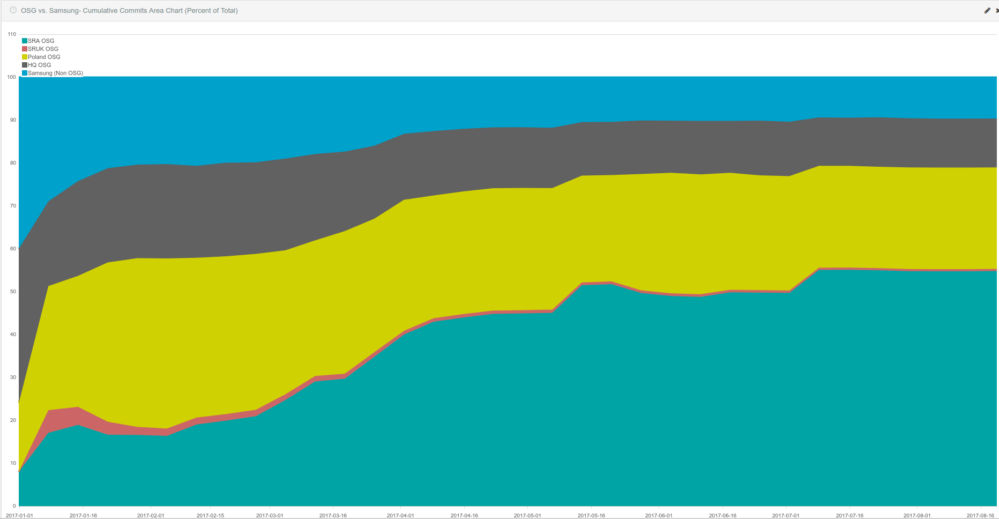

图3：将您公司的贡献显示为一段时间内总贡献的百分比，可以让您确定贡献最多代码的团队。

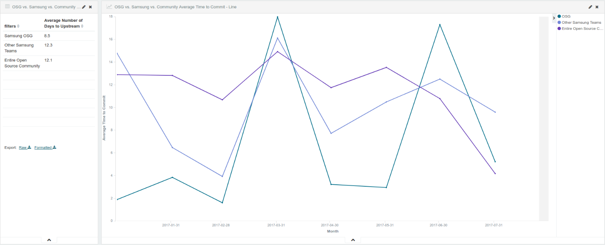

图4：向上游提交代码所需的时间对于跟踪您的开发效率很有价值。 此表格和图表显示了各个团队向上游贡献代码的速度，并将其与整个社区进行比较。

例如，您还可以使用这些指标将您的业绩与参与内核生态系统的其他公司进行比较（图 5）。 这种竞争分析可帮助您更好地了解项目的整体开发人员生态系统。

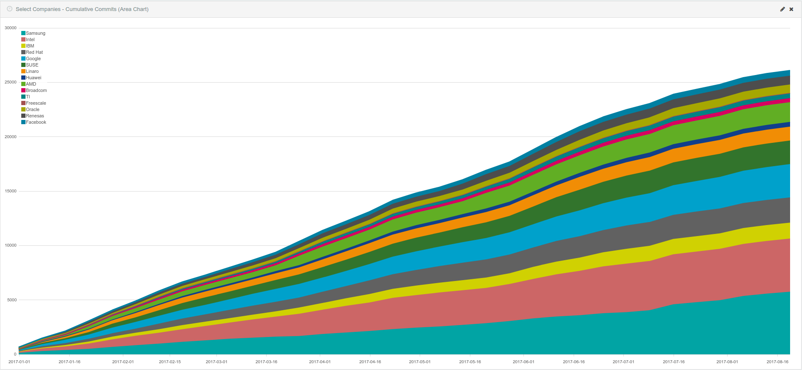

图 5：可以按公司对累积贡献进行排序，以查看您的公司与其他公司的对比情况。

这些指标可以更好地了解您的优势和劣势，并有助于告知您的整体发展战略。 例如，跟踪您自己相对于竞争对手的贡献，可以提供有价值的信息，帮助组织将其产品相对于竞争对手的产品在市场上定位。

成为最高贡献者本身并不是目标，而是表明组织的发展努力正在被其参与的社区所接受。

### 3.4.3 要记住的事情

到目前为止，我们已经提供了很多关于最有效地与上游开源项目合作的信息。我们将尝试将其提炼为要记住的一些关键事项：

- 建立政策和流程来指导开源贡献
- 建立一个团队来监督所有开源贡献的批准
- 专注于能够支持您的技术的领域的贡献
- 为贡献者提供所需的 IT 基础架构和工具
- 为您的员工提供有关捐款最佳实践的培训
- 跟踪贡献、衡量影响、改进和沟通
- 建立导师计划以培训经验不足的开发人员
- 提供贡献指南、操作方法、该做什么和不该做什么
- 为开发人员提供开源法律支持
- 从您最看重的开源社区招聘
- 始终遵循特定于每个项目的社区流程和实践
- 始终考虑您的上游内容是否对整个社区有价值，而不仅仅是针对您的产品的特定案例

# 4. 上游开发实践

## 4.1 课程简介

在本节中，我们将更详细地研究大多数上游项目使用的开发流程和实践，以帮助您提供有关如何实施我们在上一节中讨论的贡献策略的实用指南。

## 4.2 学习目标

在本节结束时，您应该能够：

- 描述如何做出上游贡献的整体流程
- 解释如何最好地调整内部流程以实现更好的上游协作

## 4.3 流程概览

### 4.3.1 开始之前

在确定了需要参与的项目之后，花一点时间了解项目的内部运作（包括前面提到的治理）会很有帮助。 以下是一些开始的方法：

- 关注项目讨论（邮件列表、IRC、Slack、论坛）以了解正在进行的工作
  - 谁是核心开发者？
  - 什么是高度优先的领域？
  - 发布周期如何运作？
  - 目前未解决的主要错误有哪些
- 试用最新的稳定版和实验版
- 确定您的兴趣和优先事项如何与项目的兴趣和优先事项保持一致
- 在社区中寻找与您有共同兴趣和优先事项的其他人，并与他们一起工作

### 4.3.2 信号意图

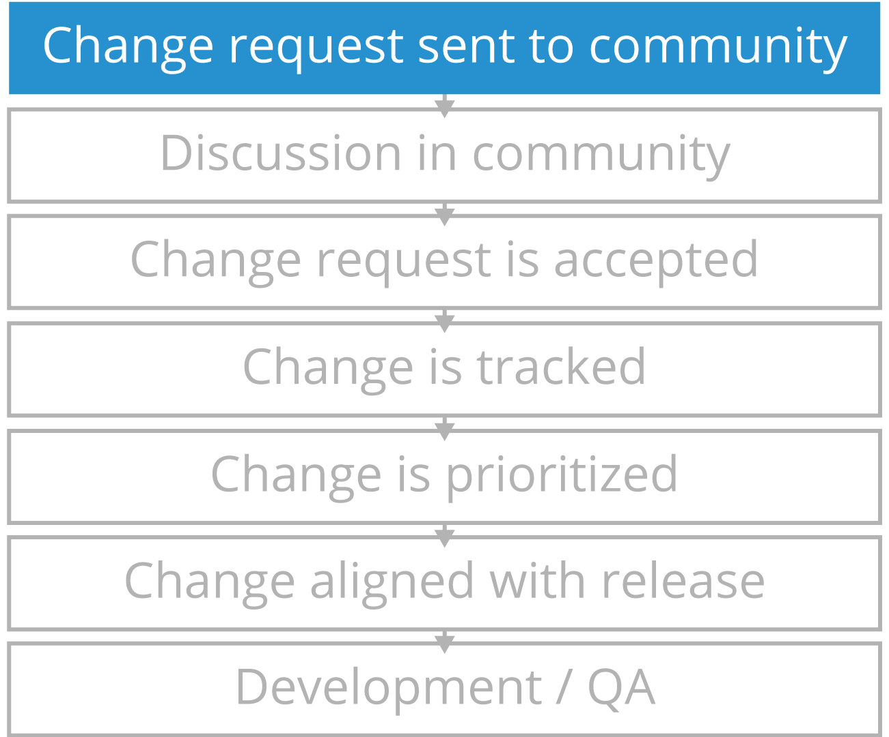

与社区沟通您计划提交哪些更改非常重要。 该过程通常从通过社区使用的任何机制向社区发送消息开始。

这种公开讨论是一个先决条件，有助于让维护者意识到你正在努力解决的需求和问题。 它通常可以帮助您招募其他人来帮助完成工作，并让您在进行大量工作（并拒绝您的更改）之前收集有关有用性和设计考虑因素的反馈。

当您提出更改建议时，请记住以下重要事项：

- 它应该对其他人有用，而不仅仅是对您的特定使用模型
- 它应该以小部分实施，并以提供立竿见影的方式交付
- 它应该得到准备在组织内实施和维护它的资源的支持

### 4.3.3 讨论和理由

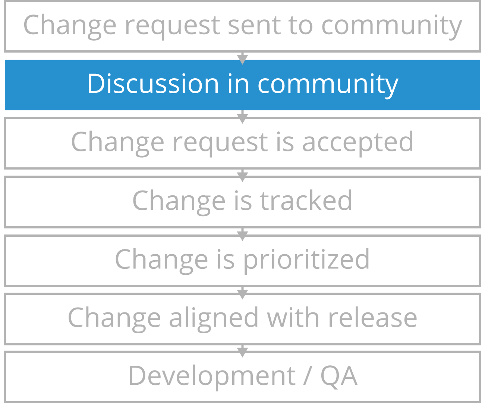

提交变更请求后，通常会在社区用于主要沟通的任何工具中进行某种形式的讨论。 这时候，它给了其他感兴趣的人一个评论、提供反馈、批评的机会，也给了维护者一个评论项目是否准备好接受这样的变化的机会。

此阶段的意见可以从简短的批准到有关实施的详细问题，特别是如果更改被认为是高风险的或可能侵入项目的核心部分。 最好先考虑一下如何说服他人并解决您在第一次发送此通信时可能遇到的潜在挑战。

### 4.3.4 接受

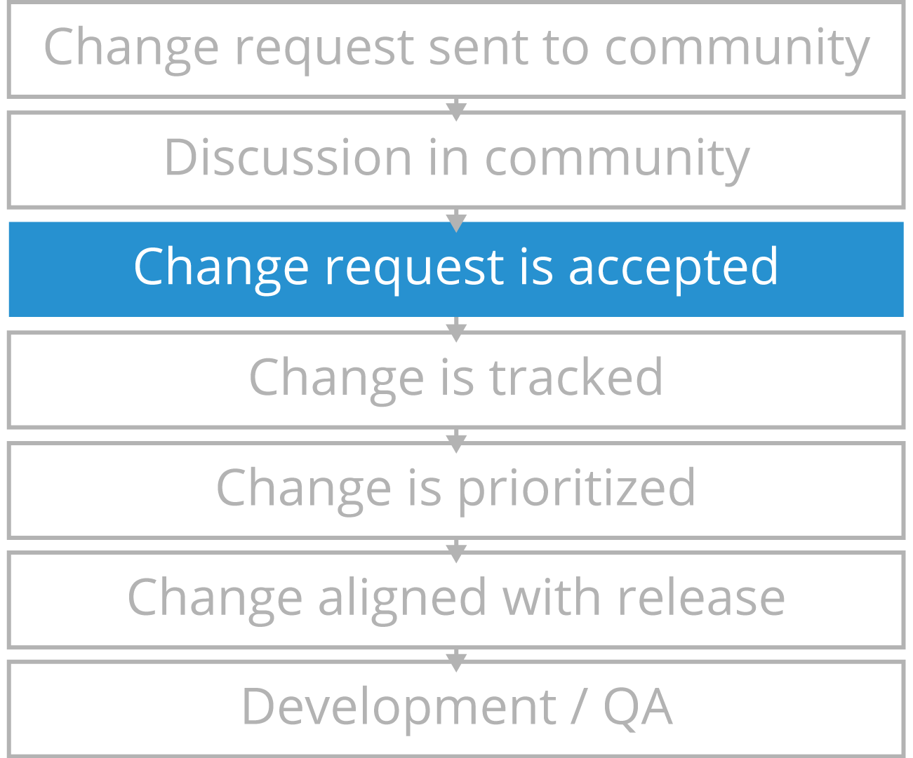

在社区讨论之后，如果维护者和其他相关方同意，则接受更改，并讨论一些额外的考虑因素，包括确定更改对项目的战略性，表明提议的实施似乎没问题，以及普遍的共识 更改不太可能影响项目的稳定性、安全性或整体功能。

一个或多个项目维护者通常会在此阶段表示他们的批准。

### 4.3.5 跟踪提议的贡献

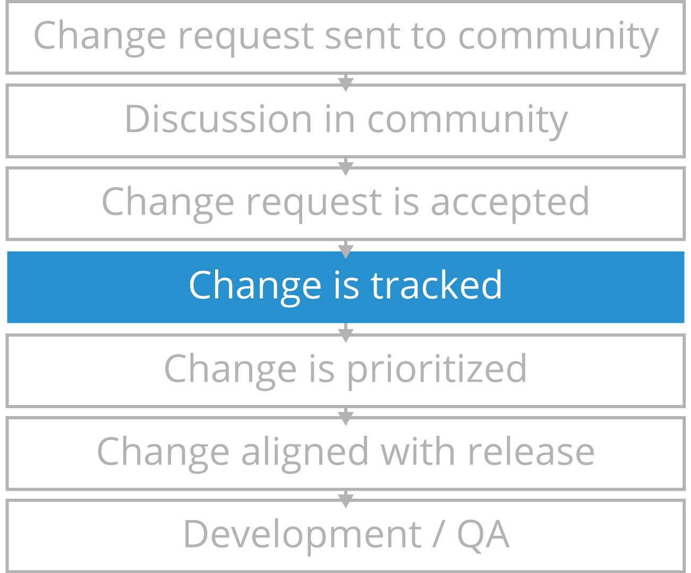

一旦更改被接受，就需要对其进行跟踪，这通常以某种形式的功能或错误跟踪发生，具体取决于项目社区使用的工具。 此跟踪条目被认为是提议的内容和被接受的更改内容的权威记录。

在这个阶段，原始提交开发人员将详细的功能信息添加到跟踪工具中，以便记录更改将影响哪些子系统以及实施的总体计划是什么。

### 4.3.6 优先排序

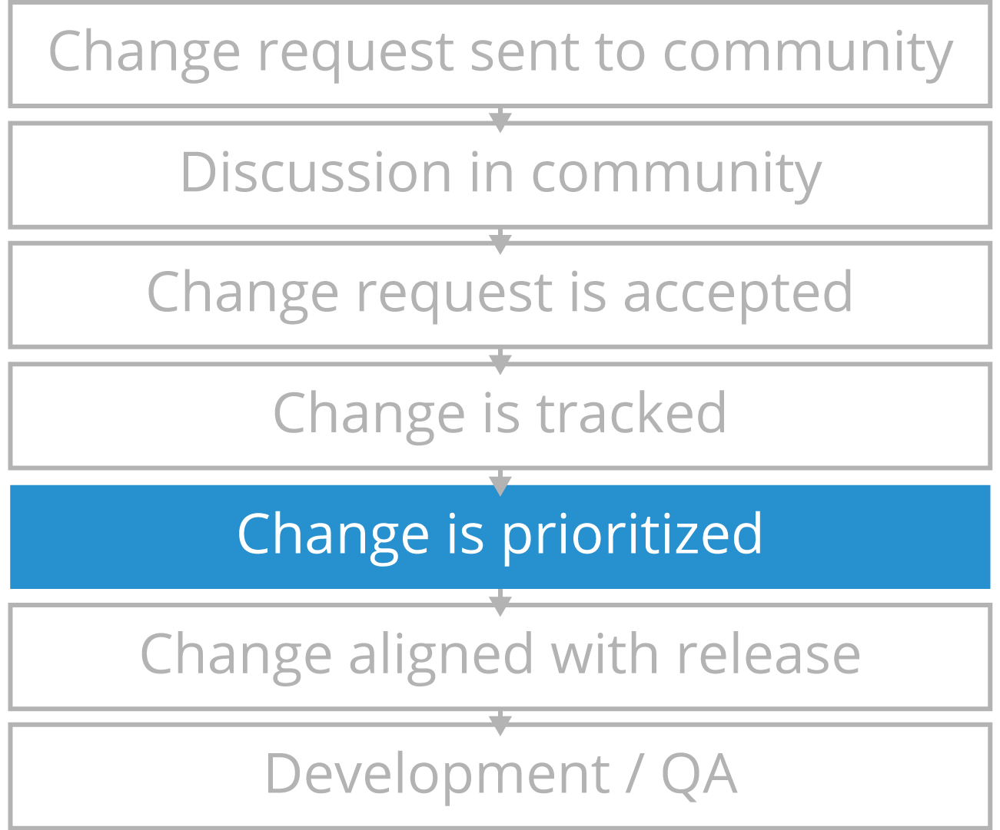

变更被接受和跟踪后，需要将其接受与项目的所有其他未决变更一起确定优先级。 在这一点上，维护人员再次参与以优先考虑哪些传入更改是项目的核心，哪些是立即需要的，哪些可以稍后接受。

由于维护人员通常对依赖项和未来版本有全局看法，因此他们可以努力确定更改的优先级并正确调整功能。 但是，如果更改足够小，或者没有触及项目的太多核心部分，他们可能会在准备就绪后立即表示他们已准备好接受它。

### 4.3.7 发布计划

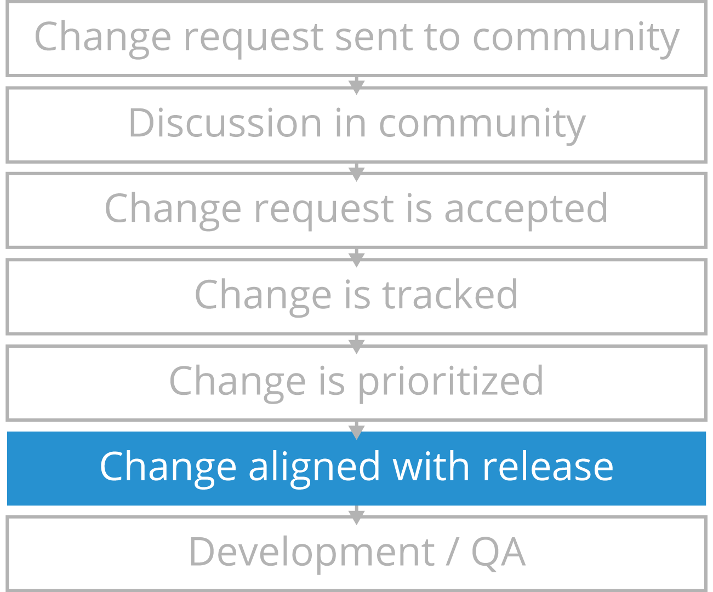

一旦维护人员完成了传入更改的优先级排序，他们将努力与提交更改请求的原始开发人员（以及整个社区）就何时准备好集成更改进行沟通。 这有助于维护者和社区计划每个版本的可管理数量的功能。

在此阶段，原始提交者将收到有关其更改计划用于哪些特定未来版本的通知。

### 4.3.8 开发与质量保证

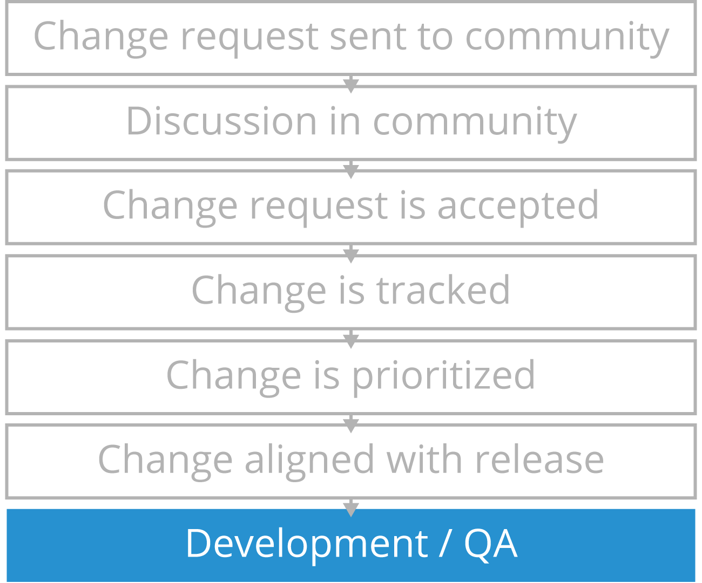

在流程中的所有先决条件都完成后，可以进行实际的开发和质量保证，开发人员和从社区招募的任何其他资源介入并开始实施新的更改，针对维护者设置的特定版本 .

如果由于某种原因开发遇到问题，或者看起来他们无法在分配给他们的特定发布窗口中进行，那么尽早与维护者和社区进行沟通很重要，以便对其更改的任何依赖都可以 在即将到来的发布周期中进行调整。

## 4.4 调整内部流程

### 4.4.1 从哪里开始

当您将变更贡献回上游社区时，考虑如何最好地调整您的内部开发流程以使其更有效，这一点很重要。 虽然您可能仍然拥有独特的内部或闭源软件产品开发流程，但在与上游开源项目合作时能够转换上下文并有效工作对于您的上游贡献以及帮助您最有效地使用开源项目都很重要 项目到您的内部代码。

为了让自己设置贡献，你通常遵循下面概述的过程（这个例子来自 Github，但可以推广到任何使用 git 作为源控制系统的系统）：

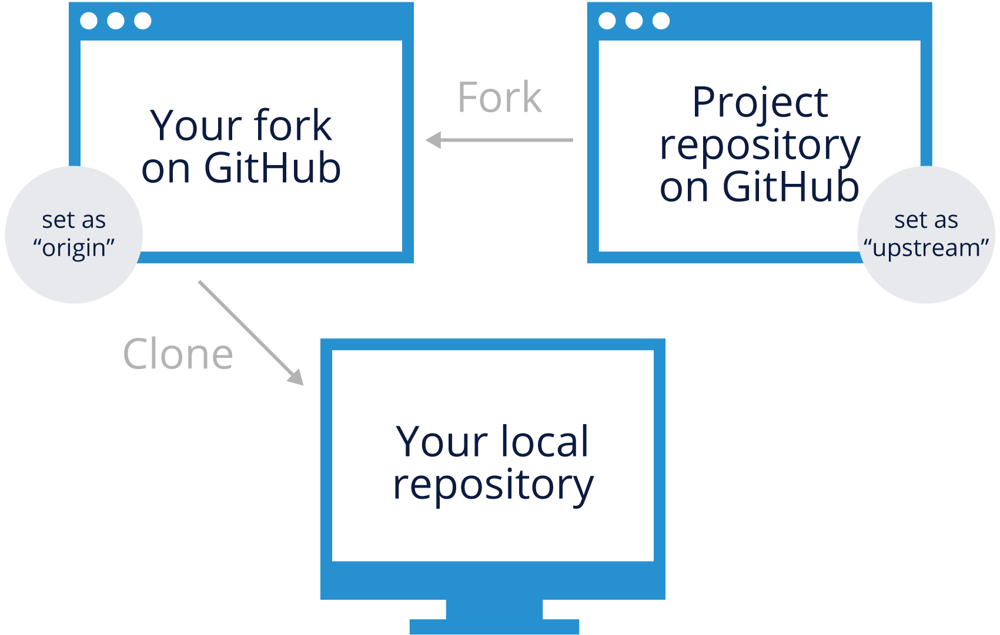

如果这是一个小的开源项目或者你组织中的其他人不太可能使用的项目，你通常可以在 Github 上将 fork 留在你自己的帐户中，但是如果它很可能被你组织中的其他团队使用，你 可能希望将上游项目分叉到公司所有的组织中，以便于维护。

完成初始设置后，通过“拉取请求”向上推送更改的一般工作流程如下所示：

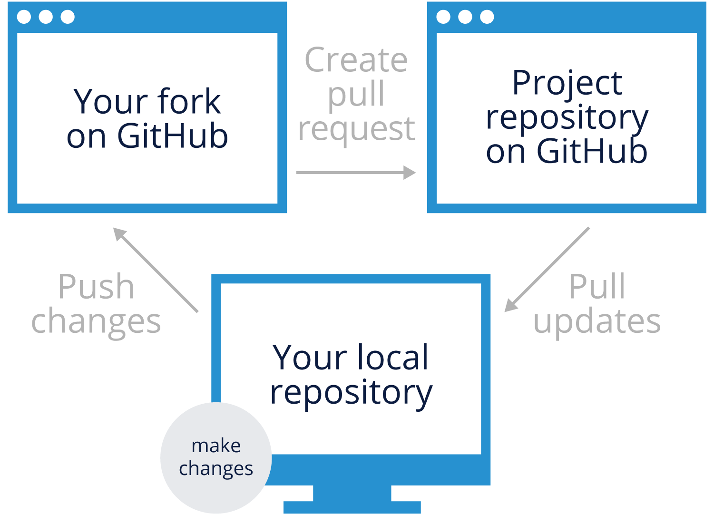

### 4.4.2 内部镜像

对于一些组织，特别是那些对Internet上开放源码存储库的长期可用性有潜在担忧的组织，在组织内部增加一个存储库结构层可能是有意义的。例如:

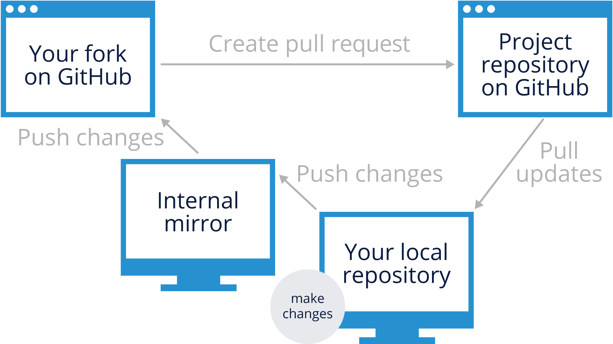

此外，对于某些组织而言，拥有开源项目内部镜像的“舒适因素”使他们能够更轻松地对产品中的开源使用进行合法签署。

虽然它确实提供了一层安全性，但它也增加了上游更改的工作量，因为您需要将这些更改从本地开发人员存储库推送到内部镜像，然后在提议之前推送到 Github 上的实际分支 你的拉取请求。

### 4.4.3 内部协作

无论您选择在有或没有内部镜像的情况下对上游项目进行消费和贡献，您仍然需要在组织内建立沟通和协作实践，以确保：

- 您正在处理上游项目的一小部分已批准版本
- 您所做的更改不是多余的或与您的内部团队发生冲突
- 您对上游项目提出的更改在整个公司内是一致的

### 4.4.4 协调上游拉取请求

如果您有多个团队使用并可能对上游开源项目进行更改，那么您必须努力协调对该项目所做的任何更改，这一点很重要。无论您是在内部镜像仓库还是公共组织仓库中监控和优先级/澄清这些更改，它都有助于识别组织内部负责充当中间“上游”审查团队的内部“维护者”。

在大型工程组织中有效地协调您的上游项目贡献似乎是很多额外的工作，但如果您想保持上游项目有效和健康，以便您可以依赖它，并且还需要您的组织在以下方面的声誉上游社区保持完整。从单个组织到上游项目的许多相互冲突的更改可能会对开源社区如何看待您的组织产生不利影响，从而对您与他们长期合作的能力产生负面影响。
