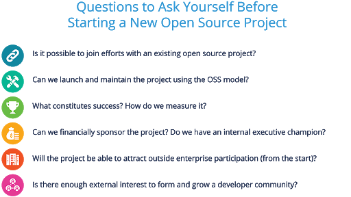
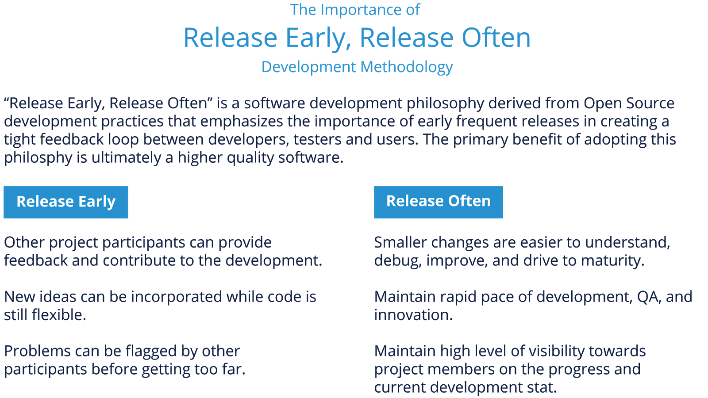
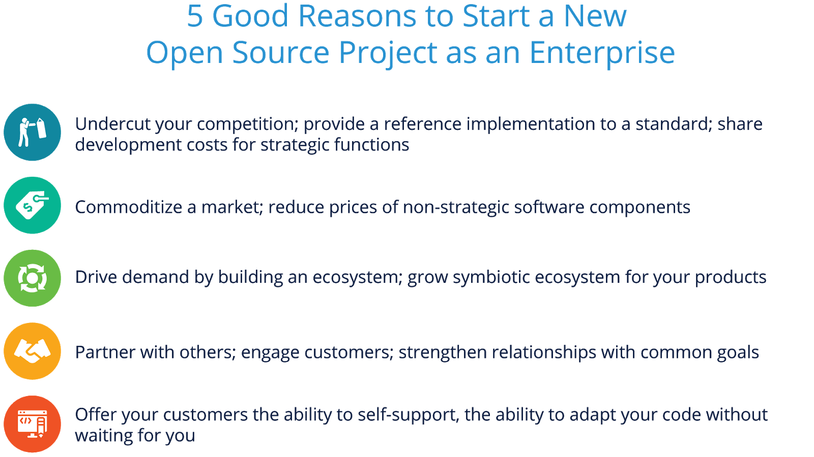
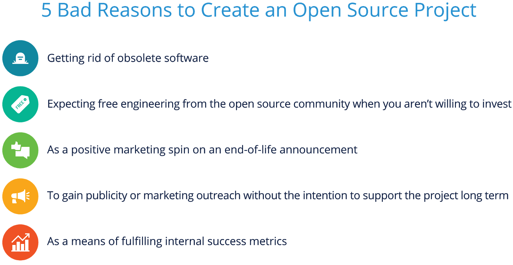

# 1. 介绍

## 1.1 课程简介

在本节中，我们将了解创建新开源项目的基本原理和价值主张。 我们将花时间讨论创建新开源项目的好坏理由，以及如何评估新项目的商业潜力。

## 1.2 学习目标

在本节结束时，您应该能够：

- 描述开源内部代码或从头开始创建新的开源项目的价值主张
- 给出一些开源代码理由的好坏例子
- 解释如何评估一个新的开源项目的商业潜力

# 2. 从哪里开始？

## 2.1 提出正确的问题

在开始创建新的开源项目之前提出正确的问题很重要。 虽然根据贵公司的独特情况，您可能还应该考虑一些其他具体问题，但下图将为您提供一个很好的开端，帮助您弄清楚要问什么。

此图的第一行真正涉及了解创建开源项目的价值主张是什么的问题。不幸的是，第一个问题并没有被经常问到——你应该认真评估是否需要创建另一个开源项目。存在成千上万个项目——您的代码是否会单独提供差异化​​的价值，还是让一个成熟且成功的开源项目变得更好？

如果您的组织了解开源开发模型（在本系列课程的前几节中进行了介绍）并致力于构建具有该结构的项目，那么在决定启动该项目之前，您仍然需要评估成功的要素和衡量标准会用。仅仅为了公共关系的目的而创建一个项目，或者为了改进开源项目启动数量的内部指标，通常会导致一个不成功的项目。

第二排问题更侧重于您的组织和社区在新的开源项目中创造价值的能力。太多的公司已经尝试（但失败）的策略是简单地将代码扔过防火墙，没有内部财务和工程投资，并希望他们的企业声誉能够吸引外部企业的参与。

花点时间考虑如何让您的潜在新开源项目取得成功。如果您得出的结论是创建开源项目不适合特定代码段，那也没关系——有很多机会参与开源生态系统或将您的技术贡献给其他开源项目。

## 2.2 你应该开源什么？

正如您必须决定向上游开源社区贡献什么（来自本系列之前的课程），决定您最初将在开放中构建什么代码或技术，或者您的专有代码。我发布是一个重要的。以下是一些可以帮助您考虑此选择的标准。

- 确定您的产品的哪些部分是战略优势的来源，以及什么只是支持这些部分
- 非战略部分通常是创建开源项目的理想选择
  - 其他公司很有可能也有同样的感觉，并且可能会帮助您维护和推进新项目。

例子：

- 行业中广泛使用的文件系统或文件格式
- 连接物联网设备的网络堆栈

另一个起点包括二次编码项目，在这种项目中，企业不需要成为权威，并且可能有更多的世界各地的技术人员可以帮助您解决问题。如果它不是关键任务代码，那么它很可能是开源的一个很好的候选者。但是，它也应该是贵公司仍在积极使用和维护的代码。对代码的商业依赖使错误修复、补丁和新功能的持续反馈循环成为可能。

## 2.3 何时创建开源项目

发布或创建新的开源项目的决定取决于您的情况。 您的公司应该首先通过使用开源软件并为现有项目做出贡献来达到一定程度的开源掌握（正如我们在本系列之前的课程中介绍的那样）。

了解如何使用开源可以教会您如何利用外部项目和开发人员来构建您的产品。 参与可以使开源社区的惯例和文化更加流畅。 但是，一旦您实现了开源流畅性，开始启动自己的开源项目的最佳时机就是“早”和“经常”。

此图提醒我们在本课程系列的开源开发实践部分中涵盖的内容。 这不仅在您回馈开源时很重要，在您考虑第一个新的开源项目时也很重要。

在您创建第一个开源项目之前，并非一切都必须绝对完美。 在流程、法律审查等方面有一些最低要求（我们将很快介绍），但在代码和治理方面建立最低要求以开始使用可以让您获得更早的参与和更早的反馈，以帮助您发展 你的新项目。

不过，在您创建第一个项目之前，我们应该讨论创建开源项目的一些好的（和坏的）原因......

## 2.4 创建开源项目的好理由

此图显示了您应该启动开源项目的五个充分理由。 虽然他们都回到业务目标，但前两个涉及在市场上获得独特的业务优势。 然而，重要的是要注意，这种“先行者”的业务优势可能是短暂的（6-10 个月），直到社区的其他人精通您开源的技术。

第三和第四项侧重于吸引客户并帮助您的非开源产品创造价值。 请记住，在开源代码中，您在提供价值的基础上，使您的产品变得更好。

最后，如果你所在的行业有技术客户（或开发人员），他们有能力用你的技术自给自足，你可以意识到不必为你选择开源的代码提供额外的技术或支持资源的价值。

## 2.5 创建开源项目的错误理由

与出于正确的原因开源一样重要的是确保您不会出于错误的原因尝试创建开源项目。 开源生态系统充斥着来自组织的失败项目，这些项目本意很好，但根本没有充分考虑为什么他们应该开源代码或创建一个新项目。

以下是一些创建新开源项目的不良理由示例：

- 摆脱过时的软件
- 当你不愿意投资时，期待开源社区的免费工程
- 作为终止生命公告的积极营销手段
- 在无意长期支持项目的情况下获得宣传或营销推广
- 作为实现内部成功指标的一种手段

希望很明显为什么所有这些都是创建开源项目的糟糕理由，但让我们看看它们都有什么共同点 - 内部关注和/或对更大开源社区的支持的期望。

在开源中工作经常被描述为（从企业的角度）“开明的利己主义”。在这种情况下这是恰当的，因为每个人都明白企业不一定出于利他的原因使用开源 - 必须有商业价值与开源中发生的事情保持一致。然而，上面显示的原因播下了对开源社区其他人不信任的种子，毕竟开源社区是由合作伙伴和竞争对手组成的。

## 2.6 评估开源项目的商业潜力

就像任何业务决策一样，确定应该创建什么、是否以及何时创建开源项目会回到最终交付给业务的价值。在考虑这些问题时，最好从构建业务案例的角度进行思考。

首先，您必须决定您的公司是要在保持代码和项目所有权的同时创建或发布代码，还是要将代码捐赠给其他人来维护和管理项目。如果代码已经存在，则存在相关问题，即您是将项目中的所有代码发布还是仅将其中的一部分作为开​​源项目发布。

要做出这些决定，请考虑退后一步来确定您为代码设定的目标。这段代码是否对您的组织之外有用并且对行业也有变革意义？贵公司是否有可能吸引合作伙伴（和/或竞争对手）使用这项技术来支持贵组织的产品组合？

例如，您可能希望从其他开发人员那里获得关于应用程序中非您工作核心部分的新见解。或者，您可能会寻求其他实际算法来检测系统监控应用程序中的日志。您可以只发布与算法相关的代码，而不是将整个产品作为开源发布。这使您能够获得他人的贡献并帮助需要类似帮助的其他人，而不会影响您的核心业务。

启动一个项目并保持总体控制可以让您进行监督，并让您能够帮助将其塑造成您需要的东西，同时仍然为贡献的开发人员提供自由和控制来完成他们的工作。

# 3. 新项目准备

## 3.1 简介

在本节中，我们将探讨如何为创建新的开源项目做准备，包括讨论法律、商业和社区考虑因素。 我们还将讨论成功所需的流程、工具和人员配备要求。

## 3.2 学习目标

在本节结束时，您应该能够：

- 解释准备创建一个新的开源项目的总体步骤
- 了解项目创建成功需要哪些流程、注意事项、工具和要求

## 3.3 内部准备

### 3.3.1 确定执行保荐人

由于创建成功的开源项目需要大量投资，因此获得组织中执行发起人的支持至关重要。 如果您有多个赞助商，这会有所帮助，但至少，您应该瞄准能够提供并承诺以下事项的人：

#### 3.3.1.1 技术和社区

- 继续公开重申对项目的承诺
- 培养以绩效为基础的认可文化
- 确保中立
- 承诺遵循开源方法和流程

#### 3.3.1.2 财务

内部：提供足够的开发资金以启动项目
外部：致力于为 IT 资源和系统管理员提供资金

### 3.3.2 分配资源

您需要让您的执行发起人适当分配资金，如上一页所述，但也需要能够安排适当的员工时间来使项目取得成功。最初开发人员的时间可能与他们花在内部代码工作上的时间相似。但是，您还需要考虑您的开发人员需要提供哪些时间、材料或帮助，以帮助新社区中的其他人快速了解代码库。

法律团队也需要资源，参与创建一个可能涉及竞争对手的开源项目，以及营销投资，以确保项目在启动后获得支持和贡献者。

您还必须为用于开始和维护项目的基础设施设置预算。这包括项目托管和源代码控制网站，如 GitHub，代码将在其中驻留和维护，以及错误解决方案和其他所需的工具。

我们很快就会更详细地介绍工具和基础设施。

### 3.3.3 培训您的员工

即使您的组织已经接受了开源主题的培训（例如本系列课程），提醒工程团队和经理注意可能与他们通常的构建产品或评估工作的方式不同的特定项目也很重要。

 **对于工程师** 

- 回顾开源开发方法和流程
- 查看贵公司的开源政策和合规性规则
- 在您的软件开发模型中集成开源软件
- 如果可能，在内部遵循开源最佳实践
- 实践并鼓励社区思考，以帮助制定更通用的解决方案

 **对于经理** 

- 传统的绩效指标可能不再适用
  - 只计算结果，不计算使用谁的代码
  - 影响结果与编写代码一样有效
- 管理你的开发者，而不是他们的维护者
  - 你无法控制开源进程
- 您的员工和社区都有学习曲线
- 建立影响力和尊重需要时间（即使这是您公司的项目）

## 3.4 审查

### 3.4.1 概述

虽然有些受众在启动新的开源项目等工作之前不一定喜欢冗长的评论，但重要的是要花一些时间来正确规划法律团队、工程团队和营销团队的评论。

这些不一定是痛苦的，因为一组简单的清单来验证最常遗漏的元素不会从裂缝中溜走可能会有所帮助。在创建一个新的开源项目的过程开始时利用这段时间可以在项目完成并获得可见性后省去很多麻烦。

我们将在以下部分介绍如何简化这些审核流程的一些最佳实践。

### 3.4.2 法律审查

新项目可能发生的最糟糕的事情之一是社区对代码库的合法清洁度不信任。确保您发布的代码具有明确的许可和出处非常重要。全面的法律审查通常有助于确保社区中的其他人可以接受所贡献的内容。

您的法律审查还应包括商标尽职调查和注册。请注意，如果您将项目贡献给基金会（稍后将在治理部分详细介绍），请确保在开源代码库之前与商标策略保持一致。

您还需要为您的项目选择一个许可证。记录任何许可或知识产权要求很重要。项目通常需要同时考虑出站许可（例如，下游用户接收代码所依据的许可）和入站贡献机制（例如，向项目做出贡献的过程）。许多项目将使用开发商的原产地证书 (DCO) 签核流程作为其入站贡献机制。如果您预计需要明确的公司对专利授权的承诺，或以后重新许可项目的能力，您可能需要查看一些更常见的贡献者许可协议（通常称为 CLA）。并非所有 CLA 都相同，因此请仔细考虑此选项。另请注意，CLA 可能会成为参与的障碍，因为开发人员通常必须通过繁琐的审批流程才能签署。有关许可选项的更多详细信息，请参阅本培训系列的开源合规性计划模块。

您的项目也可能产生非软件的可交付成果。如果您的项目正在生成文档，请讨论您是否应该为文档使用特定的许可证。例如，许多开源项目将使用软件的开源许可证和文档的知识共享许可证。此外，一些项目寻求创建可由其他人以各种方式实施的规范。这些项目应该考虑使用规范许可证的选项。

每种许可方法都有其优点和缺点，但请注意分散项目的可能性，这对于需要互操作或提供跨各种供应商解决方案可移植性的软件来说是一个特殊问题。如果商业解决方案通过社区创建的测试或一组要求，则通常通过创建允许使用项目商标的一致性程序来解决此问题。预先考虑这一点将有助于为您的法律审查和项目计划提供信息。

总之，法律审查过程的步骤包括：

- 考虑开源对贵公司知识产权的影响
- 确保完全符合开源许可证
- 为要发布的源代码选择一个开源许可，在您的项目中非常清楚地记录所有许可要求
- 决定您是否需要贡献者协议
- 考虑来自社区的可能的非软件输出和适当的许可证，例如文档和规范
- 决定任何与商标相关的考虑因素
- 确定您的生态系统计划中是否包含其他因素，例如一致性测试

### 3.4.3 技术审查

技术审查验证源代码可以在不依赖于其他内部代码或开发实践（包括任何自定义内部构建系统）的情况下运行，并且不包含公司无法包含在开源版本中的第三方代码。

技术审查应包括对所有许可和版权声明的验证，并应删除任何私人或内部代码注释。 步骤包括：

- 删除对非公共组件的关键依赖
- 提供文档和用例示例
- 删除内部注释、对其他内部代码的引用等。
- 确保编码风格一致
- 更新源代码文件中的版权声明
- 在源代码文件中添加许可声明
- 确保代码在任何外部目标平台上编译和构建
- 将许可证文本作为文件添加到根目录中

### 3.4.4 营销审核

成功的开源项目不能完全依赖于代码和技术的优点——为了让项目继续前进，还有一系列额外的业务和营销步骤需要注意。它们包括推广项目、制定成功的运营战略、提供切合实际的预算和项目品牌，以及建立活跃的社交媒体帐户和有用的域名以支持长期成功。

营销审查为品牌建立了指导方针。这一点尤其重要，因为它有助于确保市场上的信息一致。营销审查的步骤包括：

- 设计项目标志、配色方案、网站、宣传材料等。
- 正式制定品牌指南
- 为项目注册社交媒体帐户（Twitter、Facebook、LinkedIn 等）
- 为项目注册域名

通过在项目启动之前执行此营销审查，您可以在任何潜在的品牌问题（例如您的首选名称无法使用域名）威胁到项目成功之前处理它们。确保您尽早与营销团队接触，以便他们可以帮助您解决这些（和其他）问题。

你可能会发现你的营销团队会很兴奋，因为看看你能带动多少人到项目中贡献代码、参与论坛、提供错误修复和报告问题是一个有趣的挑战。

### 3.4.5 治理和流程

#### 3.4.5.1 治理模式

重要的是要考虑新的开源项目的治理模型。 但是我们所说的治理是什么意思？ 很简单，治理是围绕项目的结构，它支持以下方面的决策：

- 参与指南和要求
- 架构变化
- 提名维护者
- 争议的最终仲裁者
- 暂停参与者

有多种管理项目的方法，具有不同程度的业务和/或技术领导。 我们稍后将介绍领导力，但如果您想了解有关不同类型治理模型的更多详细信息，请参阅本培训系列中的“与开源项目有效协作”课程。

#### 3.4.5.2 领导力

在开始之前设定领导角色也很重要。对于不同的项目，这可能意味着不同的事情。如果您正在启动一个有多个企业参与者的多公司项目，该项目可能需要更正式的治理，例如管理委员会或其他管理小组。

其他安排可能只需要一个技术委员会，从技术角度监督开源项目的所有方面。该委员会的组成将主要包括技术领导，以及与执行团队的联络人，以提供有关进展和项目需求的最新信息。然后可以在技术成员和高管认为合适的情况下引入法律团队。

您的顶级架构头脑当然也会在那里，以及其他了解代码库将如何工作的人。总而言之，委员会成员将对项目的发展方向以及来自开发人员社区的支持有一个愿景。这些人是您希望在桌旁计划流程的人。

#### 3.4.5.3 基金会或独立

随着社区的发展，您需要能够适应任何新的沟通渠道。确保随着项目的发展，让您的社区参与工具决策——您可能会发现，如果用户和开发人员发现其他工具有用，随着时间的推移，他们自然会倾向于使用其他工具。
创建新的开源项目时经常出现的另一个问题是，是将您的代码捐赠给与供应商中立的非营利组织，还是通过拥有和运行您自己的项目来保留一些控制权。答案取决于您想要实现的目标——如果您正在与少数合作伙伴合作为该行业构建一项新兴技术，您可能不需要在一开始就考虑成立一个非营利基金会。

但是，如果您的计划在您的行业中具有广泛的适用性、跨行业，或者已经从小事发展成为大而复杂的事情，那么考虑一个非盈利的开源/开放标准联盟来托管您的项目通常是好的。项目。除了拥有真正的供应商中立场所来托管您的项目的价值之外，这些基金会还提供法律、治理、营销和项目基础设施服务，可以显着简化让您的项目走上成功之路的过程。

您可以选择许多基金会（和子基金会），每个基金会都提供独特的价值主张、定价和服务水平。这些基础的一些例子是：

- Apache Foundation
- Eclipce Foundation 
- Linux Foundation
- OASIS Open

您选择哪个基金会取决于您的项目所在的专业领域，以及成本、治理模型等考虑因素。

### 3.4.6 技术流程

在发布之前，创建一个标准的发布流程通常很有帮助，以便在项目维护人员进行更改和改进时安排代码的定期发布。应该为开发社区和项目的业务方面制定一个具有明确定义和可见细节的时间表。

发布这些版本的频率取决于您社区的期望。如果该项目以企业为中心，并且您正在尝试构建非常坚固的东西，那么您的发布时间表可能是一年两次。如果项目的范围更小、更敏捷，并且您正试图将其中的一部分发布出去，那么您可能会每月或每周发布代码。时间表的关键是社区必须规定时间表并从速度的角度了解其支持项目的能力，同时为用户提供他们需要和期望的东西。如果社区提供的反馈是发布过早或过慢，那么您需要查看流程并进行一些调整。这里最重要的是一致性、可预测性和可见性。

您还应该有明确定义的流程来提交代码、补丁、功能创意、文档或其他项目工件。其中一些可以在项目基础设施/工具中处理（我们将很快介绍一个主题），但技术过程的一部分不仅仅是工具，而是工作流程的期望 - 例如- 代码将如何提交，将遵循什么样的编码标准，新代码何时在发布周期中被接受等。

## 3.5 项目基础设施

### 3.5.1 开发工具

在项目启动之前，您需要为项目准备一个存储库。这本质上是代码存储库的基础设施，项目将始终可供贡献者使用。许多项目使用著名的 GitHub 或 GitLab 存储库，或者使用 Gerrit 等工具托管自己的存储库。

还有许多其他选项可用，但请记住，考虑让开发人员更轻松地参与和参与您的项目通常很有用。选择大多数开发人员熟悉的工具平台将有助于加快项目的贡献和增长。

错误、问题和功能跟踪也应作为项目基础设施计划的一部分。您希望为贡献者提供一个简单的地方来报告需要修复的问题以及对可能有用的新功能的请求。然后是自动化的构建和测试系统流程，它们可能需要包含在您项目的 GitHub 存储库中，以保持您的系统和项目流畅运行，同时扫描和检查代码以确保其质量。

通过查看本系列课程中的开源开发实践模块，您可以获得更多关于自动化测试和持续集成等方面的详细信息。

### 3.5.2 网站

关键的一步是为项目创建一个公司中立的网络形象。不要试图将开源项目网站作为公司网页的子域——即使你有最好的意图，项目中性主页的视觉区别也很重要。该网页为社区提供了一个查找项目信息的地方，包括文档、下载代码的链接等。该网页还可以提供有关项目领导、范围、用户和贡献者、预算、治理和其他详细信息的详细信息。作为中央信息存储库，您的网站还应该有非常明确的号召性用语/地点，供新开发人员加入社区。

### 3.5.3 通讯工具

为您的社区提供沟通渠道以寻求帮助至关重要。您需要找到可以集成到整个开发工作流程中的工具（例如，接收支持请求通知、代码签入、错误日志和其他任务）。您还需要为社区成员提供重要的讨论论坛和机制，以便从同时参与项目的其他人那里获得快速答案。所有这些都是重要的沟通方式，有助于实时推进项目。

要考虑的一个项目工具是 Slack，这是一个在线团队项目管理和通信平台，用户可以在其中访问和共享消息和文件、组织工作流程、执行信息搜索等。然而，Slack 是一种专有工具，超过一定的使用阈值需要花钱维护。有一些开源选项，例如 IRC、Gitter.im、Mattermost、Rocketchat 等。

根据您的开发人员和用户社区，您可能还需要现代论坛工具。 Discourse 是一个很好的选择，它是完全开源的，还提供可选的托管。选择通信系统时，请注意任何形式的锁定、财务成本以及将来迁移到新系统的难易程度。

随着社区的发展，您需要能够适应任何新的沟通渠道。确保随着项目的发展，让您的社区参与工具决策——您可能会发现，如果用户和开发人员发现其他工具有用，随着时间的推移，他们自然会倾向于使用其他工具。

### 3.5.4 文档工具

某种形式的文档管理通常对开源项目很有用，特别是如果它使创建文档、操作方法和其他基于文本的项目的过程变得更容易的话。 虽然许多项目都喜欢使用 GitHub 或 GitLab 的内置 Markdown 文本工具功能，但其他项目更喜欢使用 wiki 或其他共享编辑软件。

有关潜在 Wiki 工具选项的列表，您可以查看（毫不奇怪）维基百科。 适用于通信工具的相同警告也适用于此 - 考虑如何避免任何类型的数据或工具锁定，以便当（不是如果）您的用户和开发人员决定迁移到不同的平台时，您可以迁移您的硬件 - 获得文档、常见问题列表和操作方法内容。

# 4. 成功的项目启动和维持

## 4.1 简介

在本节中，我们将讨论成功启动开源项目所需的最后步骤，并提供一些有关如何维持和鼓励采用和对项目做出贡献的附加信息。

## 4.2 学习目标

在本节结束时，您应该能够：

- 描述成功启动开源项目所需的最后步骤。
- 解释如何建立强大的社区流程，以提高项目的采用率和强大的贡献渠道。

## 4.3 项目启动

### 4.3.1 最终代码审查

在这个过程中的这一点上，最后一遍源代码以准备启动总是一个好主意。如果您一直遵循前面概述的过程，这应该不会是一个很大的负担，但是确保没有忘记任何易于修复的项目会非常有帮助。

具体而言，此最终审查的目标应该是确保完全满足法律、技术和营销审查确定的所有要求。要查找的内容的一些示例是：

- 许可、归属和版权文本都完整且到位
- 源代码扫描器报告干净的材料清单
- 每一行代码都获得了适当的发布许可
- 评论已清除随意或不相关的语言
- 源代码不会无意中泄露内部项目
- 源代码足够完整，可以构建
- 使用公开可用的工具构建源代码
- 文件和函数名称反映项目的名称（如果它已更改）
- MAINTAINERS 文件是最新的（如果使用）

### 4.3.2 预发布

在您的新项目正式上线之前，您可以做一些事情来确保为您的组织和整个社区提供最佳的启动体验。为了确保成功，您可以做的最重要的事情之一是确保在发布之前拥有临界质量。

当您宣布新项目时，您应该已经确定哪些合作伙伴和客户将与您同在。他们应该具有对存储库的预览访问权限，以便他们可以熟悉代码并准备贡献（或已经贡献）。

如果这是您早期的开源项目之一，那么与您自己的开发人员快速复习一下，以确保他们遵循开源开发方法和流程，以期与开源社区中的其他人进行交互也无妨将为您的项目做出贡献。

在您确认所有项目基础设施都已启动并运行后，请确保您的内部开发人员已加入项目的沟通工具并开始监控问题或新贡献。

现在是重要时刻的时候了！您可以上传任何最终剩余的代码并翻转开关以使项目面向世界

### 4.3.3 良好的开源公民身份

现在您的项目已经启动，这只是未来工作的开始。您需要确保您的组织继续成为优秀的开源公民，并以鼓励其他人与您并肩并在您的项目上合作的方式运作。这里有一些方法可以做到这一点：

- 在公开场合进行对话并做出决定
  - 这建立了善意，并减少了记录决策的开销
  - 这简化了新参与者的入职流程
  - 拥有开放的档案可确保参与者发生变化时的连续性
- 聆听社区
  - 他们的经验非常宝贵，尤其是在集成和测试方面
  - 鼓励扩展您需要的通用实现
- 分配资源，就好像您将是唯一一家从事这项工作的公司一样
  - 设定目标，并确保他们有资源来完成
  - 在杠杆开发模式生效之前，这会形成动力

成为一名优秀的开源公民需要付出努力，而且这不是利他主义——对于您的组织来说，从您为启动开源项目所投入的投资中获得最佳回报是一种良好的商业实践。

# 5. 项目维护

## 5.1 建立社区

项目启动后，监控外部开发者和用户社区的活力至关重要。社区建设不会自动发生。在项目的早期阶段，可能需要在主要会议上举办开发者活动或赞助聚会以建立动力。管理期望并履行项目治理和透明度的义务也非常重要。

正在进行的活动包括：

- 确保明确传达方向或治理的任何变化
- 遵循其他类似社区的最佳实践
- 鼓励和提供面对面社区建设的机会
- 确定适当的活动并让社区提交演讲
- 考虑举办本地聚会

通过建立一个多元化的贡献者群体，您可以稍后决定通过与其他认为这项工作有价值的企业和组织进行讨论，以确定他们是否有兴趣投入时间、金钱和其他资源，从而决定将您的项目提升到一个新的水平扩大您的初步努力。通过从其他人那里获得投入和资源，可以扩展和发展项目，以便为其他贡献者做更多事情。

这种增长意味着更多的企业可能希望贡献更多的资金，让他们自己的开发人员加入进来，并通过将他们的力量放在你已经开始的努力上来帮助推进工作。这可能涉及 10,000 美元或 250,0000 美元或更多，具体取决于项目的重要性及其对其他公司的意义。一旦您的项目开始，其他公司可以进来为这项工作提供资金，如果这有助于他们的使命。

这在今天经常发生，因为企业和组织意识到他们试图解决的技术问题比他们单独的任何一个都大。那时他们可以开始看到在供应商中立的联合项目中与其他公司联合起来的战略价值，这些项目在解决企业面临的技术问题方面为更大的利益而努力。

# 5.2 指定社区倡导者

您可以聘请来帮助新的开源项目取得成功的最重要角色之一是社区倡导者（有时也称为社区经理）。这个人的角色是做任何需要让社区成功的事情。

这是一个执行起来具有挑战性的角色，也可能是一个具有挑战性的角色，因为这个人需要各种各样的技能，包括营销、开发人员宣传、业务发展、危机管理、调解人等。一个开始寻找的好地方担任此角色的人员将考虑您组织中的内部开发或营销资源。此外，不要忽视技术作家、项目经理，甚至社会学、心理学等非传统研究领域的人。

一个好的社区倡导者可以区分一个没有人使用的技术上成功的项目，一个相当好的技术项目，由于社区建设和部署的桥接技能而突飞猛进。 Linux Foundation TODO Group 是一个寻找社区管理资源帮助的好地方。

# 5.3 评估和适应

与任何新项目工作一样，如果您没有看到预期的采用和贡献类型，您需要经常评估并准备好调整您的方法。重要的是要记住，贵组织的声誉只是衡量新开源项目成败的一部分。

当社区提供反馈时保持灵活性和敏捷性让您有机会提高项目作为协作和倾听的好地方的声誉。当您的项目开始时，您应该查看一些关键指标：

- 来自初始开发人员群之外的代码提交/拉取请求的数量
- 关于您部署的任何通信渠道的讨论/主题数量
- 提交的错误报告或功能请求的数量

同样重要的是要记住，即使是负面反馈也意味着您的社区正在参与您的项目。通过实践透明度和问责制并尝试公平地解决问题，您的项目将获得积极的声誉。

记住在整个培训课程系列中一直重复的格言——“尽早发布，经常发布。”您的新项目不必在第一天就完美无缺，但通过牢记这句格言，您将在构建成功且强大的开源工作的方法。
