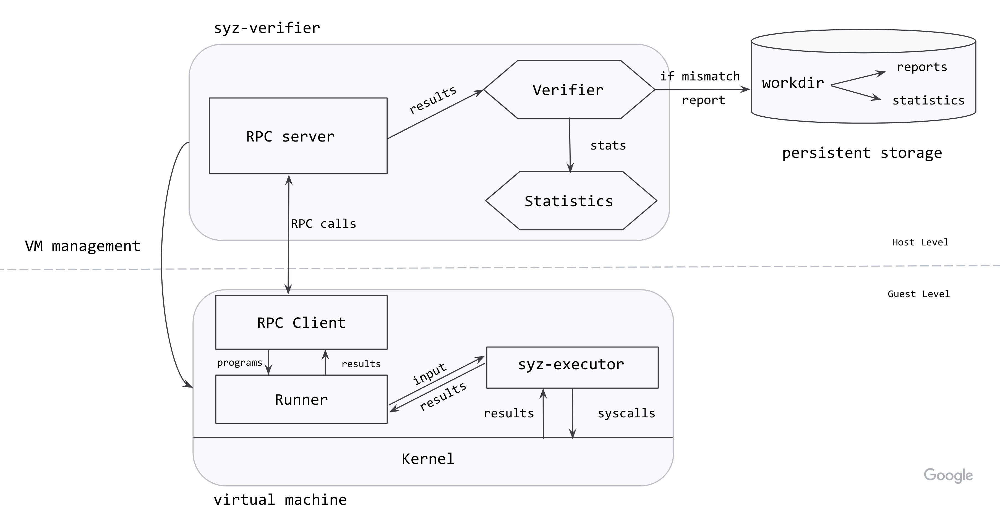

# syz-verifier

许多错误很容易被检测到：它们可能会导致断言失败、系统崩溃，或引发其他可被各种动态分析工具检测到的未定义行为。
然而，有一类被称为*语义错误*的错误，它们不会导致上述任何一种情况，但仍会造成系统行为异常。

要发现语义错误，需要为系统的*预期行为*建立一个规范。根据系统的复杂性，创建和集中管理这样的规范可能非常困难。
例如，Linux 内核的“规范”并非集中在一处，而是由文档、手册页以及大量用户空间程序的隐含期望共同构成。
因此，在 Linux 内核中检测语义错误要比检测其他类型的错误困难得多。
许多测试套件旨在检测回归问题，但创建和维护测试用例，以及覆盖新功能都需要大量的工程投入。

*差分模糊测试*是一种自动化检测语义错误的方法，它将相同的输入提供给同一系统的不同实现，然后交叉比对由此产生的行为以确定它们是否一致。
如果系统之间出现分歧，那么至少其中一个被认为是错误的。

`syz-verifier` 是一款差分模糊测试工具，它通过交叉比对程序在不同版本的 Linux 内核上的执行情况来检测语义错误。

`syz-verifier` 的架构如下图所示。



`syz-verifier` 进程负责启动并管理带有待比对内核的虚拟机实例。它还会在这些虚拟机上启动 `syz-runner` 进程。主机和客户机之间的通信由 RPC 完成。

`syz-verifier` 生成程序流并通过 RPC 持续发送给 `syz-runner`，而 `syz-runner` 负责启动 `syz-executor` 进程，并将程序转换为后者的输入。`syz-executor` 处理输入，这会在内核中触发一系列系统调用。然后，`syz-runner` 收集结果并将其发送回主机。

现在，结果包含了每个系统调用返回的错误码 (errno)。当 `syz-verifier` 收到来自所有内核针对特定程序的结果后，它会验证这些结果以确保它们完全相同。如果发现不一致，该程序会在所有内核上重新运行，以确保这种不一致不是偶发性的（例如，不是由某些后台活动或外部状态引起的）。如果这种不一致在所有重试中都出现，`syz-verifier` 会为该程序创建一份报告并将其写入持久化存储。

# 如何使用 syz-verifier

克隆仓库后（方法见[这里](/docs/linux/setup.md#go-and-syzkaller)），按如下方式构建工具：

```

make verifier runner executor

```

要开始使用该工具，需要为您想要纳入验证的每个内核创建单独的配置文件。Linux 配置的示例可以在[这里](/docs/linux/setup_ubuntu-host_qemu-vm_x86-64-kernel.md#syzkaller)找到。这些配置文件与 `syz-manager` 使用的配置文件相同。

如果您想从一组特定的系统调用生成程序，可以在内核配置文件中使用 `enable_syscalls` 选项列出它们。如果您想禁用某些系统调用，请使用 `disable_syscalls` 选项。

按如下方式启动 `syz-verifier`：
```

./bin/syz-verifier -configs=kernel0.cfg,kernel1.cfg

```

`syz-verifier` 在执行过程中也会收集统计数据。默认情况下，它们会打印到标准输出 `stdout`，但也可以使用 `stat` 标志指定一个备用文件。

# 如何解读结果

可以在 `workdir/results` 目录中找到结果。

当 `syz-verifier` 在一个程序中发现不一致时，它会为该程序创建一份报告。报告会列出每个交叉比对的内核为每个系统调用返回的结果，并高亮显示发现不一致的地方。系统调用按其在程序中出现的顺序列出。

下面展示了一份此类报告的摘录：

```
ERRNO mismatches found for program:

[=] io_uring_register$IORING_REGISTER_PERSONALITY(0xffffffffffffffff, 0x9, 0x0, 0x0)
        ↳ Pool: 0, Flags: 3, Errno: 9 (bad file descriptor)
        ↳ Pool: 1, Flags: 3, Errno: 9 (bad file descriptor)

[=] syz_genetlink_get_family_id$devlink(&(0x7f0000000000), 0xffffffffffffffff)
        ↳ Pool: 0, Flags: 3, Errno: 2 (no such file or directory)
        ↳ Pool: 1, Flags: 3, Errno: 2 (no such file or directory)

[!] r1 = io_uring_setup(0x238e, &(0x7f0000000240)={0x0, 0xf39a, 0x20, 0x0, 0x146})
        ↳ Pool: 0, Flags: 3, Errno: 6 (no such device or address)
        ↳ Pool: 1, Flags: 3, Errno: 9 (bad file descriptor)
...
```

结果的顺序由传递配置文件时的顺序决定，因此， `Pool: 0` 报告是使用 `kernel0.cfg` 创建的内核的结果，以此类推。

[标志](/pkg/ipc/ipc.go#L82)可用于确定系统调用达到的状态：
* `0` = 系统调用甚至未开始
* `1` = 系统调用已开始
* `3` = 系统调用已执行完毕
* `7` = 系统调用被阻塞
```
